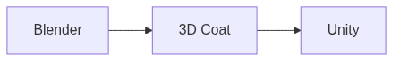

<!-- _class: cover -->
<!-- _paginate: false -->

# Texturização 

## Do modelo à superfície

**Semana 1** — Pipeline, materiais e o Kit Modular

---

## Onde vamos chegar

Um **Kit Modular de Ambiente** construído por você, do início ao fim do semestre.

Tudo que aprendermos será aplicado a esse único projeto.

<!--
Notas: Esta é a promessa da disciplina. Não é uma sequência de exercícios soltos — é um projeto que acompanha o semestre inteiro. Fixar essa ideia agora reduz a ansiedade por "conteúdo técnico" na primeira semana.

FIGURA (produzir) — assets/kit_modular_exemplo.webp
Objetivo: mostrar visualmente o que é um kit modular, para o estudante entender a meta do semestre logo no primeiro dia.
Descrição: uma pequena cena de ambiente montada a partir de peças repetidas (paredes, chão, pilar, detalhe), com as peças individuais destacadas ao lado.
Como produzir: no Blender, montar 4–5 assets simples de um tema (ex.: medieval) e renderizar duas versões — a cena completa e as peças separadas com Viewport Shading em Material Preview. Exportar como imagem.
-->

---

## Objetivos de hoje

Ao final da semana você será capaz de:

- Descrever o **pipeline** da disciplina
- Diferenciar textura **raster** e **procedural**
- Reconhecer os workspaces básicos do **Blender**
- Definir o **tema** do seu Kit Modular

<!--
Notas: Ler rápido. Não detalhar cada objetivo agora — eles voltarão ao longo da aula. O objetivo 4 (definir o tema) é o entregável central da semana.
-->

---

<!-- _class: question -->

# Qual a diferença entre a **cor** de um objeto e o **material** dele?

<!--
Notas: Deixar 2–3 respostas rápidas da turma antes de apresentar o conceito. Não corrigir — usar as respostas como ponte para os próximos slides. A intuição costuma ser: cor é "o que se vê", material é "do que é feito".
-->

---

## Textura

Uma **imagem** mapeada sobre uma superfície 3D.

Representa cor, rugosidade, reflexo, relevo...

<!--
Notas: Enfatizar que textura é dado visual "colado" na superfície. Ainda não falar em tipos de mapa (isso vem nas próximas semanas). Manter no nível conceitual.
-->

---

## Material

Conjunto de **propriedades** que define como a superfície reage à luz.

Um material pode conter **uma ou mais texturas**.

<!--
Notas: Material é o "recipiente"; textura é o "conteúdo". Essa relação hierárquica será importante quando chegarmos ao PBR. Não abrir o Principled BSDF ainda em detalhe.
-->

---

## Raster vs. Procedural

| Raster | Procedural |
|---|---|
| Imagem em pixels (bitmap) | Gerada por algoritmo |
| Controle detalhado | Resolução infinita |
| Ocupa memória | Leve, ajustável |

<!--
Notas: Apresentar como duas abordagens complementares, não rivais. Na disciplina o foco será raster/PBR pintado no 3D Coat, mas o estudante deve saber que a procedural existe. Evitar aprofundar em nós procedurais.

FIGURA (produzir) — assets/raster_vs_procedural.webp
Objetivo: contrastar visualmente uma textura raster (pixelada ao ampliar) com uma procedural (nítida em qualquer escala), tornando a diferença concreta.
Descrição: duas metades lado a lado da mesma superfície ampliada — à esquerda uma textura raster mostrando pixels; à direita uma textura procedural (ruído/xadrez) permanecendo nítida.
Como produzir: no Blender, criar um plano com duas imagens — uma raster de baixa resolução ampliada e um nó procedural (Noise/Checker). Renderizar um close comparativo. Krita pode montar a divisão lado a lado.
-->

---

## O pipeline da disciplina

Modelagem + UV → Texturização PBR → Motor de jogo

<!--
Notas: Cada software tem um papel específico e nenhum substitui o outro. Blender modela e abre UV; 3D Coat pinta os materiais PBR; Unity integra ao jogo. Não detalhar UV ou PBR agora — apenas nomear as etapas.
-->

---

## Cada etapa tem um papel

- **Blender** — modelar e abrir o mapa **UV**
- **3D Coat** — pintar os **materiais PBR**
- **Unity** — integrar ao **motor de jogo**

Esse fluxo entre softwares especializados é o padrão de estúdios de games.

<!--
Notas: Reforçar que a troca entre ferramentas especializadas é normal na produção profissional. Se surgirem perguntas técnicas avançadas sobre PBR ou UV, responder: "Vamos chegar nisso na semana X."
-->

---

## O projeto do semestre

Cada estudante constrói um **Kit Modular de Ambiente**.

Temas possíveis:

**Medieval • Fantasia • Sci-Fi • Pós-apocalíptico • Cyberpunk**

<!--
Notas: O tema é o dispositivo pedagógico da disciplina. Ele será escolhido nesta semana e acompanhará todos os exercícios. Temas repetidos entre estudantes não são problema — enriquecem as críticas.
-->

---

<!-- _class: image-right -->

## O moodboard é sua bússola

Não é decoração.

Toda decisão de **cor**, **material** e **detalhe** será comparada a ele nas críticas.

<!--
Notas: Esta é a consigna central do estúdio de hoje. Artistas profissionais passam dias nesta etapa antes de abrir qualquer software. Reforçar o peso da escolha visual.

FIGURA (produzir) — assets/moodboard_exemplo.webp
Objetivo: mostrar um exemplo de moodboard bem organizado para o estudante entender o padrão esperado do entregável.
Descrição: um painel de referências temático (ex.: pós-apocalíptico) com 10+ imagens agrupadas por ambiente, textura de close-up, iluminação e assets, montado no PureRef.
Como produzir: montar no PureRef um painel real de um tema, agrupando referências por categoria. Exportar a visão geral como imagem. Alternativamente, Figma ou Google Slides.
-->

---

## Erros comuns

Misturar estilos incompatíveis (fotorrealismo + cartoon + low poly) no mesmo moodboard.

Escolher um tema genérico demais ("floresta", "aventura").

<!--
Notas: Antecipar as duas dificuldades mais frequentes. Estratégia de mediação: pedir que o estudante retire tudo que não consegue justificar em 10 segundos, e estreitar o tema com perguntas de período, clima e estado de conservação dos materiais.
-->

---

## Dica para escolher o tema

Escolha o tema do qual você tem **mais referências visuais**.

A escolha estética vem do repertório, não da vontade abstrata.

<!--
Notas: Útil para estudantes paralisados pela quantidade de opções. Sugerir que listem 3 jogos ou filmes favoritos e identifiquem o ambiente mais recorrente.
-->

---

<!-- _class: summary-slide -->

# Resumo

- **Textura** = imagem na superfície • **Material** = como reage à luz
- **Raster** (pixels) vs. **Procedural** (algoritmo)
- Pipeline: **Blender → 3D Coat → Unity**
- Projeto do semestre: **Kit Modular**

<!--
Notas: Fechar a mini aula amarrando os conceitos. Não é preciso reler tudo — apontar que cada item voltará aplicado ao projeto.
-->

---

## Agora: demonstração

A seguir, um **tour pelo Blender**:

Shading Workspace • UV Editor • Viewport Shading

E exemplos de **kits modulares** de referência.

<!--
Notas: Transição para a demonstração de 20 min. Deixar claro que é orientação espacial, não tutorial — o estudante só precisa reconhecer esses espaços. O mapeamento UV será ensinado na Semana 2.

FIGURA (produzir) — assets/blender_workspaces_tour.webp
Objetivo: orientar visualmente onde ficam os três espaços do Blender mostrados na demonstração.
Descrição: captura da interface do Blender com três áreas destacadas e rotuladas — Shading Workspace (node editor), UV Editor e o seletor de Viewport Shading (Solid / Material Preview / Rendered).
Como produzir: abrir o Blender com um modelo simples já mapeado, capturar a interface e adicionar rótulos/setas nas três áreas usando Krita.
-->
