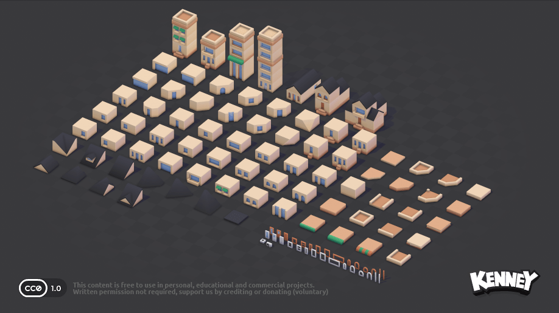
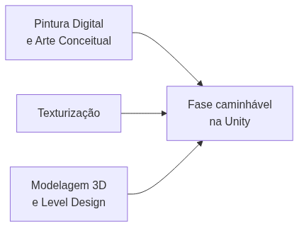
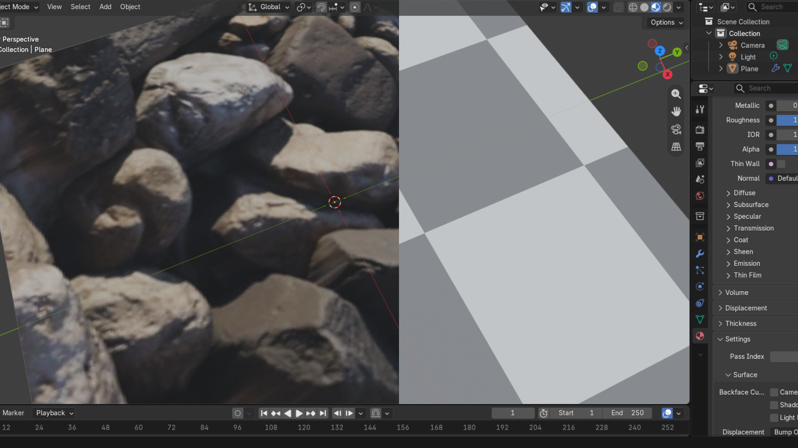
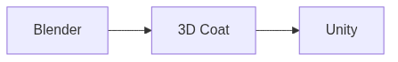
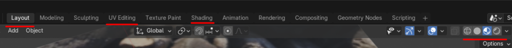
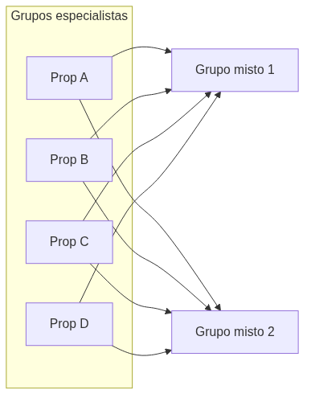

<!-- _class: cover -->
<!-- _paginate: false -->

# Texturização

## Do modelo à superfície

**Semana 1** — Vocabulário, pipeline e o trabalho interdisciplinar

<!--
Notas: Abrir sem pressa. Esta é a primeira aula do semestre — não há conteúdo anterior a retomar. A função da mini aula é situar o estudante no vocabulário, no pipeline e no projeto, antes de qualquer ferramenta.
-->

---

## Onde vamos chegar

Uma **fase caminhável** na Unity.

Construída por vocês, com **concept art**, **modelagem** e **texturização** coerentes entre si.

<!--
Notas: Esta é a promessa do semestre. Não é uma sequência de exercícios soltos — tudo alimenta um único entregável, apresentado na Semana 16. "Caminhável" significa apenas locomoção: não vamos programar gameplay. O valor está no ambiente.

[!FIGURA]
Objetivo didático — Tornar concreto o entregável final logo no primeiro dia, para que o estudante entenda a meta antes de qualquer conteúdo técnico.
Arquivo sugerido — assets/fase_caminhavel_exemplo.webp
Descrição — Captura de uma cena caminhável simples na Unity, em perspectiva de primeira pessoa, montada com peças modulares repetidas (chão, parede, pilar, detalhe); um pequeno inset no canto mostra a mesma cena em vista de topo, revelando a modularidade.
Como produzir — Montar no Blender 4–5 peças modulares simples de um tema qualquer, exportar em FBX e montar uma sala na Unity com o First Person Controller padrão. Capturar a tela em Game View e, em vista de topo, na Scene View. Compor as duas capturas em uma única imagem no Krita.
-->

---

<!-- _class: diagram -->

## Três disciplinas, um entregável

<!--
Notas: Deixar muito claro que o projeto é único e compartilhado. O concept art define a direção, a modelagem entrega a geometria, a texturização entrega a superfície. Nenhuma disciplina fecha o projeto sozinha — e o recorte temático nasce do diálogo entre as três, não é escolhido isoladamente aqui.
-->

---

Ao final da semana você será capaz de:

- Descrever o **pipeline** da disciplina
- Diferenciar textura **raster** e **procedural**
- Explicar o **trabalho interdisciplinar** do semestre
- Reconhecer os workspaces básicos do **Blender**
- Transformar um **prop cultural real** em ideia fantástica

<!--
Notas: Ler rápido, sem detalhar. Os quatro primeiros objetivos são cobertos na mini aula e na demonstração; o último é o trabalho do estúdio de hoje. Avisar que haverá uma checagem rápida no fechamento do segundo encontro.
-->

---

<!-- _class: question -->

# Qual a diferença entre a **cor** de um objeto e o **material** dele?

<!--
Notas: Deixar 2–3 respostas rápidas da turma antes de apresentar o conceito. Não corrigir — usar as respostas como ponte. A intuição costuma ser: cor é "o que se vê", material é "do que é feito". Aproveitar para introduzir o vocabulário do Cap. 1 da apostila.
-->

---

## Textura

Uma **imagem** mapeada sobre uma superfície 3D.

Representa cor, rugosidade, reflexo, relevo...

<!--
Notas: Enfatizar que textura é dado visual "colado" na superfície. Ainda não falar em tipos de mapa nem em UV — isso vem na Semana 2. Manter no nível conceitual. Referência: apostila, Parte I, Cap. 1.
-->

---

## Material

Conjunto de **propriedades** que define como a superfície reage à luz.

Um material pode conter **uma ou mais texturas**.

<!--
Notas: Material é o "recipiente"; textura é o "conteúdo". Essa relação hierárquica volta com força quando chegarmos ao PBR. Não abrir o Principled BSDF em detalhe agora — apenas nomear na demonstração.
-->

---

## Raster × Procedural

| Raster | Procedural |
|---|---|
| Imagem em pixels (bitmap) | Gerada por algoritmo |
| Controle detalhado | Resolução infinita |
| Ocupa memória | Leve, ajustável |

<!--
Notas: Duas abordagens complementares, não rivais. Nesta disciplina o foco é raster/PBR pintado no 3D Coat, mas o estudante precisa reconhecer o vocabulário. O conceito volta com aplicação prática na Semana 7 (Normal Map procedural) — dizer isso em voz alta.
-->

---

## Raster × Procedural na prática

<!--
Notas: Mostrar o contraste visual e seguir. Não abrir nós procedurais agora. Basta que o estudante veja: uma pixeliza ao ampliar, a outra não.

[!FIGURA]
Objetivo didático — Tornar concreta a diferença entre bitmap e algoritmo, que é abstrata quando explicada só por palavras.
Arquivo sugerido — assets/raster_vs_procedural.webp (já existe como .png em assets/)
Descrição — Duas metades lado a lado da mesma superfície ampliada: à esquerda uma textura raster mostrando os pixels; à direita uma textura procedural (ruído ou xadrez) permanecendo nítida na mesma ampliação.
Como produzir — No Blender, criar um plano com uma imagem raster de baixa resolução ampliada e outro com um nó procedural (Noise/Checker). Renderizar um close comparativo. Montar a divisão lado a lado no Krita.
-->

---

<!-- _class: diagram -->

## O pipeline da disciplina

Modelagem + UV → Texturização PBR → Motor de jogo

<!--
Notas: Nomear as etapas, sem detalhar UV nem PBR. O importante é o senso de trajetória: o estudante precisa saber que existe um caminho e onde cada semana se encaixa nele. Referência: apostila, Parte VI, Cap. 25.
-->

---

## Cada etapa tem um papel

- **Blender** — modelar e abrir o mapa **UV**
- **3D Coat** — pintar os **materiais PBR**
- **Unity** — integrar ao **motor de jogo**

Trocar de ferramenta entre etapas especializadas é o padrão em estúdios de games.

<!--
Notas: Nenhum software substitui o outro nesse fluxo. Se surgirem perguntas técnicas avançadas sobre PBR ou UV, responder: "Vamos chegar nisso na semana X." Não antecipar conteúdo.
-->

---

## O tema do semestre

Um **mundo fantástico original**, criado a partir de elementos **regionais de Mato Grosso do Sul**.

Ou do seu estado de origem.

<!--
Notas: Não é "fazer um jogo sobre MS". É usar o repertório cultural real como matéria-prima de fantasia. O recorte não fecha hoje — ele amadurece até a Semana 3, quando definimos o Hero Asset Referência. Hoje, começamos a gerar matéria-prima.
-->

---

<!-- _class: image-right -->

## Partimos de bens culturais reais

Cerâmica Terena • Viola de Cocho • Tereré • Chamamé • Capoeira

Complexo Ferroviário Noroeste • Igrejas históricas • Usina Santo Antônio

<!--
Notas: Vitrine, não aula sobre cada item — o aprofundamento é trabalho dos grupos no estúdio. Fonte: Relação de Bens Materiais e Imateriais do Estado de Mato Grosso do Sul (Fundação de Cultura de MS). Mencionar que vários desses bens são patrimônio da humanidade pela UNESCO — isso dá peso à pesquisa.

[!FIGURA]
Objetivo didático — Apresentar visualmente os props culturais disponíveis para que a divisão em grupos seja rápida e informada, e não uma escolha às cegas por nome.
Arquivo sugerido — assets/props_ms_vitrine.webp
Descrição — Grade de 8 células, uma por prop, cada célula com uma fotografia de referência e o nome do bem cultural embaixo, em tipografia limpa e uniforme.
Como produzir — Reunir 8 fotografias de referência (fontes oficiais: Fundação de Cultura de MS, IPHAN, acervos públicos) e montar a grade no Krita com molduras e rótulos padronizados. Registrar os créditos das imagens em um slide de apêndice ou no rodapé do arquivo.
-->

---

Reduzir o prop ao clichê turístico — "pote indígena genérico", "boiadeiro genérico".

Tradução literal: o prop vira objeto mágico igual, só muda a cor.

<!--
Notas: São os dois riscos centrais do estúdio de hoje. Antecipar aqui poupa correção depois. Deixar claro que a estrutura da atividade (pesquisa aprofundada → reagrupamento → ideação forçada) existe justamente para evitar isso.
-->

---

**Essa ideia só funciona por causa do prop, ou você chegaria nela de qualquer jeito?**

Se a ideia sobrevive sem a pesquisa, ela ainda não é sua.

<!--
Notas: Esta é a pergunta de checagem que vou repetir circulando entre os grupos nos dois encontros. Vale escrever no quadro. É o critério prático de "não genérico": a ideia precisa depender da pesquisa cultural feita.
-->

---

<!-- _class: invert -->

## Na indústria

Nenhum estúdio pinta textura antes de decidir, por escrito e em imagem, para onde o projeto está indo.

A diferença entre um artista júnior e um sênior começa aqui: saber **de onde** uma decisão visual veio.

<!--
Notas: Contextualizar o valor profissional da etapa de pesquisa, que costuma ser vista como "enrolação" antes do software. Amarrar a C1 (Processo de Projeto) e C2 (Direção Artística) da Rubrica Mestre — critérios já ativos nesta semana.
-->

---

<!-- _class: summary-slide -->

# Resumo

- **Textura** = imagem na superfície • **Material** = como reage à luz
- **Raster** (pixels) × **Procedural** (algoritmo)
- Pipeline: **Blender → 3D Coat → Unity**
- Projeto: **fase caminhável** na Unity, com três disciplinas
- Tema: **mundo fantástico** a partir de bens culturais de MS

<!--
Notas: Fechar a mini aula amarrando os conceitos. Não reler tudo — apontar que cada item volta aplicado ao projeto. Os quatro primeiros itens serão checados rapidamente no fechamento do Encontro 2.
-->

---

## Agora: demonstração

Exemplos de **kits modulares** e de uma **fase caminhável**.

Depois, um tour pelo **Blender**: Shading Workspace • UV Editor • Viewport Shading.

<!--
Notas: Transição para os 20 min de demonstração. Deixar claro que o tour do Blender é orientação espacial, não tutorial — o estudante só precisa reconhecer esses espaços quando voltar ao software. O mapeamento UV é ensinado na Semana 2.

[!FIGURA]
Objetivo didático — Orientar visualmente onde ficam os três espaços do Blender mostrados na demonstração, para que o estudante consiga reencontrá-los sozinho.
Arquivo sugerido — assets/blender_workspaces_tour.webp (já existe como .png em assets/)
Descrição — Captura da interface do Blender com três áreas destacadas e rotuladas: Shading Workspace (node editor), UV Editor e o seletor de Viewport Shading (Solid / Material Preview / Rendered).
Como produzir — Abrir o Blender com um modelo simples já mapeado, capturar a interface e adicionar rótulos e setas nas três áreas usando o Krita.
-->

---

<!-- _class: chapter -->

02

# Produção em estúdio

Da pesquisa cultural à ideia fantástica

<!--
Notas: Divisória entre a mini aula e o estúdio. Os slides a seguir ficam projetados durante a produção — são referência de consigna e de tempo para a turma, não material de exposição. Não ler em voz alta: apresentar cada um no momento em que a etapa começa.
-->

---

<!-- _class: exercise -->

## Etapa 1 — Grupos especialistas

**Um grupo por prop. 35 minutos.** Ao final, o grupo precisa conseguir **ensinar** o prop para quem nunca ouviu falar dele.

- O que é, e de onde vem?
- Como é feito ou praticado?
- Que **materiais**, formas e cores estão associados a ele?
- Que histórias ou simbologias ele carrega?

Registrem em um documento ou painel do grupo — texto **e** imagens de referência.

<!--
Notas: Timebox real da etapa: 5 min de vitrine dos props + 5 min de divisão dos grupos + 35 min de pesquisa. Evitar que todos os grupos queiram o prop "mais famoso" — sorteio ou distribuição resolve.

Circular perguntando, sem entregar resposta pronta: "Que material vocês imaginam predominando aqui — pedra, madeira, barro, metal, fibra?" / "O que torna esse prop reconhecível à primeira vista?" / "Tem alguma história ou disputa por trás disso?"

Checagem antes de liberar a etapa: o grupo consegue responder a 3 perguntas concretas (material, origem, uso)? Se não, a pesquisa está rasa e o jigsaw do Encontro 2 não vai funcionar.
-->

---

<!-- _class: diagram -->

## Reagrupamento

Cada grupo novo recebe **um especialista de cada prop**.

<!--
Notas: 5 minutos. Preparar previamente uma tabela de distribuição com nomes, ajustando na hora conforme presença. Grupos podem ter 2 integrantes do mesmo prop se o número não fechar — não é ideal, mas não invalida a dinâmica.

Explicar o porquê em uma frase: sozinho com o próprio prop, a tendência é a tradução literal. Cruzar props diferentes é o que gera ideias que ninguém acharia sozinho.
-->

---

<!-- _class: exercise -->

## Matriz morfológica — 15 min

Nas linhas, os **props** do grupo. Nas colunas, categorias de **fantasia**. Preencham ao menos **2 células por prop**.

|  | Criatura | Encantamento | Artefato | Fenômeno natural |
|---|---|---|---|---|
| **Viola de Cocho** | | | | afina o **clima** de uma região |
| **Cerâmica Terena** | | | | |
| **Tereré** | | | | |

<!--
Notas: A célula preenchida é o exemplo a dar em voz alta — Viola de Cocho × Fenômeno natural mágico → um instrumento que, ao ser tocado, "afina" o clima de uma região. Mostrar que a combinação forçada produz algo que nenhuma das duas colunas produziria sozinha.

Pedir que anotem os atributos de cada prop ao lado da linha (material, forma, cor, função, simbologia) — é deles que saem as combinações boas.

Se o grupo travar: aplicar a técnica a 1 prop só, e ampliar depois se sobrar tempo.
-->

---

<!-- _class: exercise -->

## SCAMPER — 15 min

Escolham **1–2 props** e passem por cada letra:

- **S**ubstituir — que material ou parte vira algo mágico?
- **C**ombinar — dois props do grupo viram um objeto só?
- **A**daptar — que outro contexto de fantasia usaria algo parecido?
- **M**odificar — e se for gigante, minúsculo, multiplicado?
- **P**ropor outro uso — para que mais serviria neste mundo?
- **E**liminar — o que sobra de essencial sem a parte óbvia?
- **R**earranjar — e se a lógica do prop for invertida?

<!--
Notas: É a técnica mais lenta de explicar das três. Em turmas mais lentas, esta é a que pode virar lição de casa leve — mantenha matriz morfológica e conexões forçadas, que são mais visuais e rápidas.

Não é preciso preencher as 7 letras com qualidade: 2 ou 3 respostas fortes valem mais que 7 rasas.
-->

---

<!-- _class: exercise -->

## Conexões forçadas — 15 min

Cada grupo sorteia **um** elemento de fantasia genérico:

**uma maldição • uma criatura guardiã • um portal • uma relíquia perdida**

Conectem esse elemento a um dos props do grupo e **justifiquem a ligação em 2–3 frases**.

A justificativa é obrigatória. Sem ela, a conexão é arbitrária — não é ideação.

<!--
Notas: A exigência das 2–3 frases é o principal ponto de checagem contra o clichê. Se a justificativa funciona trocando o prop por qualquer outro, a conexão ainda é arbitrária.

Repetir a pergunta de checagem circulando: "essa ideia só funciona por causa do prop, ou você chegaria nela de qualquer jeito?" e "o que dessa ideia ainda é fiel ao material/forma/função real do prop, e o que já é invenção livre?"

Registro escrito das três dinâmicas = base do C1 (Processo de Projeto) desta semana.
-->

---

<!-- _class: exercise -->

## Antes de sair

Escolha, **individualmente**, **1 ou 2 ideias** geradas hoje que você quer levar adiante.

Podem ser do seu prop original ou de outro.

Não é decisão final. O recorte temático só fecha na **Semana 3**, junto com o Hero Asset Referência.

<!--
Notas: 5–10 min finais dentro do bloco de 60. Registro em post-it físico ou digital — é o insumo que o estudante carrega para a Semana 2. Não é avaliado.

Fechamento (10 min): síntese da semana + checagem rápida dos Objetivos 1, 2 e 6 ("as três etapas do pipeline?", "raster × procedural?", "onde fica o UV Editor?") + ponte para a Semana 2: trazer o Blender instalado.
-->
