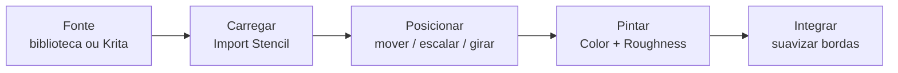

<!-- _class: cover -->
<!-- _paginate: false -->

# O carimbo e o molde

## Stencils: detalhe preciso, reproduzível e intencional

**Semana 10** — Uso de stencils no 3D Coat e criação de alphas no Krita

<!--
Notas: Abertura da mini aula (20 min). Unidade III — Pintura Digital e Bake. Crítica 🔵 Informal nesta semana. Mensagem central: na Semana 9 os estudantes aprenderam a pintar desgaste à mão livre (edge wear, dirt, scratches) no Asset 01. Hoje entra uma nova FORMA de adicionar detalhe: o stencil. Não é técnica concorrente com a pintura livre — é complementar. Se a pintura livre é desenhar à mão, o stencil é um gabarito com controle total de posição, escala e ângulo. O foco desta semana migra do Asset 01 (desgaste orgânico) para o Asset 02 (detalhe específico e temático via stencil). Deixar claro na capa a metáfora que guia a aula: alpha = carimbo; stencil = molde parado enquanto se passa a tinta por cima.
-->

---

## Objetivos de hoje

Ao final da semana você será capaz de:

- Distinguir **stencil** de **alpha/brush** e saber quando cada um serve
- Selecionar **fontes de stencil** ou criar o seu no Krita a partir de foto
- Aplicar um stencil com controle de **posição, escala, rotação e opacidade**
- Decidir **onde e por que** o stencil contribui para a narrativa do asset
- **Integrar** o stencil ao material com pintura livre (sem efeito "colado")

<!--
Notas: Ler rápido. Não antecipar bake de Normal/AO/Curvature (Semana 11) nem trim sheets/atlas (Unidade IV). Hoje é detalhe estampado com intenção, usando o 3D Coat já conhecido da Semana 8 e a pintura livre da Semana 9. O objetivo 4 (decisão projetual) é o coração da aula — o stencil é ferramenta de precisão, não de conveniência. Reforçar que a técnica é simples; a decisão de onde e por que aplicar é o que importa.
-->

---

<!-- _class: question -->

# Mesma rachadura, duas mãos. Qual pertence à pedra?

<!--
Notas: Pergunta de abertura. Exibir duas imagens lado a lado da MESMA superfície de pedra: à esquerda, rachaduras pintadas à mão com brush (orgânicas, imprecisas); à direita, rachaduras aplicadas por stencil (precisas, definidas, reproduzíveis). Perguntar: "Qual parece mais natural? Em que contexto cada uma faz mais sentido?". Deixar 2-3 respostas. Direcionar: stencil não é melhor nem pior que pintura livre — é uma ferramenta diferente para uma necessidade diferente. Padrão específico, reproduzível e controlado → stencil. Orgânico, único e irregular → pintura livre. O objetivo da semana é usar as duas juntas.

[!FIGURA]
Objetivo didático: materializar a distinção central da aula — precisão controlada (stencil) versus irregularidade orgânica (pintura livre) — antes de qualquer explicação de menu.
Arquivo sugerido: assets/rachadura_brush_vs_stencil.webp
Descrição: comparação lado a lado da mesma superfície de pedra. À esquerda, rachadura pintada à mão livre com brush, com traços irregulares e bordas imprecisas. À direita, a mesma rachadura aplicada por stencil, com forma definida, ramificações nítidas e bordas limpas.
Como produzir: no 3D Coat, no asset de pedra de demonstração, pintar uma rachadura à mão livre no canal Color e capturar o Render Room; em seguida, aplicar um stencil de rachadura e capturar no mesmo ângulo e iluminação. Compor as duas capturas lado a lado no Krita.
-->

---

## De onde viemos: Semana 9

Você já sabe adicionar detalhe **à mão livre** no 3D Coat:

- **Edge wear** nas arestas expostas
- **Dirt / grime** nas cavidades (Multiply)
- **Scratches** na direção do uso

<div class="tip">

A pintura livre entrega o **orgânico e irregular**. Hoje adicionamos a ferramenta do **específico e controlado**.

</div>

<!--
Notas: Revisão rápida. A Semana 9 desenvolveu a linguagem do desgaste por pintura livre no Asset 01. Reforçar que essas técnicas continuam válidas — o stencil não as substitui, soma-se a elas. O foco desta semana passa para o Asset 02, que recebe detalhe específico e temático via stencil. Lembrar de revisitar o moodboard do kit antes de escolher o stencil: a decisão vem das referências, não da coleção disponível.
-->

---

## Stencil × Alpha: a distinção fundamental

- **Alpha** — textura na ponta do brush; "carimba" ao longo do traço. Depende de tamanho, pressão e caminho.
- **Stencil** — máscara **estática** projetada no espaço 3D; fica **fixa** como um gabarito. Você pinta *por cima* dela.

<div class="tip">

O alpha é o **carimbo**. O stencil é o **molde** que fica parado enquanto você passa a tinta por cima.

</div>

<!--
Notas: A distinção mais importante da aula — e a fonte do erro mais comum de interface (usar o painel de Alphas em vez do de Stencils). O alpha se repete ao longo da pincelada; o stencil permanece fixo no espaço 3D independentemente de onde o brush passa. No 3D Coat, o stencil fica no painel Stencils (aba lateral) e é ativado/desativado com a tecla S. Com o stencil ativo, qualquer brush obedece ao gabarito. Deixar a metáfora carimbo/molde bem fixada — ela resolve a confusão no estúdio.
-->

---

<!-- _class: diagram -->

## Fluxo de trabalho com stencil



<!--
Notas: Este é o percurso completo que a demonstração e o estúdio seguem. Cinco etapas: obter a fonte (biblioteca do professor ou criação no Krita) → carregar no painel Stencils → posicionar com intenção → pintar em pelo menos dois canais → integrar suavizando as bordas. O GitHub Action converte o mermaid em imagem. Não deixar o diagrama grande — cinco nós em linha bastam para ancorar a estrutura da aula.
-->

---

## Fontes de stencil

De onde vêm os gabaritos:

- **Poly Haven / ArtStation** — coleções gratuitas por categoria
- **Alphas de ZBrush** — compatíveis com o 3D Coat
- **Krita** — qualquer foto vira stencil em minutos

<div class="tip">

Convenção: **fundo preto** (não pinta) + **detalhe branco** (pinta). No 3D Coat, o modo **Multiply** respeita isso automaticamente.

</div>

<!--
Notas: O estudante não precisa depender só da coleção fornecida pelo professor. Reforçar que qualquer imagem em escala de cinza pode virar stencil. A convenção fundo preto / detalhe branco é o que faz o stencil funcionar no modo Multiply — importante para não inverter o resultado. A coleção da disciplina está organizada por categoria (rachaduras, corrosão, símbolos/padrões). Próximo slide detalha a criação no Krita.
-->

---

## Criar um stencil no Krita

De uma foto de referência a um gabarito, em quatro passos:

1. Abrir a **foto** (ex.: parede rachada)
2. `Filters → Adjust → Brightness/Contrast` — contraste **alto** isola o detalhe
3. `Image → Convert Color Space → Grayscale`
4. `File → Export → PNG 1024×1024`

<div class="industry">

A internet de referências de superfície é uma **biblioteca de stencils** esperando ser convertida.

</div>

<!--
Notas: Explicar o PORQUÊ de cada passo, não só o clique. O contraste alto separa o detalhe (rachadura) do fundo; a conversão para grayscale garante que o 3D Coat leia o gabarito como máscara; o PNG 1024 é resolução suficiente para a maioria dos detalhes. Na demonstração este bloco leva ~4 min mas tem alto valor pedagógico: mostra ao estudante que ele não está limitado à biblioteca pronta. Opcional: Filters → Edge Detection para extrair só as bordas.
-->

---

## Quando usar stencil: a decisão projetual

Stencil é a ferramenta certa quando o detalhe:

- Tem **forma específica e reconhecível** (rachadura ramificada, símbolo entalhado)
- Precisa ser **reproduzido** em várias faces ou assets (padrão, marca, grade)
- Tem **escala e posição intencionais** na composição

<div class="warning">

Variação orgânica de cor, sujeira progressiva e edge wear **não** pedem stencil — pedem pintura livre.

</div>

<!--
Notas: O coração da aula. A pergunta que o estudante faz ANTES de abrir o stencil: "Esse detalhe precisa ser específico e controlado, ou pode ser orgânico e irregular?". Se específico → stencil. Se orgânico → brush. Insistir: o stencil responde a uma necessidade do tema (rachadura, símbolo, corrosão, padrão de uso) — nunca é aplicado aleatoriamente. Este slide sustenta o critério C5 (Texturização) e a mediação circulante do estúdio: "O que esse objeto sofreu que deixaria essa marca específica?".
-->

---

## Posicionar com intenção, não onde "coube"

O stencil conta a história de um **evento específico**.

- Rachaduras começam em **pontos de tensão** — arestas, furos, transições
- Símbolos têm **posição compositiva** — centro de um escudo, face principal
- O gabarito fica **fixo** no espaço: mude de câmera e ele não se move

<div class="tip">

Antes de pintar, responda: *"Por que aqui? O que causou esse detalhe neste ponto?"*

</div>

<!--
Notas: Segundo erro-chave depois da integração: posicionamento aleatório. Rachaduras no meio de uma superfície plana sem fissuras ao redor denunciam falta de lógica narrativa. Demonstrar que o stencil permanece fixo enquanto se muda de face reforça a natureza de "gabarito no espaço" (não segue o brush). A incapacidade do estudante de justificar a posição é o sinal a caçar na circulação. Controles no 3D Coat: Drag move, Ctrl+Drag escala, Shift+Drag rotaciona; tecla S ativa/desativa.
-->

---

## Integração: o stencil precisa pertencer ao material

Aplicar e deixar por aí → o detalhe parece **estampado**, flutuando. Integrar tem duas etapas:

- **Suavizar bordas** — brush de opacidade baixa (10–15%) funde o stencil ao material
- **Resposta do material** — o detalhe muda a **roughness**, não só a cor

<div class="tip">

Uma rachadura real é mais rugosa nos bordos. Aplicar só no **Color** não basta.

</div>

<!--
Notas: O erro mais comum de todos: stencil sem integração de bordas, resultando em efeito "colado sobre". A suavização de bordas NÃO é etapa opcional de finalização — é parte do fluxo. E o detalhe precisa ressoar em outros canais: pintar o stencil também no Roughness (fratura de pedra = mais rugosa; símbolo entalhado = pode ser polido nas bordas; corrosão = muito rugosa). O protocolo do estúdio exige aplicação em DOIS canais (Color e Roughness) — se só existir Stencil_Color, o trabalho está incompleto.
-->

---

## Uma camada por detalhe, nomeada por função

```
Stencil_Rachadura_Color   ← detalhe no canal de cor
Stencil_Rachadura_Rough   ← mesma forma no roughness

Dirt_Color                ← sujeira acumulada no detalhe
```

Salvar com sufixo `_S10`. Ajustar um detalhe sem retrabalhar os outros.

<!--
Notas: Nomenclatura como na Semana 9 — critério C1 (Processo de Projeto) na rubrica. Camadas nomeadas por função, nunca "Layer 1". O mesmo gabarito gera duas camadas (Color e Roughness); o Dirt integra o detalhe ao contexto (sujeira acumula dentro da rachadura, ao redor do símbolo). Salvar como [Nome]_Asset02_S10.3b. Screenshot do Paint Room com painel de Stencils e camadas nomeadas visível é evidência de aprendizagem.
-->

---

## Erros comuns

<div class="error">

**Stencil incongruente** — rachadura de concreto em metal polido; não pertence ao material.

</div>

<div class="error">

**Bordas recortadas** — sem suavização, parece "colado sobre" a superfície.

</div>

<div class="error">

**Só no Color** — o detalhe existe, mas não muda a roughness nem responde à luz.

</div>

<!--
Notas: Os três erros mais frequentes, alinhados às Possíveis Dificuldades do plano de aula. Circular no estúdio caçando exatamente estes padrões. Incongruência: antes de carregar, o estudante responde em voz alta "esse detalhe acontece nesse material, nesse universo?". Bordas: verificar ativamente se a suavização foi feita antes de liberar o estudante. Só no Color: conferir o painel de camadas — sem Stencil_Rough, incompleto. Um quarto erro a mencionar oralmente: usar o painel de Alphas em vez do de Stencils (o detalhe se repete no traço em vez de ficar fixo).
-->

---

<!-- _class: summary-slide -->

# Resumo

- **Stencil** é máscara fixa (molde); **alpha** é carimbo no traço do brush
- Fontes: biblioteca, Poly Haven/ArtStation ou **criado no Krita** a partir de foto
- Use stencil para o **específico e controlado**; pintura livre para o orgânico
- **Posição com intenção** — o detalhe conta a história de um evento
- **Integrar sempre**: suavizar bordas + aplicar no **Color e no Roughness**

<!--
Notas: Amarrar a mini aula antes da demonstração. Cada item retorna na demonstração ao vivo (carregar → posicionar → Color → Roughness → integrar → criar no Krita) e no estúdio (Asset 02 recebe o detalhe de stencil). Lembrar: semana de crítica 🔵 Informal — sem nota, mas o professor registra evidências de C5 e C2 para calibrar a CF4 (Semana 11). O Asset 02 precisa sair desta semana em estado de apresentação.
-->

---

## Agora: demonstração

A seguir, ao vivo no 3D Coat: carregar e **posicionar** um stencil de rachadura, aplicar no **Color** e no **Roughness**, **criar um stencil no Krita** e **integrar** as bordas.

A pergunta que você leva ao estúdio: **esse detalhe pertence ao material ou está por cima?**


<!--
Notas: Transição para a demonstração de 20 min. Sequência: asset de pedra com três camadas base → Import Stencil de rachadura → posicionar saindo de uma aresta em direção ao centro → Stencil_Rachadura_Color (interior mais claro) → Stencil_Rachadura_Rough (fratura mais rugosa + micro-trincas) → criar stencil no Krita a partir de foto → integrar bordas com brush 10%. Verificar cada etapa no Render Room. Não demonstrar bake nem trim sheet — fora do escopo desta semana.

[!FIGURA]
Objetivo didático: antecipar o resultado esperado da demonstração para que a turma reconheça o alvo visual antes de produzir no estúdio.
Arquivo sugerido: assets/demo_stencil_rachadura.webp
Descrição: captura do Render Room do 3D Coat mostrando o asset de pedra com uma rachadura aplicada por stencil, saindo de uma aresta em direção ao centro — interior mais claro no Color e superfície mais rugosa no Roughness, com micro-trincas irradiando. Painel de Stencils visível à lateral com o gabarito carregado e o painel de Layers com Stencil_Rachadura_Color e Stencil_Rachadura_Rough nomeadas.
Como produzir: no 3D Coat, aplicar o stencil de rachadura no asset de demonstração seguindo o percurso da demonstração (Color + Roughness + integração de bordas); abrir o Render Room com iluminação HDR e capturar em ângulo que mostre a rachadura na aresta, com os painéis de Stencils e Layers abertos.
-->
