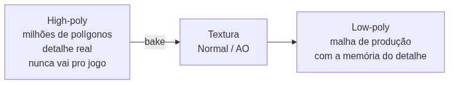
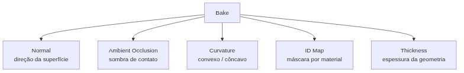

<!-- _class: cover -->
<!-- _paginate: false -->

# Detalhe que a luz acredita

## Bake de Normal Map, AO e Curvature

**Semana 11** — Transferindo detalhe de geometria do high-poly para o low-poly

<!--
Notas: Abertura da mini aula (20 min). Unidade III — Pintura Digital e Bake. Crítica 🔴 FORMAL (CF4) nesta semana — a 4ª das 6, primeira a avaliar o Critério 6 (Bake). Mensagem central: até agora todo detalhe foi pintado à mão sobre o low-poly (S09 desgaste, S10 stencil). Hoje entra uma peça nova de workflow — esculpir/modelar detalhe em uma malha auxiliar de alta resolução e TRANSFERIR esse detalhe para o low-poly pelo bake. Deixar claro na capa: o bake não substitui a pintura; ele resolve o que a pintura não resolve bem — detalhe de geometria real (chanfros, entalhes profundos). Apostila: Cap. 8.
-->

---

## Objetivos de hoje

Ao final da semana você será capaz de:

- Explicar o que é **bake** e diferenciar o papel do **high-poly** (fonte) do **low-poly** (produção)
- Reconhecer os cinco mapas de bake: **Normal, AO, Curvature, ID Map e Thickness**
- Configurar **cage**, **ray distance** e **resolução** de um bake no Blender
- Executar **Normal Map** e **AO** sem artefatos visíveis
- Integrar o bake ao material que já convive com **desgaste** e **stencil**

<!--
Notas: Ler rápido. O foco PRODUTIVO da semana é apenas Normal e AO — Curvature e ID Map são apresentados hoje só conceitualmente e voltam com demonstração completa na Semana 12. Não antecipar o mascaramento automático por Curvature/ID. Objetivos alinhados ao plano de aula (itens 1 a 5); o item 6 — apresentação na CF4 — é tratado no encontro 2.
-->

---

<!-- _class: question -->

# A mesma malha, o mesmo número de polígonos. Por que uma parece ter mais detalhe?

<!--
Notas: Pergunta de abertura (do plano de aula). Exibir um objeto do kit — ex.: um baú — em duas versões: low-poly de produção com arestas retas, e a MESMA malha com Normal Map de bake mostrando chanfros e profundidade nos entalhes da tampa. Deixar 2-3 respostas. Direcionar para a ideia central: o Normal Map engana a luz — não adiciona geometria, informa ao motor como a luz deveria se comportar como se houvesse geometria ali.

[!FIGURA]
Objetivo didático: materializar em uma imagem o salto conceitual de toda a aula — geometria idêntica, leitura de detalhe completamente diferente.
Arquivo sugerido: assets/mesma_malha_com_bake.webp
Descrição: comparação lado a lado do MESMO asset low-poly (ex.: baú ou tampa de baú do kit). À esquerda, versão crua com arestas retas e sem chanfro; contador de polígonos visível. À direita, a mesma malha com Normal Map de bake aplicado, exibindo chanfros e profundidade nos entalhes — mesmo contador de polígonos.
Como produzir: no Blender, abrir o asset low-poly de demonstração; capturar o viewport Rendered sem Normal Map; depois conectar o Normal Map baked e capturar do mesmo ângulo e iluminação. Exibir o painel de estatísticas (polígonos) em ambas. Compor lado a lado no Krita.
-->

---

## De onde viemos: Semanas 9 e 10

Todo o detalhe até aqui foi **pintado à mão** sobre o low-poly, no 3D Coat:

- **Semana 9** — desgaste: edge wear, dirt, scratches
- **Semana 10** — stencil: rachaduras, símbolos, corrosão

Hoje não trocamos a pintura por outra coisa. Adicionamos uma fonte nova de detalhe: a **geometria real** de uma malha auxiliar.

<!--
Notas: Revisão rápida. Reforçar a nota de transição do plano de aula: o bake NÃO substitui o que foi aprendido — um Normal Map de bake convive no mesmo material com o EdgeWear e o Dirt pintados. A pintura livre resolve mal detalhe de geometria profunda (chanfros, entalhes, sobreposição de placas); é exatamente esse buraco que o bake preenche.
-->

---

## O que é bake?

Bake é **transferir informação de superfície** de uma malha para outra, gravando o resultado em uma textura.

- A informação sai de uma malha que **tem** a geometria (high-poly)
- É gravada em um mapa que a malha **sem** a geometria (low-poly) pode usar
- A projeção acontece **através do UV** — por isso o UV precisa estar pronto

<!--
Notas: Definição central. A palavra-chave é TRANSFERÊNCIA via projeção pelo UV. Amarrar ao pré-requisito: o low-poly já foi UV mapeado nas Semanas 2 a 4 — sem UV limpo não há bake limpo. O padding das ilhas (Semana 4) volta a importar aqui, agora como qualidade de bake.
-->

---

## Dois papéis, uma mesma peça

<!--
Notas: O high-poly existe SÓ para ser "fotografado" pelo bake e pode até ser descartado. A malha que joga é sempre o low-poly — mas com a memória do detalhe gravada em textura. Frase do plano de aula: "O high-poly nunca aparece no jogo." O GitHub Action converte o mermaid em imagem; por isso o diagrama vai no markdown, não na nota.
-->

---

<!-- _class: diagram -->

## Os cinco mapas de bake

Hoje você domina os **dois primeiros**. Os outros três você já sabe que existem — metade do caminho para usá-los na Semana 12.

<!--
Notas: Visão geral — foco produtivo só em Normal e AO. Curvature e ID Map são mencionados aqui apenas conceitualmente e voltam com tempo dedicado na Semana 12 (mascaramento automático). Resistir à tentação de aprofundar Curvature/ID agora, como alerta a nota do plano de aula. Thickness: usado para simular subsurface em materiais orgânicos/translúcidos.
-->

---

## Normal Map — a ilusão de profundidade

Captura a **direção de cada face** do high-poly e grava como cor RGB.

- É o mapa **mais importante** do bake
- Reconstrói chanfros e entalhes sem adicionar um único polígono
- Espaço **Tangent** (padrão para motores de jogo e 3D Coat)

<!--
Notas: O Normal Map é o coração da semana. A textura resultante é roxo-azulada característica (Tangent Space). Ele não muda a silhueta do objeto — engana só o sombreamento da superfície. Por isso continua sendo importante ter geometria de silhueta correta no low-poly; o bake resolve o detalhe interno, não o contorno.
-->

---

## Ambient Occlusion — sombra de contato

Captura o quanto cada ponto está **abrigado da luz ambiente** por geometria vizinha.

- Frestas, cantos e reentrâncias ficam mais **escuros**
- É um mapa em escala de cinza
- Entra **multiplicado** sobre o Albedo para reforçar profundidade

<!--
Notas: A AO sozinha, sem cor nenhuma, já dá leitura de profundidade forte — por isso é multiplicada sobre o Albedo. No estúdio ela entra como camada Multiply (60-80% de opacidade) sobre o Color, reforçando as frestas e cantos que o Dirt pintado nas Semanas 9-10 já sugeria. É a ponte entre o bake e o desgaste pintado.
-->

---

## Os parâmetros que decidem o resultado

- **Cage** — envelope extrudido do low-poly onde o Blender procura o high-poly
- **Ray distance / Extrusion** — distância que o raio viaja em busca do detalhe
- **Resolução** — coerente com os mapas do asset (1024 ou 2048)
- **Margin / Padding** — margem nas bordas das ilhas de UV

Cage pequena demais: o bake fica liso. Grande demais: captura geometria vizinha errada. É ajuste gradual — comece pequeno.

<!--
Notas: Estes quatro parâmetros são o motivo de esta mini aula ser mais densa que as anteriores — bake precisa ser entendido ANTES de usado (ao contrário da pintura, onde o erro é visualmente óbvio e corrigível na hora). O Margin retoma o princípio de padding da Semana 4, agora aplicado à qualidade do bake. Não aprofundar cage customizada vs. extrusion automática aqui — isso aparece na demonstração.
-->

---

## Onde o bake encontra o que você já sabe

O Normal Map de bake **não substitui** nada — ele **se soma**.

- Convive com o **Normal procedural** da Semana 7
- Convive com o **desgaste pintado** das Semanas 9 e 10
- No 3D Coat, entra como **camada adicional** no canal Normal

<!--
Notas: Ponto conceitual que gera confusão e volta nas estratégias de mediação. Analogia útil: o procedural da S7 é como textura de pele (padrão geral repetido por toda a superfície); o bake de hoje é como uma cicatriz específica (detalhe único, localizado, que veio de geometria real ali). Os dois coexistem no mesmo canal Normal, em camadas separadas. O EdgeWear/Dirt continuam pintados por cima ou ao redor.
-->

---

## Erros comuns

**Escala diferente** entre high e low-poly — bake vazio ou puro ruído. Verifique `Scale` no painel N **antes** de tudo.

**Cage grande demais** — bleeding: grava geometria de outra face. Reduza a extrusion pela metade e regrave.

**Ordem de seleção errada** — o Blender bakeia para o objeto **ativo** (o último selecionado).

<!--
Notas: Os três erros mais frequentes, na ordem das Possíveis Dificuldades do plano de aula. A escala é SEMPRE o primeiro ponto de verificação — antes de mexer em qualquer parâmetro de cage. Ordem de seleção: high-poly primeiro, depois Shift+clique no low-poly (ativo por último, contorno laranja mais claro). Circular no estúdio caçando exatamente estes três padrões.
-->

---

## Sempre verifique rotacionando

Um artefato que não aparece de um ângulo pode aparecer claramente de outro.

Manchas em superfícies que deveriam ser planas = sinal clássico de **cage mal ajustada**.

Rotacione o asset no viewport **antes** de declarar o bake pronto.

<!--
Notas: Vira hábito de trabalho, como a "leitura à distância" da Semana 9. O gesto — girar o objeto e conferir cada face antes de considerar pronto — deve ser repetido a cada bake no estúdio. É a defesa contra entregar um bake com artefato para a CF4. Se disponível, mostrar um exemplo de erro preparado previamente para contraste no Image Editor.
-->

---

## Curvature e ID Map: só um aperitivo

Aparecem hoje **apenas como conceito** — voltam com tempo na Semana 12:

- **Curvature** — detecta convexo (arestas) e côncavo (frestas); base de máscara automática
- **ID Map** — cor sólida por material; máscara de seleção rápida

<!--
Notas: Deliberadamente breve. A nota do professor no plano de aula é explícita: resistir à tentação de aprofundar Curvature e ID Map agora — eles voltam na Semana 12 com demonstração completa de mascaramento automático no 3D Coat. Deixar só a semente: para quem tem um asset com dois materiais distintos (ex.: madeira + metal), esse é o candidato ideal para ID Map na próxima semana.
-->

---

<!-- _class: summary-slide -->

# Resumo

- **Bake** transfere detalhe do **high-poly** para o **low-poly** via UV
- **Normal** engana a luz; **AO** dá sombra de contato (Multiply)
- **Cage, ray distance, resolução e padding** decidem a qualidade
- Verifique **escala** antes e **rotacione** para caçar artefatos
- O bake **se soma** ao desgaste e ao stencil — não os substitui

<!--
Notas: Amarrar a mini aula antes da demonstração. Cada item retorna na demonstração ao vivo (setup completo de Normal + AO no Blender) e no estúdio (high-poly de uma parte do asset + bake). Lembrar: hoje é 🔴 Crítica Formal CF4 no encontro 2 — Bake (C6) é avaliado pela primeira vez, com peso de 25% no Portfolio de Artefatos.
-->

---

## Agora: demonstração

A seguir, ao vivo no Blender: setup completo de bake de **Normal Map** e **AO** — cage, ray distance e verificação de artefatos.

A pergunta que você leva ao estúdio: **que parte do meu asset ganharia com detalhe de geometria real?**

<!--
Notas: Transição para a demonstração de 20 min. Sequência: par de malhas já carregado (high-poly com chanfros/entalhes + low-poly com UV) → renomear e ordem de seleção → criar Image Texture Node de destino → Cycles + Selected to Active + Cage/Extrusion → bake Normal (Tangent) → bake AO → verificar artefatos rotacionando. Não demonstrar Curvature — só volta na Semana 12. No estúdio, cada estudante cria high-poly de UMA parte do Asset 01 ou 02 e executa o bake.

[!FIGURA]
Objetivo didático: antecipar o alvo visual da demonstração para que a turma reconheça o resultado esperado antes de produzir no estúdio.
Arquivo sugerido: assets/demo_setup_bake.webp
Descrição: captura do Blender com a cena de bake montada — high-poly (com chanfros e entalhes esculpidos) e low-poly (malha de produção) na mesma origem, viewport em wireframe mostrando o cage como envelope ao redor do low-poly. Ao lado, o painel Bake em Cycles com Selected to Active e Cage ativos, e o Image Editor exibindo um Normal Map roxo-azulado recém-gerado.
Como produzir: no Blender, carregar o par de malhas de demonstração; ativar Cycles, configurar Selected to Active com Cage/Extrusion; executar o bake de Normal Map; abrir o Image Editor com o mapa gerado e o viewport em wireframe mostrando o cage. Capturar a tela com os três painéis visíveis.
-->
