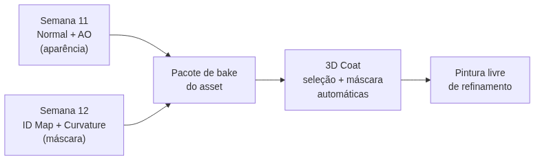

<!-- _class: cover -->
<!-- _paginate: false -->

# O bake que não se vê

## ID Map e Curvature como máscara

**Semana 12** — Quando o bake deixa de capturar aparência e passa a capturar informação

<!--
Notas: Abertura da mini aula (20 min). Unidade III — Pintura Digital e Bake. Crítica 🔵 INFORMAL nesta semana (circulante, sem nota). Apostila: Parte V, Cap. 15 — Bake de Texturas (ID Map e Curvature Map); Parte V, Cap. 17 — Máscaras, Stencils e Decals. Mensagem central da capa: até a Semana 11 todo bake existia para SER VISTO (Normal engana a luz, AO dá sombra de contato). Hoje entram dois mapas que NÃO são feitos para o olho — são feitos para o software LER e gerar seleção/máscara automática no 3D Coat. O processo de bake em si (cage, ray distance, resolução) já foi dominado na S11; o que muda é o PROPÓSITO. Não antecipar Atlas/Trim Sheets (S13-14).
-->

---

<!-- _class: objectives -->

## Objetivos de hoje

Ao final da semana você será capaz de:

- Diferenciar bake de **aparência** (Normal, AO) de bake de **máscara** (ID Map, Curvature)
- Configurar um **ID Map** com cor sólida e única por material
- Configurar um **Curvature Map** que lê arestas e sulcos da geometria
- Alimentar **Edge Highlight** e **Cavity Dirt** no 3D Coat com esses mapas
- Combinar máscara automática com o **desgaste pintado** das Semanas 9 e 10

<!--
Notas: Ler rápido. Os objetivos vêm dos itens 1 a 6 do plano de aula. Reforçar o item central: hoje NÃO se aprende um processo novo de bake — o fluxo de seleção, cage e execução já foi aprendido na S11. Muda o USO: gerar máscara para acelerar seleção, não adicionar detalhe visual direto. O item 6 (justificar na crítica circulante o que se beneficia de automação vs. pintura livre) é trabalhado no encontro 2.
-->

---

<!-- _class: question -->

# Como eu seleciono só o metal deste objeto sem clicar peça por peça?

<!--
Notas: Pergunta de abertura (do plano de aula). Exibir no projetor um asset com dois materiais distintos (madeira + metal) já texturizado na S10, ao lado do MESMO asset como um ID Map colorido (uma cor sólida por material). Deixar 2-3 respostas. Direcionar para a ideia central: cada cor sólida no ID Map corresponde a um material — o 3D Coat lê essa imagem e gera uma máscara de seleção instantânea, sem seams nem cliques manuais.

[!FIGURA]
Objetivo didático: materializar o salto conceitual da aula — a mesma peça vista como aparência (à esquerda) e como informação de seleção (à direita).
Arquivo sugerido: assets/asset_vs_idmap.webp
Descrição: comparação lado a lado do MESMO asset do kit com dois materiais (ex.: baú de madeira com ferragens metálicas). À esquerda, o asset texturizado normalmente (madeira e metal com sua aparência real). À direita, o mesmo asset como ID Map: madeira em vermelho puro sólido, metal em verde puro sólido, sem gradiente nenhum.
Como produzir: no Blender, renderizar o asset já texturizado (viewport Rendered). Depois atribuir materiais de cor sólida saturada por seleção de face, bakear como Diffuse (só Color) e exportar o ID Map. Compor as duas imagens lado a lado no Krita.
-->

---

## De onde viemos: o bake que se vê

Na **Semana 11** todo bake existia para ser **olhado**:

- **Normal Map** — engana a luz, simula profundidade
- **Ambient Occlusion** — sombra de contato nas frestas

Esses mapas entram no material para o **olho humano** ver. Hoje entram dois mapas que o **software** lê.

<!--
Notas: Revisão rápida. Amarrar à Semana 11: Normal e AO são bakes de aparência — vão para o canal do material e mudam o que se vê. Preparar o contraste do próximo slide: ID Map e Curvature não vão direto ao olho; vão virar seleção e máscara. Reforçar também S09 (desgaste pintado) e S10 (stencil): tudo isso convive; hoje não substitui nada.
-->

---

<!-- _class: comparison -->

## Duas naturezas de bake

### Aparência
**Normal · AO**

Vai para o material.
O **olho** lê.
Adiciona detalhe visual.

### Máscara
**ID Map · Curvature**

Vira seleção e máscara.
O **software** lê.
Acelera a decisão.

<!--
Notas: Slide-chave da aula — o conceito que organiza tudo. Aparência: o bake é o produto final, vai ser visto. Máscara: o bake é meio, é lido por um gerador do 3D Coat para produzir automaticamente algo que antes era pintado à mão. Frase-âncora do plano de aula: "é a primeira vez em que o bake deixa de ser captura de aparência e passa a ser captura de informação para seleção." Se a turma sair só com esta distinção, a aula cumpriu o essencial.
-->

---

## ID Map — identidade por cor

Atribui uma **cor sólida e única** a cada material ou grupo de faces.

- Não representa luz, sombra ou textura — apenas **identidade**
- No Blender: materiais de cor saturada + `Bake Type: Diffuse` (só Color)
- Cada área que você quer selecionar depois precisa de **cor exclusiva, sem gradiente**

<!--
Notas: O ID Map não tenta ser bonito — existe para ser lido por um programa, não por um olho. A única regra: cada área a selecionar depois precisa de cor exclusiva e sem gradiente. Color Space sRGB (diferente de Normal/AO que usam Non-Color) porque representa cor pura de identidade, não dado técnico. Cores saturadas e opostas na roda cromática (vermelho, verde, azul, magenta) — mesmo que nunca apareçam no material final.
-->

---

## Curvature Map — a geometria pura

Compara a normal de cada ponto com a dos **vizinhos**:

- Superfície **convexa** (arestas, cantos salientes) → tom **claro**
- Superfície **côncava** (sulcos, frestas) → tom **escuro**
- Mede **forma**, não luz — independe da iluminação

<!--
Notas: A Curvature lê geometria pura. Ligar diretamente à Semana 9: "vocês pintaram EdgeWear nas arestas à mão, região por região. O Curvature faz a primeira passada automática disso — ele já sabe, geometricamente, onde estão as arestas e os sulcos." O estudante continua no controle da decisão artística, mas não parte do zero. Ponto que gera confusão e volta no próximo slide: Curvature ≠ AO.
-->

---

<!-- _class: comparison -->

## AO ou Curvature? Parecem, mas medem coisas diferentes

### AO pergunta
*Quanta luz ambiente chega aqui?*

Depende de **oclusão de luz**.

### Curvature pergunta
*Esta superfície se dobra para dentro ou para fora?*

Depende só de **forma**.

Às vezes concordam visualmente — por isso, às vezes, vale usar as duas juntas.

<!--
Notas: Desfaz a confusão mais comum da semana (item nas Estratégias de Mediação). A analogia do plano de aula: "A AO mede oclusão de luz; a Curvature mede se a geometria é côncava ou convexa, independente de luz." Uma escurece frestas por falta de luz; a outra escurece frestas por serem côncavas. Visualmente parecidas, conceitualmente distintas — e é por isso que coexistem no pacote de bakes.
-->

---

## Por que essas máscaras aceleram o 3D Coat

Dentro do 3D Coat, os novos mapas alimentam geradores automáticos:

- **Curvature** → **Edge Highlight** (realce de aresta) e **Cavity Dirt** (sujeira de cavidade)
- **ID Map** → **seleção por cor**: isolar "só o metal" com um clique

O objetivo não é abandonar o pincel — é automatizar as duas primeiras decisões (onde há aresta, onde há material X) para gastar a pintura livre em **refinamento**.

<!--
Notas: O que na Semana 9-10 foi construído manualmente com pincéis e alphas (edge wear, dirt), o Curvature agora alimenta automaticamente. O ID Map permite isolar uma região de material com um clique para ajustar cor, roughness ou desgaste específico. Insistir: automação = ponto de partida, não veredito. A opacidade da camada automática é sempre ajustável e o estudante tem autoridade para reduzir/apagar onde a leitura não corresponde à narrativa de uso.
-->

---

## O que muda (e o que não muda) na configuração

Cage, ray distance, resolução e margin funcionam **igual à Semana 11**.

- **ID Map** — exige **preparação antes**: materiais/faces já organizados
- **Curvature** — nenhuma preparação especial, roda no **próprio low-poly**

Curvature **não precisa** do par high/low da Semana 11. Não duplique um high-poly à toa.

<!--
Notas: Nota do professor do plano de aula, essencial para evitar retrabalho no estúdio. A única diferença real está na preparação ANTES do bake: ID Map depende de materiais/grupos de face nomeados; Curvature não precisa de high-poly — gera-se a partir do low-poly puro (ou do high-poly da S11 se o detalhe fino só existir nele). Muitos estudantes, por hábito da S11, vão tentar duplicar high-poly desnecessário — esclarecer já aqui.
-->

---

<!-- _class: diagram -->

## O pacote completo de bake

<!--
Notas: O GitHub Action converte o mermaid em imagem — por isso o diagrama vai no markdown, não na nota. Fechar a ideia: os quatro mapas (Normal, AO, Curvature, ID Map) formam o pacote completo de bake da disciplina. A partir de agora qualquer asset novo pode passar pelo fluxo completo desde o início. O 3D Coat consome o pacote para gerar seleção e máscara; a pintura livre entra depois, só no refinamento.
-->

---

## Erros comuns

**Cores do ID Map muito próximas** — a seleção por cor captura duas áreas juntas. Use cores saturadas e opostas na roda cromática.

**Vazamento na borda das faces** — anti-aliasing do bake mistura as cores. Desligue a suavização no bake de ID Map.

**Curvature com ruído** em superfícies lisas — N-gons ou triangulação irregular. Verifique a topologia antes de rebakear.

<!--
Notas: Os três erros mais frequentes, na ordem das Possíveis Dificuldades do plano de aula. Cores próximas (dois tons de marrom/cinza) quebram a seleção por cor — trocar por vermelho/verde/azul/magenta puros. Vazamento de borda: nitidez importa mais que suavidade no ID Map; desligar anti-aliasing/filtro. Ruído no Curvature: N-gons geram variação de normal; Mesh > Clean Up ou retopologia rápida da região. Circular no estúdio caçando exatamente estes três padrões.
-->

---

<!-- _class: industry -->

## Na indústria

Estúdios usam ID e Curvature como base de **smart materials**: uma biblioteca de desgaste que se adapta sozinha à geometria de qualquer asset.

O artista ajusta — o mapa faz a primeira passada.

<!--
Notas: Contextualizar o valor profissional (não decorativo). Em pipelines de produção (Substance Painter, 3D Coat), Curvature e ID alimentam "smart masks" e "smart materials" que se ajustam automaticamente à forma do objeto — o mesmo material aplicado a assets diferentes já respeita arestas e cavidades de cada um. É exatamente o princípio que volta nas Semanas 13-15 (Atlas, Trim Sheets, otimização): automação acelera, mas não substitui o julgamento artístico.
-->

---

<!-- _class: summary-slide -->

# Resumo

- Normal e AO capturam **aparência**; ID Map e Curvature capturam **informação**
- **ID Map** = cor sólida por material → seleção por clique
- **Curvature** = convexo claro, côncavo escuro → Edge Highlight e Cavity Dirt
- A configuração do bake é a **mesma da S11** — muda a preparação e o uso
- A máscara automática **acelera**, não substitui a pintura das Semanas 9 e 10

<!--
Notas: Amarrar a mini aula antes da demonstração. Cada item retorna na demonstração ao vivo (bake de ID Map e Curvature no Blender + importação no 3D Coat) e no estúdio (pacote de quatro mapas de um asset do kit). Lembrar: crítica 🔵 informal nesta semana — o pacote de bakes gerado hoje será evidência de C6 (Bake) na CF5 da Semana 14 (Trim Sheets), quando o kit precisa estar tecnicamente coerente.
-->

---

## Agora: demonstração

A seguir, ao vivo no Blender e no 3D Coat: bake de **ID Map** e **Curvature**, e importação do **pacote completo** para gerar máscara automática.

A pergunta que você leva ao estúdio: **qual asset do meu kit tem dois materiais que valem um ID Map?**

<!--
Notas: Transição para a demonstração de 20 min. Sequência do plano de aula: asset com Mat_Madeira/Mat_Metal já preparado → bake de ID Map (Diffuse, só Color, sRGB, blocos sólidos sem gradiente) → bake de Curvature (Non-Color, direto no low-poly, Pointiness/método da versão) → importar no 3D Coat: Curvature alimenta Cavity Dirt, ID Map alimenta seleção por cor → antes/depois. No estúdio, cada estudante gera ID Map + Curvature de um asset do kit, fechando o pacote de quatro bakes.

[!FIGURA]
Objetivo didático: antecipar o alvo visual da demonstração para que a turma reconheça o resultado esperado antes de produzir no estúdio.
Arquivo sugerido: assets/demo_idmap_curvature.webp
Descrição: montagem de três painéis do asset de demonstração — (1) o ID Map com blocos de cor sólida saturada (uma cor por material, sem gradiente); (2) o Curvature Map com arestas claras e sulcos escuros; (3) o resultado no 3D Coat com Cavity Dirt automático nas cavidades e uma seleção de material isolada pela cor do ID Map.
Como produzir: no Blender, bakear o ID Map (Diffuse/Color, sRGB) e o Curvature (Non-Color) do asset de demonstração; exportar ambos. No 3D Coat, importar os mapas, aplicar o Curvature como fonte de Cavity Dirt e usar o ID Map para uma seleção por cor. Capturar as três telas e compor lado a lado no Krita.
-->
