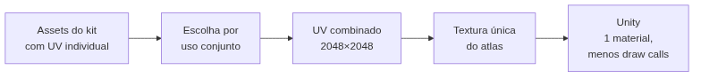

<!-- _class: cover -->
<!-- _paginate: false -->

# Uma textura para muitos

## Texture Atlas e a economia de draw calls

**Semana 13** — Quando o kit deixa de ser asset por asset e passa a ser produção

<!--
Notas: Abertura da mini aula (20 min). Início da Unidade IV — Otimização e Integração ao Motor. Crítica 🔵 INFORMAL nesta semana (circulante, sem nota). Apostila: Parte V, Cap. 18 — Texture Atlas e Trim Sheets (conceito e criação de atlas; otimização de draw calls). Mensagem central da capa: até a Semana 12 cada asset teve sua própria textura dedicada — correto para APRENDER UV, PBR, pintura e bake em profundidade, mas não é como um kit modular é entregue em produção. Hoje o foco desloca de "como texturizar bem um objeto" para "como texturizar um kit inteiro de forma eficiente para o motor". Não é técnica nova de pintura ou bake — é decisão de ARQUITETURA de produção. Não antecipar Trim Sheets (S14).
-->

---

<!-- _class: objectives -->

## Objetivos de hoje

Ao final da semana você será capaz de:

- Explicar o que é um **Texture Atlas** e por que ele reduz **draw calls**
- Avaliar **quais assets** do seu kit valem compartilhar textura, por critério técnico
- Reorganizar **UV islands de objetos diferentes** dentro de um único espaço 0–1
- Manter **texel density** e **padding** coerentes entre os assets combinados
- Justificar o **trade-off** entre economia de textura e resolução individual

<!--
Notas: Ler rápido. Os objetivos vêm dos itens 1 a 6 do plano de aula. Reforçar o item central: hoje NÃO se aprende um recurso novo de pintura ou bake — reaproveita-se o UV mapping das Semanas 2 a 4 sob uma lente nova: eficiência para tempo real, não apenas ausência de distorção. O item 6 (justificar o agrupamento na crítica circulante) é trabalhado no encontro 2.
-->

---

<!-- _class: question -->

# Duas cenas idênticas aos olhos. Por que uma custa muito mais para o motor?

<!--
Notas: Pergunta de abertura (do plano de aula). Exibir no projetor uma cena com 5 objetos do mesmo kit, cada um com sua textura (5 materiais carregados), ao lado da MESMA cena com os 5 objetos compartilhando uma única textura combinada (1 material). Deixar 2-3 respostas. Direcionar para a ideia central: cada material/textura distinta que a GPU precisa carregar para renderizar um frame gera um draw call adicional.

[!FIGURA]
Objetivo didático: materializar o salto conceitual da aula — mesma imagem final, custo de renderização completamente diferente.
Arquivo sugerido: assets/duas_cenas_mesmo_visual.webp
Descrição: comparação lado a lado da mesma cena do kit modular com 5 objetos (ex.: barril, caixote, tocha, mesa, banco). À esquerda, rótulo "5 materiais / 5 texturas" e cada objeto com sua textura própria. À direita, rótulo "1 material / 1 textura" com os mesmos 5 objetos visualmente idênticos, mas compartilhando um único atlas. Um contador de "draw calls" visível em cada lado (alto à esquerda, baixo à direita).
Como produzir: no Unity, montar a cena com os 5 assets do kit de referência; no Frame Debugger ou Stats, capturar a contagem de batches/draw calls com materiais separados. Depois combinar as texturas em um atlas, reaplicar um material único e capturar novamente. Compor as duas telas lado a lado no Krita com os rótulos e contadores.
-->

---

## De onde viemos: uma textura por objeto

Das Semanas 1 a 12, cada asset recebeu sua **própria textura dedicada**:

- Um UV, um conjunto de mapas, um material por peça
- Foi o caminho certo para **aprender** UV, PBR, pintura e bake a fundo

Isso não estava errado — estava incompleto. Faltava olhar o **kit inteiro** como um problema de produção, não peça por peça.

<!--
Notas: Revisão rápida e nota de transição do plano de aula. Cada asset com textura própria foi a abordagem correta para o aprendizado em profundidade, mas não é como um kit modular chega a produção real. Preparar o contraste do próximo slide: em cena, dezenas de instâncias dos mesmos assets (paredes, barris, caixas repetidos) — se cada peça carrega textura própria, o custo de renderização cresce rápido.
-->

---

## O que é um draw call

Uma **instrução da CPU para a GPU** desenhar uma geometria com um material específico.

- Trocar de material entre objetos **custa** tempo de processamento
- Muitos objetos pequenos e repetidos = **muitos** draw calls
- Esse é exatamente o perfil de um **kit modular de ambiente**

Você não vai escrever uma linha de código hoje. Esta otimização é **trabalho de artista** — e mesmo assim tem impacto direto em performance.

<!--
Notas: Definição central. Reforçar a frase do plano de aula: "Vocês não vão escrever nenhuma linha de código hoje. A otimização de hoje acontece inteiramente na forma como vocês organizam o UV e a textura." Reduzir o número de materiais distintos é uma das otimizações mais diretas disponíveis ao artista de texturas, antes de qualquer otimização de código. Um kit modular repete o mesmo conjunto de peças dezenas de vezes em cena — daí o ganho.
-->

---

## Texture Atlas: definição

Uma **única textura** (ex.: 2048×2048) que contém, dentro do mesmo espaço de imagem, os mapas de **vários objetos** — cada um em uma região exclusiva.

- Cada objeto deixa de ocupar sozinho o espaço 0–1 inteiro
- Passa a ocupar apenas uma **fração**, dividindo-a com os demais
- Vários objetos passam a usar o **mesmo material**

<!--
Notas: Definição do atlas. Analogia do plano de aula: "Pensem no atlas como uma folha de contato de fotos — em vez de uma foto por página, várias fotos organizadas numa única folha, cada uma ainda reconhecível e separada, mas compartilhando o mesmo papel." O que muda em relação ao UV individual: o UV de cada objeto combinado precisa ser REMAPEADO para caber na sua fração do espaço.
-->

---

<!-- _class: comparison -->

## UV individual × UV de atlas

### UV individual
**Semanas 2 a 4**

Um objeto ocupa **todo** o 0–1.
Um material por peça.
Ótimo para **aprender**.

### UV de atlas
**Hoje**

Vários objetos **dividem** o 0–1.
Um material para o grupo.
Pensado para **produção**.

<!--
Notas: Slide-chave. O UV individual não é substituído — é revisitado com objetivo novo. A mesma competência (islands, padding, texel density) agora se aplica entre OBJETOS diferentes, não só entre ilhas do mesmo objeto. Frase-âncora: a decisão do atlas é de arquitetura de produção, não de pintura. Se a turma sair só com esta distinção, o essencial foi cumprido.
-->

---

## Quais assets combinar

Nem todo conjunto é bom candidato. Critério, não conveniência:

- **Aparecem juntos em cena** — elementos da mesma parede modular, do mesmo conjunto
- **Complexidade de material semelhante** — misturar cor sólida e detalhe fino desperdiça espaço
- **Tamanho relativo em cena** informa a **proporção** de espaço no atlas

A pergunta não é "quais três são mais fáceis de combinar" — é "quais três **realmente aparecem juntos** com frequência suficiente para justificar compartilhar textura".

<!--
Notas: Critérios de planejamento do atlas (item 3 da mini aula). O erro que se quer prevenir é escolher os assets "mais prontos" por conveniência. Objetos que aparecem juntos e com complexidade parecida combinam melhor; tamanho em cena define proporção de espaço — um objeto grande (parede) precisa de mais área que um pequeno (moeda), mesmo no mesmo atlas. Isso alimenta a justificativa escrita que o estúdio vai exigir (C1 e C7).
-->

---

## Reorganizar UV islands: a Semana 4 volta

Padding, texel density consistente e aproveitamento de espaço **continuam valendo** — agora **entre objetos diferentes**.

- A texel density precisa ser **coerente** entre os assets combinados
- Um objeto pequeno que ocupa espaço demais **rouba resolução** dos outros
- O padding entre grupos de objetos evita **bleeding** na fronteira

<!--
Notas: Item 4 da mini aula. Os princípios da Semana 4 são reaplicados, mas o "objeto de referência" agora é o KIT inteiro, não uma peça isolada. Nota do professor do plano de aula: este é o ponto onde mais erros conceituais aparecem — reforçar que texel density consistente entre objetos diferentes é tão importante quanto era entre ilhas do mesmo objeto. Preparar o próximo slide, que isola a proporção de espaço.
-->

---

## O espaço vem da cena, não do editor

A proporção de cada objeto no atlas deve refletir seu **tamanho real em cena** — não dividir tudo em partes iguais.

Dividir o atlas em três áreas **iguais** entre objetos de tamanhos diferentes: o grande fica borrado, o pequeno ganha definição que não precisa.

<!--
Notas: Isola o erro mais comum e mais custoso da semana (Possíveis Dificuldades nº 2). A decisão de espaço no atlas deve vir da comparação visual dos objetos na escala real da cena, não da conveniência de organização no UV Editor. Estratégia de mediação: colocar os três objetos lado a lado na escala real e perguntar "qual deles claramente precisa de mais pixels para não ficar borrado?". A comparação visual corrige mais rápido que a explicação teórica.
-->

---

<!-- _class: diagram -->

## O fluxo do atlas

<!--
Notas: O GitHub Action converte o mermaid em imagem — por isso o diagrama vai no markdown, não na nota. Fechar a lógica: parte-se dos assets já texturizados (com UV individual das semanas anteriores), escolhe-se o grupo por uso conjunto, remapeia-se o UV para um espaço combinado, gera-se uma textura única e chega-se ao motor com um material só. Cada etapa é uma decisão de artista, não de programador.
-->

---

## Cuidado: o remap invalida o que já foi pintado

Quando um asset já tinha **desgaste, stencil ou bake** (Semanas 9 a 12), remapear o UV muda a posição dessas camadas.

- A reconstrução do detalhe é **parte esperada** do processo, não erro
- **Salve como novo arquivo** — não sobrescreva o original intacto
- Priorize reconstruir o asset com **mais detalhe pintado** primeiro

<!--
Notas: Possíveis Dificuldades nº 3 e nº 6. Alertar ANTES da reorganização: mover o UV desloca espacialmente as camadas pintadas nas Semanas 9-12, exigindo reconstrução. Normalizar como esperado: "vocês já sabem pintar desgaste e stencil, então da segunda vez vai mais rápido". Sugerir manter o .blend original salvo à parte. Priorizar o Asset 01 (o mais trabalhado desde a S09); objetos simples resolvem-se rápido ao final.
-->

---

## Erros comuns

**Escolha por conveniência** — combinar os assets "mais prontos" em vez dos que aparecem juntos. Escreva a justificativa antes de mexer no UV.

**Sobreposição entre objetos** — a ilha de um objeto invade a de outro. Mais difícil de ver que no mesmo objeto: use `UV → Select Overlap`.

**Padding insuficiente entre grupos** — bleeding na fronteira quando a textura comprime ou gera mipmap. Trate cada objeto como um bloco e afaste os blocos.

<!--
Notas: Os três erros mais frequentes, nas ordens das Possíveis Dificuldades do plano de aula (nº 1, 4 e 5). Conveniência: exigir a justificativa escrita antes de reorganizar frequentemente expõe a fragilidade do critério. Sobreposição entre objetos diferentes é mais fácil de passar despercebida que entre ilhas do mesmo objeto — verificar com ferramenta, não só com o olho. Padding: aplicar folga extra nas bordas externas do grupo, não só internamente. Circular no estúdio caçando exatamente estes três padrões.
-->

---

<!-- _class: industry -->

## Na indústria

Kits modulares comerciais quase nunca entregam uma textura por peça. Atlas e materiais compartilhados são **padrão de produção** — a diferença entre um kit que roda e um que trava a cena.

Reduzir draw calls é uma das primeiras otimizações que um artista de ambiente entrega.

<!--
Notas: Contextualizar o valor profissional. Em pipelines de produção, agrupar assets em atlas e compartilhar materiais é rotina — não um truque avançado. É a competência que separa o portfólio de estudante do portfólio de quem entende produção. Amarra à Unidade IV inteira (Atlas, Trim Sheets, channel packing, Unity): otimização acelera sem sacrificar o julgamento artístico.
-->

---

<!-- _class: summary-slide -->

# Resumo

- **Draw call**: cada material distinto custa; o atlas reduz materiais
- **Texture Atlas**: vários objetos dividem um único espaço 0–1
- Combine por **uso conjunto e tamanho**, não por conveniência
- **Texel density e padding** valem agora **entre objetos diferentes**
- Otimização é sempre **trade-off** — e reconhecê-lo já é competência técnica

<!--
Notas: Amarrar a mini aula antes da demonstração. Cada item retorna na demonstração ao vivo (atlas de 3 assets no Blender) e no estúdio (planejar e remapear o próprio kit). Lembrar: crítica 🔵 informal nesta semana — o atlas e a justificativa de agrupamento produzidos hoje serão evidência de C7 (Otimização) na CF5 da Semana 14 (Trim Sheets), quando Otimização entra em nota formal pela primeira vez.
-->

---

## Agora: demonstração

A seguir, ao vivo no Blender: combinar **3 assets** em um único UV **2048×2048** — proporção por tamanho, padding entre grupos e validação de texel density.

A pergunta que você leva ao estúdio: **quais três assets do meu kit realmente aparecem juntos em cena?**

<!--
Notas: Transição para a demonstração de 20 min. Sequência do plano de aula: 3 objetos de referência (tamanhos visivelmente diferentes) já com UV individual → avaliar e decidir proporção pelo tamanho em cena → selecionar os três e abrir o UV Editor conjunto → reposicionar e redimensionar as ilhas proporcionalmente, com Pack Islands mantendo proporção relativa → padding generoso entre grupos → criar imagem 2048×2048 e reposicionar as texturas existentes → validar com checkerboard e conferir texel density comparável. Se o tempo apertar, mostrar textura combinada já preparada — o ponto central é a reorganização do UV, não a repintura. No estúdio, cada estudante escolhe três assets do próprio kit e começa o remapeamento.

[!FIGURA]
Objetivo didático: antecipar o alvo visual da demonstração para que a turma reconheça o resultado esperado antes de produzir no estúdio.
Arquivo sugerido: assets/demo_atlas_combinado.webp
Descrição: montagem de três painéis — (1) três objetos do kit de referência de tamanhos diferentes (ex.: barril grande, caixote médio, tocha pequena), cada um com seu UV individual; (2) o UV Editor com as ilhas dos três reorganizadas dentro de um único quadrado 0–1, proporção maior para o objeto maior, padding visível entre os grupos; (3) os três objetos no viewport com o checkerboard do atlas combinado aplicado, mostrando texel density comparável entre eles.
Como produzir: no Blender, carregar os três objetos de demonstração com UV individual; abrir o UV Editor em modo conjunto e reorganizar as ilhas proporcionalmente ao tamanho em cena, com padding entre grupos; aplicar um checkerboard sobre o atlas combinado e capturar os três estados. Compor os painéis lado a lado no Krita.
-->
