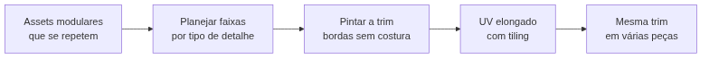

<!-- _class: cover -->
<!-- _paginate: false -->

# Uma faixa que se repete

## Trim Sheets para arquitetura modular

**Semana 14** — Quando o padrão vale mais que o objeto

<!--
Notas: Abertura da mini aula (20 min). Unidade IV — Otimização e Integração ao Motor. Crítica 🔴 FORMAL (CF5) nesta semana — vale 30% do Portfolio de Artefatos, o maior peso das cinco críticas formais realizadas até aqui, e a primeira vez que o Critério 7 (Otimização) entra em nota formal. Apostila Cap. 9 — Trim Sheets: conceito e workflow; Aplicação em arquitetura modular. Mensagem central da capa: na Semana 13 o problema era agrupar OBJETOS distintos em uma textura fixa (atlas). Hoje o problema é o oposto — elementos que se REPETEM em quantidade variável (paredes, vigas, molduras, trilhos). A trim sheet é uma faixa de textura que se estica e repete via tiling ao longo de qualquer comprimento, sem nunca precisar de textura nova por segmento. Não antecipar UDIMs / channel packing (S15).
-->

---

<!-- _class: objectives -->

## Objetivos de hoje

Ao final da semana você será capaz de:

- Diferenciar **Trim Sheet** de **Texture Atlas** quanto ao propósito
- Planejar uma trim temática com **faixas por tipo de detalhe**
- Mapear um asset modular com **UV elongado e tiling**
- **Validar** a repetição sem costura visível nem distorção de escala
- Aplicar a mesma trim a **mais de uma variação**, como evidência de otimização

<!--
Notas: Ler rápido. Os objetivos vêm dos itens 1 a 6 do plano de aula. Reforçar: hoje NÃO é técnica nova de pintura — é uma nova lógica de reutilização. O atlas (S13) e a trim (S14) são ferramentas complementares. O item da reutilização em mais de uma peça é a prova concreta de C7 (Otimização), avaliado formalmente pela primeira vez na CF5 de hoje.
-->

---

<!-- _class: question -->

# Se este corredor precisasse crescer dez metros, quantas texturas novas isso exigiria?

<!--
Notas: Pergunta de abertura (do plano de aula). Exibir no projetor uma parede modular composta por vários segmentos repetidos ao longo de um corredor do kit de referência. Deixar 2–3 respostas. Direcionar para a ideia central: o atlas resolve quando o número de objetos é conhecido e fixo; elementos arquitetônicos modulares se repetem em quantidade que muda conforme o design da cena. A trim resolve isso com uma faixa que se repete via tiling — zero textura nova por segmento adicional.

[!FIGURA]
Objetivo didático: materializar o problema que a trim resolve — repetição em quantidade variável, não conjunto fixo de objetos.
Arquivo sugerido: assets/corredor_modular_repeticao.webp
Descrição: um corredor do kit modular formado por vários segmentos de parede idênticos enfileirados. Sobre cada segmento, um rótulo pequeno "1 textura?" repetido, sugerindo o desperdício de tratar cada segmento como textura única. Ao lado, uma seta indicando "+10 m" com pontos de interrogação, insinuando a pergunta da abertura.
Como produzir: no Blender ou Unity, enfileirar 6 a 8 instâncias do mesmo segmento de parede modular do kit de referência formando um corredor; capturar o viewport em perspectiva. No Krita, adicionar os rótulos repetidos e a seta de extensão "+10 m".
-->

---

## De onde viemos: o atlas agrupa objetos fixos

Na Semana 13, o **Texture Atlas** combinou vários objetos distintos em um único espaço 0–1.

- Cada objeto ocupa uma **região fixa e exclusiva**
- Funciona quando o número de peças é **conhecido**
- Um material só para o grupo → menos draw calls

O atlas não estava errado — resolve um problema. Só que **não é o problema de hoje**: elementos que se repetem sem fim.

<!--
Notas: Revisão rápida e nota de transição do plano de aula. O atlas parte do princípio de que cada objeto ocupa uma região fixa e exclusiva do espaço UV — ótimo para peças distintas, ruim para elementos modulares que se repetem em grande quantidade com pequenas variações. Repetir esses elementos no atlas, um do lado do outro, desperdiçaria espaço e criaria dezenas de UVs quase idênticas. Preparar o contraste do próximo slide.
-->

---

## Trim Sheet: definição

Uma textura organizada em **faixas** — cada faixa é um tipo de detalhe reutilizável, projetado para se **repetir via tiling**.

- O UV do asset vira uma **tira estreita e longa** sobre uma faixa
- O padrão se **repete** ao longo do comprimento da peça
- Uma parede de 1 m e uma de 10 m usam a **mesma** textura

O atlas é uma folha de contato: cada foto aparece uma vez. A trim é um rolo de fita decorada: o padrão se repete quanto for preciso.

<!--
Notas: Definição central. Analogia do plano de aula: "O atlas da semana passada é como uma folha de contato — cada foto aparece uma vez, num lugar fixo. A trim sheet de hoje é como um rolo de fita adesiva decorada: o padrão se repete quantas vezes for necessário, ao longo de qualquer comprimento que precisarem cortar." A diferença essencial em relação ao atlas: não há região fixa por objeto — há um padrão que se estica e repete.
-->

---

<!-- _class: comparison -->

## Texture Atlas × Trim Sheet

### Texture Atlas
**Semana 13**

Objetos **distintos**, número fixo.
Cada um numa região **exclusiva**.
Sem repetição.

### Trim Sheet
**Hoje**

Um elemento que **se repete**.
Faixa reutilizada por **tiling**.
Quantidade **variável**.

<!--
Notas: Slide-chave. As duas ferramentas são complementares, não concorrentes — um kit modular de produção real usa as duas ao mesmo tempo, escolhendo a certa para cada tipo de asset. Frase-ponte sugerida para a apresentação da CF5: "Uso o atlas quando tenho um número fixo de objetos diferentes para agrupar; uso a trim quando tenho um elemento que se repete em quantidade que eu não sei de antemão." Se a turma sair só com esta distinção, o essencial da aula foi cumprido.
-->

---

## Tiling horizontal ou vertical

A direção da faixa segue **como a peça realmente se repete** na cena — não é escolha arbitrária de layout.

- **Horizontal** — elementos que se estendem em comprimento (paredes, rodapés)
- **Vertical** — elementos que se repetem em altura (colunas, trilhos, molduras de porta)

<!--
Notas: Item 2 da mini aula. Faixas horizontais servem elementos que se repetem ao longo do comprimento; faixas verticais servem os que se repetem em altura. A escolha depende de como o asset modular de fato se repete no ambiente. Preparar o próximo slide, que aborda o planejamento das faixas por tipo de detalhe.
-->

---

## Planejar as faixas: um alfabeto do kit

Antes de pintar, decidir **quais faixas** a trim vai conter, com base nas superfícies mais recorrentes do seu tema:

- Uma faixa para o **material estrutural** dominante (madeira, pedra, metal)
- Uma faixa para **junção / reforço** (rebites, encaixes, vigas)
- Uma faixa para **ornamento ou desgaste** do tema (talha, ferrugem, musgo)

Cada faixa deve estar amarrada a uma **peça real e nomeada** do seu kit. Se você não sabe qual peça ela vai construir, ela ainda não é prioridade.

<!--
Notas: Item 3 da mini aula. Analogia: "Pensem nas faixas como um alfabeto visual do kit — em vez de escrever a mesma palavra com tinta nova a cada vez, criam as letras uma vez e as combinam quantas vezes precisarem." O erro que se quer prevenir (Possíveis Dificuldades nº 3): faixas genéricas sem relação com os assets reais. Exigir que cada faixa planejada seja associada a uma peça específica alimenta C1 (Processo) e C7 (Otimização).
-->

---

## Mapeamento: UV elongado com tiling

O UV do asset ocupa uma **tira estreita** sobre a faixa e **repete** ao longo do comprimento da peça.

- O texel density calibra o tamanho do "motivo" que se repete
- Peça mais longa = **mais repetições**, não padrão esticado
- É a **mesma disciplina de texel density** da Semana 4, sob a lógica de repetição

**Tratar a trim como atlas:** mapear o UV uma única vez, sem tiling. Sem repetição, a trim perde toda a sua vantagem.

<!--
Notas: Item 4 da mini aula e o erro mais comum da semana (Possíveis Dificuldades nº 1, vindo direto da S13). Nota do professor do plano: o estudante trata a trim como um atlas, mapeando o UV uma única vez sem tiling. A trim só cumpre seu propósito se o UV realmente repetir o padrão ao longo do comprimento. Teste de diagnóstico: pedir para o estudante explicar o que faria se a peça precisasse ser o dobro do tamanho — se a resposta é "redesenhar a textura", o UV não está configurado como trim.
-->

---

## Onde a costura falha

Se as bordas da faixa não se encontram sem descontinuidade, cada repetição do padrão mostra uma **costura visível (seam)**.

- Mesmo princípio da **textura seamless** da Semana 6
- Agora em **um só eixo** — o de repetição — não nos quatro lados
- Validar sempre com **preview de tiling lado a lado**, não só na faixa isolada

<!--
Notas: Item 5 da mini aula (Possíveis Dificuldades nº 2). Se as bordas esquerda/direita (ou superior/inferior) não casarem, o tiling produz uma linha ou mudança de tom a cada repetição. É o mesmo offset + patch da Semana 6, restrito ao eixo de tiling da faixa. Reforçar: verificar com o preview de repetição lado a lado, não apenas olhando a textura sozinha.

[!FIGURA]
Objetivo didático: tornar visível a diferença entre uma borda que casa e uma que não casa quando a faixa se repete.
Arquivo sugerido: assets/tiling_costura_comparacao.webp
Descrição: duas tiras da mesma faixa de trim repetidas três vezes lado a lado. Em cima, rótulo "costura visível" com uma linha vertical evidente de descontinuidade a cada junção. Embaixo, rótulo "sem costura" com o padrão fluindo continuamente, sem quebra de tom.
Como produzir: no Krita, criar uma faixa simples (ex.: madeira) e duplicá-la três vezes lado a lado sem tratar as bordas — capturar a versão com costura. Depois aplicar offset + patch nas bordas do eixo de repetição e duplicar novamente para capturar a versão sem costura. Empilhar as duas tiras com os rótulos.
-->

---

## Reutilizar é a prova da otimização

A mesma trim aplicada a **duas ou mais peças de tamanhos diferentes** — sem pintar nada novo.

- Uma parede curta e uma longa usam a **mesma faixa**
- Basta recalibrar o **número de repetições** por peça
- Essa conta é a evidência concreta de **C7 — Otimização**

Registre: quantas peças do kit compartilham essa trim, e quantas texturas únicas seriam necessárias sem ela.

<!--
Notas: Objetivo 5 do plano de aula e o coração da CF5 (C7 entra em nota pela primeira vez). "Essa é a prova concreta de otimização: a mesma textura, sem nenhuma pintura adicional, serve a duas peças de tamanhos diferentes do kit." Distorção de escala (Possíveis Dificuldades nº 4): ao aplicar a mesma trim a comprimentos diferentes, ajustar o tiling count proporcionalmente ao comprimento mantém o tamanho do motivo constante — mesma lógica de texel density entre assets da Semana 4.
-->

---

<!-- _class: diagram -->

## O fluxo da trim sheet

<!--
Notas: O GitHub Action converte o mermaid em imagem — por isso o diagrama vai no markdown, não na nota. Fechar a lógica: parte-se dos elementos modulares que se repetem, planejam-se as faixas por tipo de detalhe, pinta-se a trim com bordas sem costura, mapeia-se o UV elongado com tiling e chega-se à reutilização da mesma trim em várias peças. Cada etapa é decisão de artista.
-->

---

## Erros comuns

**Trim tratada como atlas** — UV mapeado uma vez, sem tiling. Pergunte-se: e se a peça dobrasse de tamanho amanhã?

**Costura visível** — bordas que não casam ao repetir. Corrija com offset + patch, só no eixo de tiling.

**Faixa genérica** — sem relação com peça real do kit. Nomeie a peça antes de pintar a faixa.

<!--
Notas: Os três erros mais frequentes, das Possíveis Dificuldades do plano (nº 1, 2 e 3). Caçar exatamente estes três padrões ao circular no estúdio. Para o erro de tratar como atlas, a estratégia de mediação é a pergunta "se essa parede precisasse ser o dobro do tamanho amanhã, o que você faria?" — se a resposta envolve redesenhar, reforçar a diferença de propósito. Para faixa genérica: exigir a peça nomeada do kit antes de começar.
-->

---

<!-- _class: industry -->

## Na indústria

Kits modulares de produção dependem de trim sheets. Uma única faixa bem planejada veste quilômetros de arquitetura sem custo de textura adicional.

Atlas e trim juntos são o **vocabulário padrão** da otimização de ambientes — cada um para o problema certo.

<!--
Notas: Contextualizar o valor profissional. Trim sheets são rotina em ambientes de jogos AAA e indie — grande parte da arquitetura modular de produção é vestida por poucas trims reutilizadas. Amarra à Unidade IV: atlas (S13), trim (S14) e, à frente, otimização de compressão e Unity. A competência que separa o portfólio de estudante do portfólio de quem entende produção é saber ESCOLHER a ferramenta certa por critério técnico.
-->

---

<!-- _class: summary-slide -->

# Resumo

- **Trim Sheet**: faixa de textura reutilizada por **tiling**
- Difere do atlas: **repetição variável**, não objetos fixos
- Faixas planejadas por **tipo de detalhe**, amarradas a peças reais
- Bordas **sem costura** — mesma disciplina da textura seamless
- **Reutilizar em várias peças** é a evidência concreta de C7

<!--
Notas: Amarrar a mini aula antes da demonstração. Cada item retorna na demonstração ao vivo (trim mapeada numa parede modular no 3D Coat) e no estúdio (planejar e iniciar a própria trim). Lembrar a turma: hoje é crítica 🔴 FORMAL (CF5), vale 30% do PA — o maior peso das cinco — e Otimização (C7) entra em nota pela primeira vez. O peso maior reflete confiança no progresso já demonstrado, não uma régua mais rígida.
-->

---

## Agora: demonstração

A seguir, ao vivo no 3D Coat: mapear uma **parede modular** sobre uma faixa da trim, configurar o **tiling** e validar a repetição sem costura.

A pergunta que você leva ao estúdio: **quais elementos do meu kit se repetem o suficiente para merecer uma faixa?**

<!--
Notas: Transição para a demonstração de 20 min. Sequência do plano de aula: apresentar a trim já pronta (três faixas — madeira, metal, ornamento) → mapear o UV da parede modular sobre a faixa de madeira, com o eixo do comprimento alinhado ao eixo de tiling → configurar a repetição e mostrar o padrão contínuo no viewport → validar rotacionando a câmera (sem costura, sem distorção de escala) → reaplicar a mesma trim numa segunda peça de tamanho diferente, sem pintar nada novo. Se o tempo apertar, mostrar a trim já mapeada em ambas as peças de antemão — o ponto central é a lógica de tiling e reutilização, não a velocidade de execução. No estúdio, cada estudante planeja as faixas do próprio kit e inicia a primeira faixa.

[!FIGURA]
Objetivo didático: antecipar o alvo visual da demonstração para que a turma reconheça o resultado esperado antes de produzir no estúdio.
Arquivo sugerido: assets/demo_trim_parede_mapeada.webp
Descrição: montagem de três painéis — (1) a trim sheet completa (ex.: 1024×2048) com três faixas rotuladas: madeira, metal, ornamento; (2) o UV de uma parede modular mapeado como tira estreita sobre a faixa de madeira, com marcas de repetição ao longo do comprimento; (3) a mesma trim aplicada a duas paredes de tamanhos diferentes no viewport, ambas com o padrão contínuo e sem costura.
Como produzir: no 3D Coat, abrir a trim de demonstração com três faixas; no Blender ou no UV Room, mapear o UV da parede modular sobre a faixa de madeira com tiling configurado e capturar o UV. Aplicar a trim a duas peças de comprimentos diferentes e capturar o viewport. Compor os três painéis lado a lado no Krita com os rótulos das faixas.
-->
