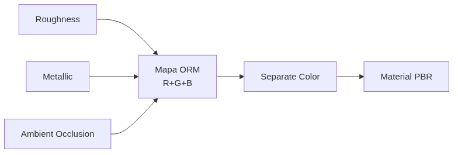

<!-- _class: cover -->
<!-- _paginate: false -->

# Quanto pesa uma textura?

## UDIMs, compressão, mipmaps e channel packing

**Semana 15** — Otimizar não é só ter menos texturas

<!--
Notas: Abertura da mini aula (20 min). Unidade IV — Otimização e Integração ao Motor. Crítica 🔵 INFORMAL (circulante), sem nota formal nesta semana. Apostila Cap. 10 — UDIMs e Multi Tile Texture; Cap. 11 — Otimização: compressão, mipmaps e channel packing. Mensagem central da capa: as Semanas 13 e 14 otimizaram a QUANTIDADE de texturas — menos arquivos, por agrupamento (atlas) ou reutilização por tiling (trim). Hoje o foco muda para o PESO e a ESTRUTURA de cada textura que sobrou: resolução, formato de compressão, mipmaps e número de mapas carregados por material. É a última semana de conteúdo novo antes da integração à Unity (S16) e da apresentação final (S17). NÃO antecipar lightmap UV nem configuração de materiais na Unity (S16).
-->

---

<!-- _class: objectives -->

## Objetivos de hoje

Ao final da semana você será capaz de:

- Explicar o que são **UDIMs** e quando um asset justifica seu uso
- Diferenciar formatos de compressão **BC1, BC3, BC7** por tipo de mapa
- Entender **mipmaps** e seu impacto na escolha de resolução
- Executar **channel packing** montando um mapa **ORM**
- **Justificar** a resolução de cada asset por importância visual
- **Quantificar** a economia de memória em uma tabela antes/depois

<!--
Notas: Ler rápido. Os seis objetivos vêm direto do plano de aula (itens 1 a 6). Reforçar: hoje não é técnica nova de pintura — é uma nova camada de otimização, sobre o peso e a estrutura de arquivo de cada textura. O fechamento da Unidade IV: atlas (S13) e trim (S14) reduziram a quantidade; hoje reduzimos o peso individual. A tabela de memória antes/depois é evidência concreta de C7 (Otimização) para a apresentação final da S17.
-->

---

<!-- _class: question -->

# Estas duas imagens parecem iguais na tela. Qual pesa mais em memória — e por quanto?

<!--
Notas: Pergunta de abertura (do plano de aula). Exibir no projetor dois arquivos do MESMO asset lado a lado: um Albedo 4096×4096 sem compressão e o mesmo Albedo 1024×1024 com compressão BC7, ambos aplicados ao asset em render comparativo. De perto parecem quase idênticos; à distância de uso, idênticos. Deixar 2–3 respostas (o peso costuma ser subestimado). Revelar a proporção real — o arquivo maior pode pesar dezenas de vezes mais. Direcionar para a ideia central: até aqui otimizamos a QUANTIDADE de texturas (atlas, trim); hoje o foco é o PESO individual de cada textura que sobrou — resolução, compressão, mipmaps e número de mapas por material.

[!FIGURA]
Objetivo didático: materializar que "parece igual na tela" não significa "custa igual em memória" — dissociar aparência de peso.
Arquivo sugerido: assets/comparacao_peso_textura.webp
Descrição: dois renders idênticos do mesmo asset lado a lado, rotulados "4096 sem compressão" e "1024 · BC7". Abaixo de cada um, uma barra de peso em memória: a da esquerda muito maior que a da direita, com os valores em MB ocultos por um ponto de interrogação, para a turma estimar antes da revelação.
Como produzir: no Blender, renderizar o mesmo asset com dois materiais — um usando Albedo 4096 PNG sem compressão, outro usando Albedo 1024 comprimido. Capturar os dois renders. No Krita, montar lado a lado com os rótulos e as barras de peso comparativas com "?" no valor.
-->

---

## De onde viemos: menos texturas, mas ainda pesadas

Nas Semanas 13 e 14, otimizamos a **quantidade** de texturas.

- **Atlas** — agrupou objetos fixos em um único espaço 0–1
- **Trim Sheet** — reutilizou uma faixa por tiling
- Resultado: **menos arquivos** distintos

Um asset pode já ter o número mínimo de texturas e ainda **desperdiçar memória**: se cada arquivo for maior que o preciso, sem mipmaps ou com mapas grayscale soltos.

<!--
Notas: Revisão rápida e nota de transição do plano de aula. Atlas (S13) e trim (S14) resolveram a otimização do lado da ORGANIZAÇÃO ESPACIAL do UV — menos texturas distintas. Hoje fechamos a Unidade IV com um tipo diferente de otimização: o PESO e a ESTRUTURA de arquivo de cada textura já produzida, independentemente de quantas existem. Preparar os quatro tópicos da mini aula: UDIMs, compressão, mipmaps e channel packing.
-->

---

## UDIMs: quando um tile 0–1 não basta

O UV pode ocupar **múltiplos tiles numerados** (1001, 1002, 1003...), cada um um espaço 0–1 independente, com sua própria textura de alta resolução.

- Usado quando **um único asset** precisa de mais detalhe do que um tile comporta
- Tipicamente o objeto **hero** do kit — grande e próximo da câmera
- Cada tile carrega uma textura própria, sem borrar o detalhe

O espaço UV 0–1 é uma **folha de papel**. Até agora tudo coube em uma folha — mesmo vários objetos no atlas. UDIM é usar **mais de uma folha para o mesmo objeto**.

<!--
Notas: Tópico 1 da mini aula. Até aqui, todo UV foi mapeado num único espaço 0–1 (S2–4), mesmo com múltiplos objetos no atlas (S13). UDIMs estendem isso para vários tiles, cada um um 0–1 independente com textura de alta resolução própria. Analogia da folha de papel (do plano de aula). Preparar o próximo slide: UDIM é exceção, não regra.

[!FIGURA]
Objetivo didático: visualizar a diferença entre um único tile 0–1 e uma grade de tiles UDIM numerados.
Arquivo sugerido: assets/udim_tiles_numerados.webp
Descrição: à esquerda, um único quadrado rotulado "0–1 · 1 tile" com um UV apertado dentro. À direita, uma grade 2×2 de quadrados rotulados 1001, 1002, 1011, 1012, cada um com parte do UV do mesmo objeto hero espalhado, sugerindo mais resolução total.
Como produzir: no Blender, no UV Editor, ativar o modo UDIM e distribuir os UVs de um asset detalhado por 3–4 tiles; capturar o UV Editor com os tiles numerados. Comparar com um print do mesmo objeto em tile único. Montar lado a lado no Krita com os rótulos.
-->

---

## UDIM é exceção, não regra

A maioria dos assets de um kit modular **não precisa** de UDIM.

- Atlas e trim já resolvem a maior parte dos casos (S13–14)
- UDIM se justifica só para o asset **mais importante e mais próximo** da câmera
- Se houver um objeto hero com muito mais detalhe que os demais

Empolgação com o recurso novo não é justificativa. A pergunta é: **esse asset perde detalhe perceptível em um único tile?**

<!--
Notas: Tópico 1 (continuação) e Possíveis Dificuldades nº 4 do plano. Reforçar: UDIM é solução de exceção. Erro comum: aplicar UDIM a um asset comum, já bem servido por um tile único. Estratégia de mediação: perguntar diretamente se o asset sofre perda de detalhe perceptível em um único tile antes de justificar o uso. Para a maioria dos kits, a conclusão esperada é "não preciso de UDIM" — e isso conta como decisão justificada, não tarefa pendente.
-->

---

## Compressão: BC1, BC3, BC7

Motores não guardam texturas como PNG — usam formatos comprimidos para GPU, decodificados em tempo real.

- **BC1** — compressão agressiva, sem alpha. Bom para Albedo sem transparência e Metallic
- **BC3** — inclui canal alpha completo. Para transparência real (folhagem, grades)
- **BC7** — alta qualidade, arquivo maior. Ideal para **Normal Maps** e Albedo hero

A pergunta não é "qual formato é melhor", é **"qual erro esse mapa específico pode tolerar sem que o olho perceba"**.

<!--
Notas: Tópico 2 da mini aula. Motores decodificam esses formatos na GPU com custo mínimo de performance. BC1 (DXT1): mais agressivo, sem alpha ou alpha de 1 bit. BC3 (DXT5): alpha completo. BC7: maior qualidade, custa mais que BC1/BC3 mas muito mais fiel — recomendado para Normal Maps, onde artefato agressivo vira distorção de superfície visível. Frase-chave: um Normal Map errado quebra a leitura de profundidade da superfície inteira, por isso merece a compressão de maior qualidade mesmo custando mais.
-->

---

## Mipmaps: por que textura grande demais não é "mais seguro"

Mipmaps são versões **pré-calculadas** da textura em resoluções decrescentes, trocadas conforme a distância à câmera.

- Geradas **automaticamente** pelo motor
- Evitam **aliasing** em superfícies distantes e economizam banda
- O motor já troca por uma versão menor quando o objeto está longe

O detalhe extra de uma textura maior que o necessário **nunca é visto** de perto o suficiente para justificar o peso. Escolha bem o tamanho original.

<!--
Notas: Tópico 3 da mini aula. Mipmaps: cada nível é metade do tamanho do anterior, gerados automaticamente e trocados dinamicamente pela distância. Evitam aliasing e economizam banda de memória na renderização. Argumento central: mipmap é a razão pela qual textura grande demais não é "mais seguro", é só mais pesado — e ainda gera mais níveis de mipmap para armazenar. O trabalho do estudante é escolher bem o tamanho da versão original, não empurrar a decisão para depois.
-->

---

## Channel packing: o mapa ORM

Roughness, Metallic e AO são mapas em **escala de cinza** — cada um usa só 1 canal, mas ocupa um arquivo RGB inteiro se exportado sozinho.

### Antes
**3 arquivos**

Roughness · Metallic · AO
Cada um grayscale, arquivo próprio.

### Depois (ORM)
**1 arquivo**

R = Roughness
G = Metallic
B = AO

<!--
Notas: Tópico 4 da mini aula — o coração da aula prática. Channel packing combina os três mapas grayscale em um único arquivo: Roughness no R, Metallic no G, AO no B — o mapa ORM (Occlusion-Roughness-Metallic). Três texturas viram uma, sem perda de informação, porque cada mapa já usava só um canal. Analogia do plano: é a mesma lógica do atlas (S13), mas em vez de combinar OBJETOS no espaço UV, combina MAPAS diferentes nos canais de cor de uma imagem. Nada muda visualmente no resultado final — só o número de arquivos que o motor carrega.
-->

---

<!-- _class: diagram -->

## O pipeline do channel packing

Três mapas grayscale entram nos canais R, G e B; no material, um nó **Separate Color** os devolve a cada input.

<!--
Notas: O GitHub Action converte o mermaid em imagem — por isso o diagrama vai no markdown, não na nota. Fechar a lógica do fluxo: os três mapas grayscale (Roughness, Metallic, AO) são empacotados nos canais R/G/B de um único ORM; no node editor do Blender, um nó Separate Color reparte de volta — R para Roughness, G para Metallic, B multiplica a cor (AO). O render final deve ficar idêntico ao de três mapas separados. Este é exatamente o percurso da demonstração de 20 min.
-->

---

## Só grayscale entra no ORM

Channel packing **só funciona** porque os três mapas de origem já eram escala de cinza.

**Incluir Albedo no ORM** — o Albedo é cor real (RGB), não um valor único. Ele não cabe no esquema de canais e quebra a técnica.

A pergunta-chave: *esse mapa usa cor real, ou é uma escala de cinza representando um valor único?*

<!--
Notas: Nota do professor do plano de aula — o erro conceitual mais comum da semana (Possíveis Dificuldades nº 2). Reforçar que combinar um mapa que realmente precisa de cor (Albedo) no esquema ORM não faz sentido e quebra a técnica. Estratégia de mediação: perguntar "esse mapa representa uma cor real que varia em RGB, ou um valor único em escala de cinza?" — se for cor real, não entra no channel packing.
-->

---

## Resolução: por critério, não por hábito

Nem todo asset merece a mesma resolução. Classifique **antes** de decidir.

- **Hero** — grande, próximo da câmera, foco da cena → 2048
- **Secundário** — presença regular, média distância → 1024
- **Fundo** — pequeno, repetido, distante → 512

**"Deixei tudo em 2048 porque já estava assim"** — resolução por conveniência, não por importância visual em cena.

<!--
Notas: Objetivo 5 do plano e Possíveis Dificuldades nº 3. Tendência de manter a mesma resolução desde as primeiras semanas (sempre 2048) sem reavaliar. Estratégia: exigir a classificação explícita hero/secundário/fundo ANTES de decidir a resolução — a decisão vem da importância em cena, não do padrão que o estudante já usa. Os valores (2048/1024/512) são exemplo do plano, não regra fixa. Essa classificação alimenta a tabela de resolução justificada, evidência de C7.
-->

---

## Erros comuns

**Inversão de canais** — Metallic no R em vez do G. Material fisicamente incoerente. Verifique cada canal isolado contra o mapa de origem.

**Albedo no channel packing** — cor real não é grayscale. Não entra no ORM.

**Compressão genérica** — mesmo formato para todos os mapas. Normal Map tolera muito menos erro que Albedo.

<!--
Notas: Os três erros mais frequentes, das Possíveis Dificuldades do plano (nº 1, 2 e 5). Caçar exatamente estes ao circular no estúdio. Inversão de canais é o erro mais grave e menos perceptível visualmente — a estratégia é verificar sistematicamente cada canal isolado (R, G, B) contra o mapa de origem, em vez de confiar no resultado combinado. Compressão: retomar a tabela BC1/BC3/BC7 e pedir justificativa mapa por mapa, não texture set por texture set.
-->

---

<!-- _class: industry -->

## Na indústria

Nenhum jogo entrega texturas soltas em PNG cru. **ORM, compressão por tipo de mapa e mipmaps** são rotina de produção — não um extra.

O que separa o portfólio de estudante do portfólio de quem entende produção é saber **justificar com números** por que cada textura pesa o que pesa.

<!--
Notas: Contextualizar o valor profissional. Channel packing, compressão específica por mapa e mipmaps são práticas padrão em qualquer pipeline de produção real, AAA ou indie. Amarra à Unidade IV: atlas (S13), trim (S14), otimização de peso (S15) e, à frente, integração na Unity (S16). O objetivo do semestre é que cada estudante feche sabendo justificar, com números, o peso das próprias texturas — a tabela de memória de hoje é essa evidência.
-->

---

<!-- _class: summary-slide -->

# Resumo

- **UDIM** — múltiplos tiles para um asset hero; exceção, não regra
- **Compressão** — BC1/BC3/BC7 conforme o erro que cada mapa tolera
- **Mipmaps** — o motor troca por versões menores; não superdimensione
- **Channel packing (ORM)** — R/G/B = Roughness/Metallic/AO, só grayscale
- **Resolução** por importância visual; **tabela antes/depois** como evidência

<!--
Notas: Amarrar a mini aula antes da demonstração. Cada item retorna na demonstração ao vivo (montar o ORM e reconfigurar o material no Blender) e no estúdio (channel packing de um asset + revisão de resolução + tabela de memória). Lembrar: hoje é crítica 🔵 INFORMAL, sem nota formal — mas a tabela de memória e os mapas ORM compõem as evidências acumuladas de C7 para a apresentação final da S17. Fechamento da Unidade IV: quatro ferramentas complementares — atlas, trim, channel packing e o entendimento de UDIM.
-->

---

## Agora: demonstração

A seguir, ao vivo: montar um **mapa ORM** combinando Roughness, Metallic e AO, reconfigurar o material no Blender e comparar o peso antes/depois.

A pergunta que você leva ao estúdio: **quais mapas do meu kit já são grayscale e podem virar um único ORM?**

<!--
Notas: Transição para a demonstração de 20 min. Sequência do plano: combinar os três canais em um único PNG _ORM (Roughness no R, Metallic no G, AO no B) → reconfigurar o material no Blender com um nó Separate Color, comparando render antes/depois (deve ficar idêntico) → mostrar compressão por tipo de mapa (BC7 para Normal, BC1 para Albedo e ORM) e mipmaps habilitados → comparar o peso em disco dos três arquivos separados versus o ORM comprimido, registrando a economia percentual. Se o laboratório não tiver editor com edição por canal, usar um ORM já preparado e focar o tempo na reconfiguração do material no Blender — a parte mais transferível. No estúdio, cada estudante monta o ORM de ao menos um asset e revisa a resolução do kit.

[!FIGURA]
Objetivo didático: antecipar o alvo visual da demonstração para que a turma reconheça o resultado esperado antes de produzir no estúdio.
Arquivo sugerido: assets/demo_orm_channel_packing.webp
Descrição: montagem de três painéis — (1) os três mapas grayscale de origem (Roughness, Metallic, AO) empilhados e rotulados; (2) o mapa ORM resultante, uma textura colorida "sem sentido" isolada, com legenda R/G/B; (3) o node setup no Blender com o nó Separate Color repartindo os canais para os inputs do material, ao lado do render final idêntico ao dos mapas separados.
Como produzir: no Krita, carregar Roughness/Metallic/AO de um asset de demonstração e copiá-los para os canais R/G/B de uma nova imagem; exportar o ORM. No Blender, montar o node tree com Separate Color e capturar o node editor + render. Compor os três painéis lado a lado no Krita com os rótulos.
-->
