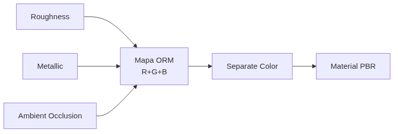

<!-- _class: cover -->
<!-- _paginate: false -->

# Do peso da textura à cena na Unity

## UDIMs, compressão, ORM, UV2 e a fase caminhável

**Semana 15** — Fechando a Unidade IV: otimizar e integrar

<!--
Notas: Abertura da mini aula (20 min). Unidade IV — Otimização, Trim Sheets e Integração na Unity. Crítica 🔵 INFORMAL (circulante), sem nota formal nesta semana. Apostila: Parte V, Cap. 19 e 20 (UDIMs, Texture Arrays, Compressão, Mipmaps, Channel Packing); Parte VI, Cap. 21 e 22 (Lightmaps e Integração com Unity). Esta é a última semana de produção da disciplina antes do Projeto Final — fecha a Unidade IV combinando dois assuntos: o PESO de cada textura (resolução, compressão, mipmaps, ORM) e a INTEGRAÇÃO COMPLETA no motor (UV2, importação do kit inteiro, montagem da fase caminhável, lightmap bake da cena). Semana densa e com dois encontros de estúdio — o objetivo final é o kit inteiro funcionando como uma cena única, otimizada e iluminada, pronta para a defesa da Semana 16.
-->

---

<!-- _class: objectives -->

## Objetivos de hoje

Ao final da semana você será capaz de:

- Explicar **UDIMs** e identificar (ou descartar) a necessidade no próprio kit
- Diferenciar formatos de compressão **BC1, BC3, BC7** por tipo de mapa
- Executar **channel packing**, combinando Roughness/Metallic/AO em um mapa **ORM**
- **Justificar** a resolução de cada asset e **quantificar** a economia de memória
- Diferenciar **UV1** (textura) de **UV2** (lightmap) e gerar um UV2 sem sobreposição
- **Importar o kit inteiro** na Unity, montar a fase caminhável e rodar o **lightmap bake**
- **Capturar evidência visual** (renders e teste de caminhada) do kit como cena única

<!--
Notas: Os sete objetivos vêm direto do plano de aula. Reforçar: hoje não é técnica nova de pintura — são duas camadas novas sobre o que já existe. Primeiro, o peso e a estrutura de arquivo de cada textura (fechando o que as Semanas 13–14 começaram do lado da organização espacial do UV). Segundo, a integração completa no motor — o primeiro contato de C8 na disciplina. É uma semana carregada: o objetivo não é perfeição em cada etapa, é ter, ao final do segundo encontro, o kit inteiro como uma cena caminhável, otimizada e iluminada.
-->

---

<!-- _class: question -->

# Estas duas imagens parecem iguais na tela. Qual pesa mais em memória — e por quanto?

<!--
Notas: Pergunta de abertura. Exibir no projetor dois arquivos do MESMO asset lado a lado: um Albedo 4096×4096 sem compressão e o mesmo Albedo 1024×1024 com compressão BC7, ambos aplicados ao asset em render comparativo. De perto (e à distância de uso) parecem quase idênticos. Deixar 2–3 respostas — o peso costuma ser subestimado. Revelar a proporção real. Direcionar para a ideia central: até aqui otimizamos a QUANTIDADE de texturas (atlas, trim); hoje o foco inicial é o PESO individual de cada textura que sobrou.

[!FIGURA]
Objetivo didático: materializar que "parece igual na tela" não significa "custa igual em memória".
Arquivo sugerido: assets/comparacao_peso_textura.webp
Descrição: dois renders idênticos do mesmo asset lado a lado, rotulados "4096 sem compressão" e "1024 · BC7", com uma barra de peso em memória abaixo de cada um (valores ocultos por "?" até a revelação).
Como produzir: no Blender, renderizar o mesmo asset com dois materiais (Albedo 4096 sem compressão vs. 1024 comprimido). Montar lado a lado no Krita com rótulos e barras comparativas.
-->

---

## De onde viemos: menos texturas, ainda no Blender

Nas Semanas 13 e 14, otimizamos a **organização espacial** do UV.

- **Atlas** (S13) e **Trim Sheet** (S14) → menos arquivos distintos
- Materiais PBR completos, com bake integrado desde as Semanas 11–12
- Todo o trabalho, até aqui: **Blender e 3D Coat**

Hoje fecha a Unidade IV em duas frentes: o **peso** de cada textura que sobrou, e a **primeira vez que o kit inteiro entra em um motor de jogo real**.

<!--
Notas: Nota de transição do plano. Atlas e trim resolveram a QUANTIDADE de texturas. Hoje o assunto muda duas vezes: primeiro para o PESO e a ESTRUTURA de arquivo (resolução, compressão, mipmaps, channel packing); depois para a INTEGRAÇÃO no motor (UV2, importação completa, fase caminhável, bake). É a última semana de produção antes do Projeto Final — preparar os dois blocos da mini aula.
-->

---

## UDIMs: quando um tile 0–1 não basta

O UV pode ocupar **múltiplos tiles numerados** (1001, 1002...), cada um um espaço 0–1 independente com textura própria.

- Usado só quando **um asset** — tipicamente o hero do kit — precisa de mais detalhe do que um tile único comporta
- Diferença rápida de **Texture Array**: UDIM é recurso de **autoria** (Blender); Texture Array é estrutura de **tempo real** do motor, fora do escopo prático desta disciplina

**É exceção, não regra.** A maioria dos kits não precisa de UDIM — a pergunta é: esse asset perde detalhe perceptível em um único tile?

<!--
Notas: Tópico 1 da mini aula (Bloco 1). Analogia do plano: o espaço 0–1 é uma folha de papel; até agora tudo coube em uma folha, mesmo com vários objetos no atlas. UDIM é usar mais de uma folha para o MESMO objeto. Possíveis Dificuldades nº 6: aplicar UDIM sem necessidade real — reforçar que a maioria dos kits conclui "não preciso de UDIM", e isso é decisão justificada, não tarefa pendente.

[!FIGURA]
Objetivo didático: visualizar a diferença entre um tile único 0–1 e uma grade de tiles UDIM numerados.
Arquivo sugerido: assets/udim_tiles_numerados.webp
Descrição: à esquerda um quadrado "0–1 · 1 tile" com UV apertado; à direita uma grade 2×2 de tiles numerados (1001, 1002, 1011, 1012) com o UV do mesmo objeto hero espalhado.
Como produzir: no Blender, distribuir os UVs de um asset detalhado por 3–4 tiles UDIM e capturar o UV Editor; comparar com um tile único; montar lado a lado no Krita.
-->

---

## Compressão: BC1, BC3, BC7

Motores não guardam texturas como PNG — usam formatos comprimidos para GPU, decodificados em tempo real.

- **BC1** — agressivo, sem alpha. Albedo sem transparência e Metallic
- **BC3** — alpha completo. Transparência real (folhagem, grades)
- **BC7** — alta qualidade, arquivo maior. **Normal Maps** e Albedo hero

A pergunta não é "qual formato é melhor", é **"qual erro esse mapa específico pode tolerar sem que o olho perceba"**.

<!--
Notas: Tópico 1 (continuação). BC1 (DXT1): mais agressivo. BC3 (DXT5): alpha completo. BC7: maior qualidade, recomendado para Normal Maps — um artefato agressivo ali vira distorção de superfície visível na cena inteira, por isso merece a compressão de maior qualidade mesmo custando mais.
-->

---

## Mipmaps e channel packing: fechando o peso

**Mipmaps** — versões pré-calculadas em resolução decrescente, trocadas automaticamente pela distância à câmera. O detalhe extra de uma textura maior que o necessário **nunca é visto** de perto o suficiente para justificar o peso.

**Channel packing (mapa ORM)** — Roughness, Metallic e AO são grayscale (1 canal útil cada). Combiná-los em R, G, B de uma única imagem elimina dois arquivos sem perda de informação.

Mesma lógica do atlas da Semana 13 — mas combinando **mapas**, em vez de objetos, no mesmo espaço.

<!--
Notas: Tópicos 1 (mipmaps) e 4 (channel packing) da mini aula, condensados. Mipmaps: cada nível é metade do anterior, gerados automaticamente e trocados dinamicamente — argumento contra superdimensionar resolução de asset pequeno ou distante. Channel packing: R = Roughness, G = Metallic, B = AO — o mapa ORM (Occlusion-Roughness-Metallic). Nada muda visualmente; só o número de arquivos que o motor carrega. Preparar o próximo slide: o pipeline do ORM no node editor.
-->

---

<!-- _class: diagram -->

## O pipeline do channel packing

Três mapas grayscale entram nos canais R, G e B; no material, um nó **Separate Color** os devolve a cada input.

<!--
Notas: O GitHub Action converte o mermaid em imagem — por isso o diagrama vai no markdown, não na nota. Fechar a lógica: os três mapas grayscale (Roughness, Metallic, AO) são empacotados nos canais R/G/B de um único ORM; no Blender, um nó Separate Color reparte de volta — R para Roughness, G para Metallic, B multiplica a cor (AO). O render final deve ficar idêntico ao de três mapas separados. Este é o percurso do Passo 1 da demonstração.
-->

---

## Só grayscale entra no ORM

Channel packing **só funciona** porque os três mapas de origem já eram escala de cinza.

**Incluir Albedo no ORM** — o Albedo é cor real (RGB), não um valor único. Ele não cabe no esquema de canais e quebra a técnica.

A pergunta-chave: *esse mapa usa cor real, ou é uma escala de cinza representando um valor único?*

<!--
Notas: Erro conceitual mais comum da semana (Possíveis Dificuldades nº 1, na forma de inversão/inclusão indevida de canal). Estratégia de mediação: perguntar "esse mapa representa uma cor real que varia em RGB, ou um valor único em escala de cinza?" — se for cor real, não entra no channel packing.
-->

---

## Resolução: por critério, não por hábito

Nem todo asset merece a mesma resolução. Classifique **antes** de decidir.

- **Hero** — grande, próximo da câmera, foco da cena → 2048
- **Secundário** — presença regular, média distância → 1024
- **Fundo** — pequeno, repetido, distante → 512

**"Deixei tudo em 2048 porque já estava assim"** — resolução por conveniência, não por importância visual em cena.

<!--
Notas: Objetivo 4 do plano. Estratégia: exigir a classificação explícita hero/secundário/fundo ANTES de decidir a resolução. Os valores são exemplo, não regra fixa. Essa classificação alimenta a tabela de memória, evidência de C7 — e será quantificada na Etapa 4 do estúdio.
-->

---

## Bloco 2 — UV1 e UV2: duas perguntas diferentes

O mesmo objeto vai carregar **dois canais de UV**, com finalidades distintas.

### UV1 (desde a S2)
**"Que pixel de textura aparece aqui?"**

Pode ter ilhas sobrepostas (atlas) ou repetidas por tiling (trim).

### UV2 (novo, hoje)
**"Quanta luz chega neste ponto?"**

Cada ponto físico é único → **sem nenhuma sobreposição**.

<!--
Notas: Bloco 2 da mini aula (≈8 min) — abrindo a porta para o motor. O UV1, usado desde a S2, foi otimizado para textura: sobreposição ali é desejável (atlas, trim), porque a mesma região serve a várias partes do objeto. Um lightmap registra a luz incidente sobre CADA PONTO FÍSICO da superfície — se duas regiões compartilham o mesmo espaço de UV, elas vazam luz uma para a outra no bake. Frase-chave: "UV1 responde 'que pixel de textura aparece aqui?'. UV2 responde 'quanta luz chega exatamente neste ponto?'."

[!FIGURA]
Objetivo didático: contrastar visualmente o layout do UV1 (com possível sobreposição/repetição) e o do UV2 (sem sobreposição, com padding).
Arquivo sugerido: assets/uv1_vs_uv2_layout.webp
Descrição: dois quadrados de UV do mesmo asset lado a lado — "UV1" com ilhas sobrepostas/repetidas; "UV2" com todas as ilhas separadas e padding visível.
Como produzir: no Blender, capturar o UV Editor do UV1 e, depois de gerar o UV2 de lightmap, capturar o novo layout. Montar lado a lado no Krita.
-->

---

## Gerar UV2 não é opcional para quem vai à Unity

Todo asset que vai para a fase caminhável precisa de um UV2 próprio — o Blender gera automaticamente, **sem substituir** o UV1.

- Sobreposição no UV2 → **manchas de luz incoerentes** (light bleeding) no bake
- Padding insuficiente entre ilhas também vaza luz, mesmo sem sobreposição direta
- Prevenir no UV é **muito mais rápido** que diagnosticar depois do bake pronto

Inspecione o UV2 no UV Editor **antes** de exportar — ausência de sobreposição, padding adequado.

<!--
Notas: Fecha o Bloco 2. Possíveis Dificuldades nº 2 do plano — o erro técnico mais comum na primeira tentativa de UV2. O UV1 já validado nas semanas anteriores não é reaberto nem alterado; o UV2 é gerado de forma independente e os dois convivem, exportados juntos no FBX. Este é exatamente o percurso dos Passos 2–3 da demonstração.
-->

---

<!-- _class: summary-slide -->

# Resumo da mini aula

- **UDIM** — múltiplos tiles para um asset hero; exceção, não regra
- **Compressão** — BC1/BC3/BC7 conforme o erro que cada mapa tolera; **mipmaps** evitam superdimensionar
- **Channel packing (ORM)** — R/G/B = Roughness/Metallic/AO, só grayscale
- **Resolução** por importância visual; tabela antes/depois como evidência de C7
- **UV1 × UV2** — textura pode sobrepor; lightmap **nunca** sobrepõe
- Hoje o kit entra, pela primeira vez, **inteiro** em um motor de jogo real

<!--
Notas: Amarrar a mini aula antes da demonstração. Cada bloco retorna na demonstração ao vivo e no estúdio. Lembrar: hoje é crítica 🔵 INFORMAL, sem nota formal — mas ORM, UV2, tabela de memória e a fase caminhável compõem as evidências acumuladas de C7 e o primeiro contato de C8, formalmente avaliados na CF5 da Semana 16.
-->

---

<!-- _class: chapter -->

## Demonstração

### Channel packing, UV2 e primeira montagem na Unity

<!--
Notas: Divisor de seção — abre os 20 minutos de demonstração ao vivo. Sequência: ORM (6 min) → UV2 de lightmap (5 min) → exportação e importação completa na Unity (6 min) → cálculo de economia (3 min). Nota do professor: se o bake demorar mais que o tempo disponível, preparar uma cena com o bake já concluído e usar o tempo ao vivo para ORM e UV2 — as partes mais transferíveis para o estúdio. Este é o único momento da disciplina em que ORM, UV2 e importação completa aparecem juntos: reforçar que no estúdio esse fluxo se repete para o kit inteiro.
-->

---

## Passo 1 e 2 — ORM e UV2 ao vivo

**ORM (6 min):**
1. Combinar Roughness (R), Metallic (G) e AO (B) do asset de demonstração em um único PNG
2. Reconfigurar o material no Blender (nó Separate Color) e comparar o render antes/depois

**UV2 (5 min):**
1. No mesmo asset, gerar o UV2 com a ferramenta de lightmap do Blender
2. Mostrar no UV Editor: UV1 pode sobrepor; UV2 não tem nenhuma, com padding entre ilhas

<!--
Notas: Passos 1 e 2 da demonstração. Se o laboratório não tiver editor com edição por canal, usar um ORM já preparado e focar o tempo na reconfiguração do material — a parte mais transferível.

[!FIGURA]
Objetivo didático: antecipar o alvo visual da demonstração para que a turma reconheça o resultado esperado antes de produzir no estúdio.
Arquivo sugerido: assets/demo_orm_channel_packing.webp
Descrição: três painéis — (1) os três mapas grayscale de origem empilhados; (2) o mapa ORM resultante colorido "sem sentido"; (3) o UV Editor com UV1 (sobreposto) e UV2 (sem sobreposição) lado a lado.
Como produzir: no Krita, empacotar Roughness/Metallic/AO em um ORM. No Blender, capturar o node tree e o UV Editor com os dois canais. Compor os painéis no Krita.
-->

---

## Passo 3 — Exportação e importação completa na Unity

1. Reexportar o asset em FBX confirmando que **ambos os canais de UV** (UV1 e UV2) são incluídos
2. Na Unity: criar material URP/Lit — **Base Map** ← Albedo, **Normal Map** ← Normal (flag ativada), **Metallic/Smoothness** ← ORM
3. Marcar o objeto como **Static** (Contribute GI) e rodar um lightmap bake rápido — mostrar antes/depois

**Smoothness é o inverso de Roughness.** Superfície mais lisa → Smoothness alto. Pode ser preciso inverter o canal correspondente do ORM.

<!--
Notas: Passo 3 da demonstração — retoma o gancho "por que o objeto aparece cinza ao importar": a Unity não lê o node setup do Blender, só recebe geometria, UV e arquivos de textura brutos. Cuidado 1 (Smoothness invertido) e Cuidado 2 (flag "Normal Map" no Inspector, antes de conectar — sem ela a textura é lida como cor comum, erro silencioso, relevo invertido ou achatado) são os dois erros que mais pegam na primeira importação. Comparar visualmente com o render de referência do Blender.

[!FIGURA]
Objetivo didático: mostrar o container de material da Unity recebendo os mesmos mapas já produzidos, mais o cuidado com a flag do Normal Map.
Arquivo sugerido: assets/demo_material_unity_slots.webp
Descrição: Inspector da Unity com a flag "Normal Map" marcada, ao lado do material Lit com Base Map, Normal Map e Metallic/Smoothness preenchidos, e um mini antes/depois do lightmap bake.
Como produzir: capturar o Inspector da textura Normal com a flag ativada e o material Lit configurado na Unity; rodar Generate Lighting e capturar viewport antes/depois.
-->

---

## Passo 4 — Cálculo de economia

Comparar o peso em disco dos mapas separados versus o ORM comprimido — o dado que cada estudante vai registrar para o próprio kit.

O bake é a mesma lógica do bake de Normal e AO no Blender (S11–12): calcular uma informação complexa **uma vez** e gravar como textura — aqui, a luz indireta, gravada no UV2.

<!--
Notas: Passo 4 da demonstração. Exemplo do dado que os estudantes vão registrar na tabela de memória antes/depois. Fecha a demonstração amarrando o bake à lógica de bake já conhecida desde as Semanas 11–12 — reduz o estranhamento do conceito novo.
-->

---

<!-- _class: exercise -->

## Estúdio — Encontro 1 (50 min)

**"Cinquenta minutos, três frentes: criar mapas ORM para os assets do seu kit, gerar UV2 de lightmap para os que ainda não têm, e começar a importar tudo na Unity. Não precisa terminar o kit inteiro hoje — o objetivo é ter o processo rodando em pelo menos dois ou três assets antes de expandir para o resto no segundo encontro."**

<!--
Notas: Consigna entregue verbalmente, do plano de aula. Transição da demonstração para a produção em estúdio. Reforçar: o objetivo do primeiro encontro não é o kit completo — é o processo validado em alguns assets, para expandir com segurança no segundo encontro.
-->

---

<!-- _class: timeline -->

## Etapas do estúdio 1

1. **Channel packing (≈15 min)** — ORM para ao menos dois assets; reconfigurar materiais no Blender e validar visualmente
2. **UV2 de lightmap (≈15 min)** — gerar UV2 sem alterar o UV1; verificar ausência de sobreposição e padding
3. **Primeira importação na Unity (≈15 min)** — exportar FBX com os dois canais, criar materiais, posicionar na cena
4. **Registro (≈5 min)** — tabela de memória antes/depois; salvar `[Nome]_Otimizacao_Integracao_S15.blend`

<!--
Notas: Atividade estruturada do plano de aula. Papel do professor: circular verificando inversão de canal no ORM (erro mais custoso — verificar canal por canal isolado), UV2 realmente sem sobreposição antes de exportar, resolução justificada por importância visual, não por hábito. Perguntas de mediação: "Esse asset vai aparecer perto da câmera no seu kit, ou é fundo repetido? Isso muda a resolução?" / "Se eu isolasse o canal R do seu ORM, eu veria o Roughness?"
-->

---

<!-- _class: chapter -->

## Encontro 2

### Do kit disperso à cena completa

<!--
Notas: Divisor de seção — abre o segundo encontro (1h30). Estrutura: Crítica Coletiva (20 min, informal) → Produção em Estúdio (60 min, expansão do kit + montagem da fase caminhável + lightmap bake final) → Fechamento (10 min). Este é o encontro em que o kit deixa de ser "alguns assets testados" e vira uma cena única, coerente e iluminada.
-->

---

## Crítica coletiva — circulante, sem nota formal

**Abertura:** *"Hoje é crítica circulante — quero ver o ORM com canais corretos, o UV2 sem sobreposição e o que já está rodando na Unity."*

Em cada estação: *"Mostra o canal R isolado do ORM."* / *"Essa ilha do UV2 sobrepõe alguma outra?"* / *"O que você percebeu de diferente entre o render do Blender e o resultado na Unity?"*

**Síntese:** a maioria já tem o processo rodando em alguns assets. O estúdio de hoje é expandir para o kit inteiro, montar a fase caminhável completa e rodar o lightmap bake final — a cena que vai direto para a defesa da Semana 16.

<!--
Notas: Formato circulante, sem nota formal (crítica 🔵 informal). Encorajar comparação entre colegas sobre a lógica de resolução hero/secundário/fundo. A síntese final já antecipa o estúdio de 60 min: a cena de hoje é a que vai para a apresentação e defesa da Semana 16.
-->

---

<!-- _class: exercise -->

## Estúdio — Encontro 2 (60 min)

**"Sessenta minutos para fechar a semana: primeiro, expandir ORM e UV2 para os assets restantes do kit e importar tudo na Unity. Segundo, montar a fase caminhável — todos os assets posicionados de forma coerente, com colisão de piso e limites de percurso, sem gameplay adicional. Terceiro, rodar o lightmap bake da cena completa e capturar renders e um teste de caminhada."**

<!--
Notas: Consigna entregue verbalmente, do plano de aula. Este é o estúdio de fechamento da Unidade IV — três frentes na sequência: completar o kit, montar a cena, bake final.
-->

---

<!-- _class: timeline -->

## Blocos do estúdio 2

1. **Expansão ORM/UV2 e importação restante (≈20 min)** — repetir o processo para os assets ainda não trabalhados; importar e configurar materiais
2. **Montagem da fase caminhável (≈20 min)** — posicionar o kit formando uma composição coerente; colisão de piso e limites de percurso; marcar Static e ajustar a luz direcional
3. **Lightmap bake e captura de evidência (≈15 min)** — Generate Lighting; revisar vazamento de luz; capturar 4 ângulos + vídeo/gif de caminhada
4. **Fechamento da tabela de memória (≈5 min)** — consolidar antes×depois; salvar `[Nome]_Kit_Unity_S15`

<!--
Notas: Atividade estruturada do segundo estúdio. Papel do professor: priorizar apoio a vazamento de luz no bake (sintoma de UV2 mal gerado ou objetos sobrepostos na cena) e inversão de canal no ORM. Para quem termina rápido: testar variações de iluminação (cor, intensidade, ângulo) e observar o impacto no clima da cena, antecipando a discussão de direção artística da defesa. Pergunta de mediação: "A cena já comunica o tema do seu kit mesmo sem legenda? O que ajudaria a comunicar melhor até a Semana 16?"
-->

---

## Montando a fase caminhável

A cena não precisa de gameplay além da locomoção — o objetivo é o kit **percorrível e coerente** com o tema regional definido desde a Semana 1.

- Todos os assets posicionados em uma composição única
- **Colisão de piso** e limites de percurso (paredes ou barreiras invisíveis)
- Objetos relevantes marcados **Static** (Contribute GI)
- Luz direcional ajustada (intensidade, ângulo, cor) coerente com o tema

É o kit inteiro, pela primeira vez, como uma **cena única** — não mais assets isolados testados um a um.

<!--
Notas: Bloco 2 do segundo estúdio. Sem gameplay adicional além de andar pela cena — o foco é composição, colisão básica e luz. Essa é a cena que sustenta a apresentação da Semana 16: precisa comunicar o tema do kit por si só, mesmo sem legenda.
-->

---

## Lightmap bake final: diagnosticando vazamento de luz

Executar o **Generate Lighting** da cena completa e revisar antes de aceitar o resultado.

**Vazamento de luz (light bleeding)** — sintoma de UV2 com sobreposição ou objetos sobrepostos na cena. Verifique o UV2 **antes** de ajustar parâmetros de luz.

Capturar **screenshots de pelo menos 4 ângulos** e um **vídeo curto ou gif** de teste de caminhada pela fase.

<!--
Notas: Bloco 3 do segundo estúdio. Reforça a Estratégia de Mediação do plano: estudante com vazamento de luz volta ao Blender e inspecciona o UV2 ilha por ilha antes de mexer nos parâmetros de luz — resolver na origem, não compensando. Renders e vídeo/gif compõem a evidência de C9 (Apresentação) para a Semana 16.
-->

---

## Erros comuns da semana

**Inversão de canais no ORM** — Metallic no R em vez do G. Verifique cada canal isolado contra o mapa de origem.

**Sobreposição no UV2** — vaza luz entre regiões distintas. Confira no UV Editor antes de exportar.

**Normal Map sem a flag ativada** — lido como cor comum na Unity; relevo invertido ou achatado.

**Escala incorreta na importação** — compare com um cubo de 1 metro e ajuste a escala de importação.

<!--
Notas: Revisão consolidada das Possíveis Dificuldades do plano (nº 1, 2, 3 e 5). Caçar exatamente estes ao circular nos dois estúdios. Escala: diferenças de unidade entre Blender e Unity podem distorcer o tamanho — posicionar um objeto de escala conhecida ao lado do asset importado.
-->

---

<!-- _class: industry -->

## Na indústria

Nenhum jogo entrega texturas soltas em PNG cru, nem assets sem UV2 e material reconstruído no motor. **ORM, compressão por tipo de mapa, UV2 de lightmap e integração no engine** são rotina de qualquer pipeline — AAA ou indie.

Levar a mesma arte de uma ferramenta para outra, diagnosticando e corrigindo o que quebra no caminho, é o trabalho central de um **artista técnico** — e saber justificar com números por que cada textura pesa o que pesa é o que separa o portfólio de estudante do portfólio de quem entende produção.

<!--
Notas: Contextualizar o valor profissional, combinando os dois eixos da semana (peso de arquivo + interoperabilidade de ferramentas). É esperado e normal que a primeira importação de cada estudante tenha ao menos um problema (normal map, smoothness ou lightmap) — o objetivo da semana é o primeiro ciclo completo de diagnóstico e correção nesse ambiente novo, não a perfeição na primeira tentativa.
-->

---

<!-- _class: summary-slide -->

# Resumo da semana

- **UDIM, compressão (BC1/BC3/BC7), mipmaps, ORM** — o peso de cada textura, justificado por critério
- **UV1 × UV2** — textura pode sobrepor; lightmap nunca sobrepõe
- **Kit inteiro importado na Unity**, materiais reconstruídos nos slots corretos
- **Fase caminhável montada** — colisão de piso, limites de percurso, luz direcional
- **Lightmap bake da cena completa**, sem vazamento de luz perceptível
- Evidência acumulada de **C7** (Otimização) e primeiro contato de **C8** (Integração), para a CF5 da Semana 16

<!--
Notas: Fecha a semana. Lembrar: crítica 🔵 INFORMAL, sem nota formal — mas tudo produzido hoje (ORM, UV2, tabela de memória, cena Unity, renders) compõe as evidências acumuladas de C7 e o primeiro contato de C8, formalmente avaliados na CF5 — Projeto Final, na Semana 16.
-->

---

## Fechamento — o que fica desta semana

Hoje vocês fecharam a Unidade IV e viram o kit inteiro, pela primeira vez, montado como uma cena única dentro de um motor de jogo — com otimização de arquivo e iluminação baked. É a integração final de tudo que foi produzido desde a Semana 1.

*"Das quatro ferramentas de otimização desta unidade — atlas, trim, ORM e UDIM — qual vocês acham que vão usar mais fora da disciplina? E o que foi mais diferente entre trabalhar no Blender/3D Coat e montar a cena na Unity?"*

**Semana 16** é a última com crítica coletiva: **apresentação e defesa** do Kit Modular e da fase caminhável montada hoje. A cena, os renders e o vídeo de caminhada vão compor essa apresentação.

<!--
Notas: Roteiro de Fechamento (10 min) do plano. Síntese técnica + reflexão aberta de fechamento de unidade (deixar 2–3 respostas) + antecipação da Semana 16 — que agora é a defesa final, não mais um checkpoint intermediário. Confirmar entregas: mapas ORM (`_ORM_S15`), assets com UV2 (`.blend` atualizado), tabela de memória, projeto Unity `[Nome]_Kit_Unity_S15`, renders + vídeo/gif (`_Renders_S15`) — tudo até o fim do segundo encontro. Lembrar que a tabela de memória e a cena montada hoje compõem evidência de C7 e o primeiro contato de C8 para a CF5 da Semana 16.
-->
