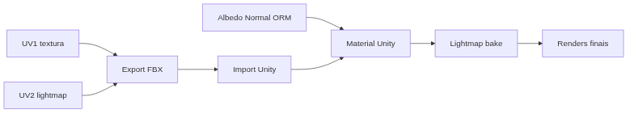

<!-- _class: cover -->
<!-- _paginate: false -->

# Do arquivo à cena no motor

## UV2 de lightmap, materiais na Unity e primeira iluminação baked

**Semana 16** — O kit inteiro, montado pela primeira vez

<!--
Notas: Abertura da mini aula (20 min). Unidade IV — Otimização e Integração ao Motor. Crítica 🔵 INFORMAL (circulante), sem nota formal nesta semana. Apostila Cap. 11 — Abertura de malha para lightmap; Cap. 12 — Importação e configuração na Unity; renderização de modelos texturizados. Mensagem central da capa: até aqui todo o trabalho aconteceu no Blender e no 3D Coat. Hoje o kit inteiro entra, pela primeira vez, em um motor de jogo real. Isso exige duas coisas novas: um segundo canal de UV só para a luz (UV2) e a reconstrução dos mapas PBR já produzidos dentro do sistema de material da Unity. É o ensaio geral da apresentação final (S17). NÃO antecipar a apresentação/defesa nem os critérios formais da CF6 — isso é conteúdo da S17.
-->

---

<!-- _class: objectives -->

## Objetivos de hoje

Ao final da semana você será capaz de:

- Diferenciar **UV1** (textura) de **UV2** (lightmap) e por que a luz baked precisa do próprio mapa
- **Gerar UV2** de lightmap no Blender, sem sobreposição e com padding
- **Exportar** em FBX preservando os dois canais de UV
- **Configurar** materiais PBR no shader da Unity (Albedo, Normal, Metallic/Smoothness)
- **Executar** um lightmap bake simples da cena montada
- **Capturar** renders finais do kit sob a iluminação baked

<!--
Notas: Ler rápido. Os seis objetivos vêm direto do plano de aula (itens 1 a 6). Reforçar: hoje não é técnica nova de pintura nem de otimização — é transporte para o motor. Nada do que foi produzido nas 15 semanas muda; o que muda é o ambiente que lê esses mapas e uma camada de UV nova que nunca foi necessária até agora. Os renders capturados hoje já começam a compor a evidência visual (breakdown) para a apresentação da S17.
-->

---

<!-- _class: question -->

# Tudo que você fez em 15 semanas está nos mapas de textura. Por que o objeto aparece cinza ao importar na Unity?

<!--
Notas: Pergunta de abertura (do plano de aula). Exibir no projetor o MESMO asset em duas situações: o material completo aberto no Blender (Principled BSDF, todos os nós conectados) e o mesmo asset ainda sem material, cinza, recém-importado na Unity. Deixar 2–3 respostas. Direcionar para a ideia central: a Unity não lê o node setup do Blender — ela só recebe geometria, UV e os arquivos de textura brutos. O trabalho de hoje é reconstruir, dentro do sistema de material da Unity, a mesma lógica de leitura de mapas que já existe no Blender, mais uma camada de UV nova: o lightmap.

[!FIGURA]
Objetivo didático: materializar o gancho da aula — o trabalho está guardado nos mapas, mas o motor não herda o material montado no Blender.
Arquivo sugerido: assets/asset_blender_vs_unity_cinza.webp
Descrição: dois painéis lado a lado do mesmo asset do kit. À esquerda, rotulado "Blender", o objeto com material completo (Principled BSDF, todos os nós conectados visíveis ao fundo). À direita, rotulado "Unity", o mesmo objeto cinza liso, recém-importado, sem material.
Como produzir: no Blender, capturar o viewport com o material aplicado e o node editor visível. Na Unity, importar o mesmo FBX sem material e capturar o objeto cinza na cena. Montar lado a lado no Krita com os rótulos "Blender" e "Unity".
-->

---

## De onde viemos: conteúdo pronto, motor ainda não

A Unidade IV otimizou a **produção de conteúdo** do kit.

- **Atlas** (S13) e **Trim Sheet** (S14) — menos texturas
- **ORM, compressão e resolução** (S15) — texturas mais leves
- Todo o trabalho até aqui: **Blender e 3D Coat**

Esta semana fecha a Unidade IV **transportando** esse conteúdo, pela primeira vez, para dentro de um motor de jogo real.

<!--
Notas: Revisão rápida e nota de transição do plano de aula. As Semanas 13–15 resolveram a Unidade IV do lado da produção: menos texturas e texturas mais leves. Hoje o mesmo conteúdo entra na Unity. Isso exige um UV que ainda não foi trabalhado — o UV2 de lightmap — e a reconfiguração dos mapas PBR dentro do sistema de material da Unity (URP), que lê canais de forma diferente do Principled BSDF do Blender. Preparar os quatro tópicos da mini aula: UV2, geração de UV2, materiais na Unity e lightmap bake.
-->

---

## UV1 e UV2: duas perguntas diferentes

O mesmo objeto carrega **dois canais de UV**, com finalidades distintas.

### UV1 (desde a S2)
**"Que pixel de textura aparece aqui?"**

Pode ter ilhas sobrepostas (atlas) ou repetidas por tiling (trim).

### UV2 (novo, hoje)
**"Quanta luz chega neste ponto?"**

Cada ponto físico é único → **sem nenhuma sobreposição**.

<!--
Notas: Tópico 1 da mini aula. O UV1, usado desde a S2, foi otimizado para textura: sobreposição ali é DESEJÁVEL, porque a mesma região de textura é reaproveitada (atlas na S13, tiling na S14). O lightmap registra a luz incidente sobre cada ponto da superfície — se duas regiões compartilham o mesmo espaço de UV, elas vazam luz uma para a outra no bake, mesmo sendo partes fisicamente distintas. Por isso o UV2 é exclusivo para a luz e não pode ter sobreposição, mesmo que o UV1 do mesmo objeto tenha sobreposição intencional. Frase-chave do plano: "UV1 responde 'que pixel aparece aqui?'; UV2 responde 'quanta luz chega neste ponto?'".
-->

---

## Por que a sobreposição no UV2 vaza luz

Se duas ilhas do UV2 ocupam o mesmo espaço, o bake grava a **mesma luz** em regiões fisicamente distintas do objeto.

- O resultado são **manchas de luz incoerentes** (light bleeding)
- Prevenir no UV é **muito mais rápido** que diagnosticar depois do bake
- Inspecione o UV2 no UV Editor **antes** de exportar

Padding insuficiente entre ilhas também vaza luz entre ilhas **adjacentes** — não basta não sobrepor, é preciso espaço entre elas.

<!--
Notas: Tópico 1 (continuação) e Possíveis Dificuldades nº 1 do plano — o erro técnico mais comum e mais confuso para quem faz pela primeira vez. Reforçar a estratégia: antes de qualquer bake, inspecionar visualmente o UV2 ilha por ilha e confirmar ausência de sobreposição E padding suficiente. Vazamento de luz é sintoma de UV2 mal gerado (ou objetos muito próximos na cena) — resolver na origem (UV), não compensando com parâmetros de luz.
-->

---

## Gerando UV2 no Blender

O Blender gera **automaticamente** um segundo canal de UV com regras próprias de lightmap: empacotamento sem sobreposição e com padding.

- Gerado **independente** do UV1 — não o substitui
- Ambos convivem no mesmo objeto e são exportados juntos
- Você **não reabre** o UV1 já validado desde as primeiras semanas

UV2 é um mapa **adicional**, que existe só para a luz. O UV1 continua sendo o responsável pela aparência da textura.

<!--
Notas: Tópico 2 da mini aula. O Blender oferece geração automática de um segundo canal de UV, adequada para lightmap (sem sobreposição, com padding). Esse UV2 é gerado de forma independente do UV1 e não o altera — os dois convivem. Reforçar: o estudante NÃO deve mexer no UV1 que já está pronto e validado. Na maioria dos casos a geração automática do UV2 basta. Preparar a demonstração: mostrar no UV Editor a diferença entre o layout do UV1 e o do UV2.

[!FIGURA]
Objetivo didático: contrastar visualmente o layout do UV1 (com possível sobreposição/repetição) e o do UV2 (sem sobreposição, com padding).
Arquivo sugerido: assets/uv1_vs_uv2_layout.webp
Descrição: dois quadrados de UV do mesmo asset lado a lado. À esquerda, "UV1" com ilhas grandes, algumas sobrepostas ou repetidas. À direita, "UV2" com todas as ilhas separadas, sem sobreposição, com espaço (padding) visível entre elas.
Como produzir: no Blender, no UV Editor, capturar o layout do UV1 do asset de demonstração; gerar o segundo canal de UV (lightmap) e capturar o layout do UV2. Montar lado a lado no Krita com os rótulos "UV1 · textura" e "UV2 · lightmap".
-->

---

<!-- _class: diagram -->

## O caminho do asset até a cena

Os dois canais de UV vão juntos no FBX; os mapas já produzidos entram no shader da Unity; a cena marcada como *Static* recebe o bake.

<!--
Notas: O GitHub Action converte o mermaid em imagem — por isso o diagrama vai no markdown, não na nota. Percorrer o fluxo: os dois canais de UV (UV1 e UV2) são exportados juntos no FBX; na Unity, o material é reconstruído com os mapas já produzidos (Albedo, Normal, ORM); os objetos marcados como Static recebem o lightmap bake; por fim, capturamos os renders. Este é exatamente o percurso da demonstração de 20 min. Erro a antecipar (Possíveis Dificuldades nº 4): esquecer de conferir se o FBX exportou os DOIS canais — sem isso, a Unity gera um lightmap UV automático de baixa qualidade.
-->

---

## Materiais na Unity: os mapas nos slots certos

O shader **Lit** (URP) espera os mapas PBR em slots próprios.

- **Base Map** ← Albedo
- **Normal Map** ← seu Normal Map
- **Metallic / Smoothness** (ou Mask Map) ← seu mapa ORM

Os mapas que você já produziu estão **certos**. O que muda é o *container* que lê esses mapas — o shader da Unity tem os próprios botões.

<!--
Notas: Tópico 3 da mini aula. O shader Lit do URP espera Base Map (Albedo), Normal Map e um slot combinado de Metallic/Smoothness (ou Mask Map, conforme o pipeline). Analogia do plano: é como levar a mesma receita de um forno para outro — os ingredientes (mapas) são os mesmos, mas o forno tem os próprios botões e você precisa saber onde cada um fica. O trabalho técnico e artístico das 15 semanas não muda. Preparar os dois próximos slides: as duas diferenças que mais pegam — Smoothness invertido e a flag do Normal Map.
-->

---

## Cuidado 1: Smoothness é o inverso de Roughness

A Unity usa **Smoothness**; você produziu **Roughness** desde a S5. Eles são opostos.

- Superfície mais **lisa** → Smoothness **alto**
- Superfície mais **áspera** → Smoothness **baixo**
- Pode ser preciso **inverter** o canal correspondente do ORM

Conectar Roughness como se fosse Smoothness, sem inverter, deixa a superfície mais brilhante ou mais opaca do que o material realmente é.

<!--
Notas: Possíveis Dificuldades nº 3 do plano. O conceito de Roughness (usado desde a S5) é o inverso do de Smoothness (shader Lit da Unity). Estudantes frequentemente conectam o canal sem inverter. Estratégia de mediação: comparar visualmente a superfície na Unity com o render de referência do Blender e perguntar diretamente — "essa superfície deveria ser mais lisa ou mais áspera aqui? O valor que você vê bate com isso?". Se o material parece mais brilhante/opaco que o esperado, o suspeito nº 1 é o Smoothness invertido.
-->

---

## Cuidado 2: a flag "Normal Map" na importação

Todo Normal Map precisa ter a flag **"Normal Map"** ativada no Inspector da textura — **antes** de conectar ao material.

- Sem a flag, a Unity lê a textura como **cor comum**
- O material aceita a conexão **sem erro** — é um erro silencioso
- O resultado fica sutilmente errado: relevo **invertido ou achatado**

Verifique sistematicamente, para cada Normal Map, se a opção está marcada no Inspector — é o primeiro ponto de checagem antes de qualquer outro diagnóstico.

<!--
Notas: Possíveis Dificuldades nº 2 e Estratégias de Mediação do plano. Erro silencioso: a textura é importada como imagem comum, o material aceita a conexão sem erro, mas o relevo fica invertido ou achatado. Estratégia: para cada Normal Map importado, conferir no Inspector se a flag "Normal Map" está ativada ANTES de conectar. Quando o normal aparece estranho, este é o primeiro ponto de verificação, antes de investigar qualquer outra causa.
-->

---

## Lightmap bake: da malha estática à luz calculada

Para receber o bake, o objeto precisa estar marcado como **Static** (Contribute GI).

- O bake **calcula** a iluminação indireta (luz que rebate entre superfícies)
- E a **grava como textura** no UV2 de cada objeto
- Por isso o UV2 sem sobreposição é **pré-requisito**, não detalhe

É a mesma lógica do bake de Normal e AO no Blender (S11–12): calcular uma informação complexa **uma vez** e gravá-la como textura.

<!--
Notas: Tópico 4 da mini aula. Para um objeto receber lightmap bake na Unity, ele precisa estar marcado como Static (Contribute GI). O bake calcula a iluminação indireta da cena e a grava no UV2 — por isso o UV2 sem sobreposição é pré-requisito. Analogia do plano: conceitualmente parecido com o bake de Normal Map e AO já feito no Blender (S11–12) — uma informação complexa (luz, ou detalhe de superfície) é calculada uma vez e gravada como textura, para não recalcular em tempo real. Nota do professor: se o bake demorar mais que os 20 min, ter uma cena com bake concluído pronta para mostrar e usar o tempo ao vivo na parte mais transferível (configuração de material + UV2).
-->

---

## Erros comuns

**Sobreposição no UV2** — vaza luz entre regiões distintas. Confira o layout no UV Editor antes de exportar.

**Normal Map sem a flag** — lido como cor comum; relevo achatado ou invertido. Ative no Inspector.

**Smoothness invertido** — brilho não bate com o Blender. Inverta o canal do ORM se preciso.

**Escala errada na importação** — asset gigante ou minúsculo. Compare com um cubo de 1 metro.

<!--
Notas: Os erros mais frequentes, das Possíveis Dificuldades do plano (nº 1, 2, 3 e 5). Caçar exatamente estes ao circular no estúdio. Acrescentar mentalmente o nº 4: conferir que o FBX exportou os dois canais de UV, para a Unity não gerar um lightmap UV automático de baixa qualidade em vez do UV2 planejado. Escala: diferenças de unidade entre Blender e Unity — posicionar um objeto de escala conhecida (cubo de 1 m) ao lado e ajustar a escala de importação antes de montar a cena.
-->

---

<!-- _class: industry -->

## Na indústria

Nenhum asset chega pronto ao motor. **Gerar UV2, reconfigurar materiais no shader do engine e rodar o bake** são rotina de todo pipeline — AAA ou indie.

Levar a mesma arte de uma ferramenta para outra, diagnosticando e corrigindo o que quebra no caminho, é o trabalho central de um **artista técnico** — não um obstáculo acidental.

<!--
Notas: Contextualizar o valor profissional (Fechamento, reflexão de fechamento de unidade). A interoperabilidade entre ferramentas — Blender/3D Coat para produção, Unity como destino — é parte central do trabalho de um artista técnico de jogos. É esperado e normal que a primeira importação de cada estudante tenha ao menos um problema (normal map, smoothness ou lightmap). O objetivo da semana é o primeiro ciclo completo de diagnóstico e correção nesse ambiente novo, não a perfeição na primeira tentativa.
-->

---

<!-- _class: summary-slide -->

# Resumo

- **UV1 × UV2** — textura pode sobrepor; lightmap **nunca** sobrepõe
- **UV2** gerado automático no Blender, adicional ao UV1, exportado junto no FBX
- **Material na Unity** — Albedo, Normal (com flag) e Metallic/Smoothness nos slots
- **Smoothness** é o inverso de Roughness; **flag** obrigatória no Normal Map
- **Bake** exige objeto *Static*; o UV2 limpo é pré-requisito da luz
- **Renders** finais do kit montado → evidência para a S17

<!--
Notas: Amarrar a mini aula antes da demonstração. Cada item retorna na demonstração ao vivo (gerar UV2, exportar, configurar material e primeiro bake) e no estúdio (UV2 + FBX + material de dois assets no 1º encontro; kit completo, cena montada e bake final no 2º encontro). Lembrar: hoje é crítica 🔵 INFORMAL, sem nota formal — mas a cena Unity montada, o lightmap baked e os renders finais compõem a evidência central de C8 (Integração na Unity), avaliada formalmente pela primeira vez na CF6 da S17.
-->

---

## Agora: demonstração

A seguir, ao vivo: gerar o **UV2** de um asset, exportar em FBX com os dois canais, **configurar o material** no shader Lit da Unity e rodar um **primeiro lightmap bake**.

A pergunta que você leva ao estúdio: **quais assets do meu kit já têm UV1 pronto e podem receber o UV2 agora?**

<!--
Notas: Transição para a demonstração de 20 min. Sequência do plano: (1) gerar UV2 no Blender e comparar o layout com o UV1 no UV Editor; (2) exportar FBX confirmando os dois canais de UV e importar na Unity — objeto aparece cinza, retomando o gancho da abertura; (3) criar material no shader Lit, conectar Albedo ao Base Map, Normal Map (ativando a flag antes) e Metallic/Smoothness (invertendo o canal se necessário), comparando com o render de referência do Blender; (4) marcar Static, configurar luz direcional e rodar Generate Lighting, mostrando antes/depois. No estúdio (1º encontro), cada estudante gera o UV2, exporta e configura o material de ao menos dois assets antes de expandir para o kit completo no 2º encontro.

[!FIGURA]
Objetivo didático: antecipar o alvo visual da demonstração para que a turma reconheça o resultado esperado antes de produzir no estúdio.
Arquivo sugerido: assets/demo_blender_unity_pipeline.webp
Descrição: três painéis em sequência — (1) UV Editor do Blender com o UV2 gerado, ilhas separadas com padding; (2) Inspector da Unity de um Normal Map com a flag "Normal Map" marcada, ao lado do material Lit com os slots preenchidos; (3) a cena com o asset já texturizado sob luz baked, com um antes/depois do lightmap bake.
Como produzir: no Blender, capturar o UV Editor com o UV2. Na Unity, capturar o Inspector da textura com a flag ativada e o material Lit configurado; rodar Generate Lighting e capturar a viewport antes/depois. Montar os três painéis no Krita, numerados 1–2–3.
-->
