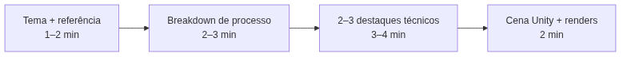

<!-- _class: cover -->
<!-- _paginate: false -->

# Contar a história de um semestre

## Apresentação e defesa do Kit Modular de Ambiente

**Semana 17** — O projeto inteiro, defendido em 15 minutos

<!--
Notas: Abertura da mini aula (20 min). Unidade V — Projeto Final e Apresentação. Crítica 🔴 FORMAL (CF6 / Projeto Final) — 40% da nota final, e a única semana em que TODOS os 10 critérios da rubrica recebem nota simultaneamente, incluindo C10 (Participação), até aqui só observado. Apostila: todos os capítulos — integração semestral. Mensagem central da capa: nas 16 semanas anteriores cada peça foi produzida isolada — UV, material, textura, bake, otimização, integração na Unity. Hoje nada tecnicamente novo é ensinado: pede-se ao estudante montar essas peças em uma narrativa coerente e defendê-la oralmente diante da turma e do professor. Esta mini aula deve ser breve e direta — o objetivo é reduzir ansiedade com clareza de formato, não adicionar conteúdo. Não prolongar além dos 20 min: o tempo de estúdio hoje é a própria defesa.
-->

---

<!-- _class: objectives -->

## Objetivos de hoje

Ao final da semana você será capaz de:

- **Apresentar** o Kit Modular completo em 10 min + 5 min de perguntas
- **Justificar** tecnicamente suas decisões, ligando cada uma a um critério da rubrica
- **Comparar** sua autoavaliação com o feedback recebido na defesa
- **Oferecer** feedback específico às apresentações dos colegas
- **Refletir** sobre sua trajetória desde a Semana 1
- **Entregar** a documentação final organizada conforme o padrão

<!--
Notas: Ler rápido. Os seis objetivos vêm direto do plano de aula (itens 1 a 6). Reforçar: hoje NÃO há técnica nova — é a integração de tudo que já foi produzido em uma narrativa defensável. A apresentação de 10+5 min alimenta C9; a justificativa técnica atravessa C1–C8; o feedback aos colegas alimenta C10; a reflexão semestral consolida a metacognição sobre o próprio aprendizado. Nada aqui exige produzir peça nova: exige curar e defender o que já existe.
-->

---

<!-- _class: question -->

# Se você tivesse só 10 minutos para convencer alguém de que este kit é bom, o que mostraria primeiro?

<!--
Notas: Pergunta de abertura (do plano de aula). Deixar 2–3 respostas da turma. Usar as respostas para introduzir a ideia central: uma boa defesa NÃO é mostrar tudo — é uma curadoria do próprio processo. Depois de 16 semanas produzindo, hoje vocês vão contar a história desse projeto para quem não acompanhou de perto. O que aparece primeiro é uma escolha editorial. Direcionar para o próximo slide: a apresentação é uma seleção, não um relatório completo das 17 semanas.
-->

---

## De onde viemos: 16 semanas, um só projeto

Cada semana produziu uma **peça** do mesmo Kit Modular.

- **UV** validado (S2–4) e **materiais PBR** completos (S5–8)
- **Texturização** artística e **bake** integrado (S9–12)
- **Otimização** em atlas, trim e ORM (S13–15)
- Cena **montada na Unity** com lightmap e renders (S16)

Hoje essas peças isoladas viram **uma narrativa coerente** — e você a defende.

<!--
Notas: Revisão rápida e nota de transição do plano de aula. Todas as 16 semanas anteriores produziram peças de um mesmo projeto integrador. A Semana 17 não ensina nada tecnicamente novo: pede que o estudante monte essas peças em uma narrativa e as defenda. É, ao mesmo tempo, o encerramento pedagógico da disciplina e a avaliação de maior peso do semestre (CF6, 40% via Projeto Final). Reforçar que o estudante chega hoje sem nenhuma entrega técnica nova a produzir — o kit já está pronto.
-->

---

## Uma defesa é curadoria, não relatório

Você **não precisa** explicar cada uma das 17 semanas.

- Escolha o que for **mais representativo** do seu trabalho
- Mostrar tudo dilui o que importa e estoura o tempo
- A apresentação é uma **escolha editorial**, não um inventário

Selecionar o que mostrar — e o que deixar de fora — já é uma decisão de artista, e é observada em **C9 (Apresentação)**.

<!--
Notas: Item central da mini aula. Frase do plano: "Vocês não precisam explicar cada uma das 17 semanas. Escolham o que for mais representativo — a apresentação é uma escolha editorial, não um relatório completo." O erro que se quer prevenir (Possíveis Dificuldades nº 2): tentar mostrar tudo e estourar os 10 minutos. Parte da avaliação de C9 é justamente organizar a fala dentro do tempo dado. Preparar o próximo slide: a estrutura sugerida dos 10 minutos.
-->

---

<!-- _class: diagram -->

## Os 10 minutos: uma sequência sugerida

Uma sugestão, **não um roteiro rígido** — ajuste ao seu projeto.

<!--
Notas: Item 1 da mini aula. O GitHub Action converte o mermaid em imagem — por isso o diagrama vai no markdown, não na nota. Detalhar a sequência do plano: (a) tema do kit e referência visual (1–2 min); (b) breakdown de processo — o que mudou da primeira versão até a final, com PELO MENOS um exemplo de feedback incorporado (2–3 min); (c) destaque técnico — 2 ou 3 decisões (UV, material, bake, otimização ou Unity) das quais o estudante mais se orgulha, explicando o porquê (3–4 min); (d) a cena final na Unity com os renders (2 min). Reforçar que a ordem é sugestão; o essencial é que o breakdown mostre evolução e que os destaques venham com justificativa.
-->

---

## O breakdown mostra evolução, não só o resultado

O coração da defesa é **o que mudou** entre a primeira versão e a final.

- Traga **pelo menos um** exemplo de feedback incorporado
- Mostre a decisão que você tomou, **reviu e mudou** no meio do caminho
- Isso é a evidência viva de **C1 (Processo de Projeto)**

<!--
Notas: Reforço do item 1 (parte b) e ligação com C1. A documentação de processo — moodboard, versões, anotações de crítica, checklists semanais (Instrumento 4) — sustenta C1. Perguntas de mediação do plano para provocar isso na defesa: "Você me mostrou o resultado final desse asset — me conta uma decisão que você tomou no meio do processo e depois mudou. O que te fez mudar?" e "Esse é o mesmo asset que eu vi na Semana 3 com o UV recém-aberto. O que mudou entre aquela versão e essa?". A trajetória do projeto precisa ser rastreável.
-->

---

## Os 5 minutos de perguntas: defesa, não interrogatório

As perguntas têm o mesmo espírito das **críticas** que você já viveu.

- O objetivo é **entender a decisão**, não expor uma falha
- *"Não sei, mas acho que..."* seguido de raciocínio **vale**
- Silêncio ou defensividade valem **menos** em C10

São as mesmas perguntas das cinco críticas formais anteriores — só que agora sobre o **projeto inteiro**.

<!--
Notas: Item 2 da mini aula. Frase do plano: "As perguntas de hoje são as mesmas que vocês já responderam nas cinco críticas formais anteriores — só que agora sobre o projeto inteiro. Vocês já treinaram isso a cada duas ou três semanas desde a CF1." Reforçar que tentativa de justificativa vale mais que silêncio — isso alimenta C10. As perguntas do professor priorizam justificativa técnica ("por que esse valor de roughness aqui?", "o que te fez escolher trim nesse elemento e atlas naquele?"), não sim/não. Tratar a defesa como conversa técnica, não como confronto.
-->

---

## A nota de hoje: a rubrica que você já conhece

Pela **primeira e única vez**, os 10 critérios recebem nota juntos.

- Você já foi avaliado em cada um deles **separadamente** no semestre
- Hoje inclui **C10 (Participação)**, até agora só observado
- Nada é novo — é a **integração** de tudo em um só momento

<!--
Notas: Item 3 da mini aula. Frase do plano: "Vocês já foram avaliados nesses critérios separadamente ao longo do semestre. Hoje é a primeira e única vez em que todos aparecem juntos, e a única vez em que a participação nas críticas também vira nota." Objetivo do slide: reduzir ansiedade (Possíveis Dificuldades nº 1) deixando claro que não há conteúdo novo sendo cobrado. A CF6 corresponde ao componente PF da fórmula NF = (PA × 0,40) + (CC × 0,20) + (PF × 0,40); C10 hoje também consolida o fechamento da nota de CC. Preparar o próximo slide: a tabela de pesos e o destaque de C5.
-->

---

## Os pesos do Projeto Final (CF6)

### Maior peso
**C5 — Texturização · 14%**

O núcleo da disciplina: narrativa de desgaste e leitura à distância.

### Também alto peso
**C2 · C4 · C8 — 12% cada**

Direção artística, materiais PBR e integração na Unity.

Os demais (C1, C3, C6, C7, C9, C10) completam a ponderação — **não é média simples**.

<!--
Notas: Item 3 (continuação). Mostrar que C5 (Texturização) tem o maior peso — coerente com ser o núcleo da disciplina. Tabela de referência da Rubrica Mestre para a CF6 / PF: C1 10%, C2 12%, C3 8%, C4 12%, C5 14%, C6 8%, C7 8%, C8 12%, C9 8%, C10 8%. NÃO é média simples dos critérios e NÃO é a mesma ponderação do Portfolio de Artefatos (PA). O estudante não precisa decorar a tabela — precisa saber que texturização, direção artística, materiais e Unity concentram o peso, orientando o que priorizar no breakdown. Evitar transformar isto em aula de planilha: é orientação, não cobrança de memorização.
-->

---

## A autoavaliação já entregue entra na conversa

Você entregou a autoavaliação (Instrumento 2) **antes** desta aula.

- Ela será **comparada** com a avaliação do professor na defesa
- **Divergência não é punição** — vira uma pergunta
- *"Me mostra a evidência que te fez pensar em nível 4 aqui."*

A própria autoavaliação já é evidência de **C1**, independentemente de bater exatamente com a nota final.

<!--
Notas: Item 4 da mini aula. Frase do plano: "Se vocês se avaliaram em 4 num critério e eu observar um 3, isso não vira automaticamente uma nota mais baixa — vira uma pergunta na hora da defesa: 'me mostra a evidência que te fez pensar em nível 4 aqui'. É a mesma lógica de justificar decisões que vocês praticam desde a Semana 3." Divergência entre autoavaliação e avaliação do professor é material de diálogo técnico, não confronto (Possíveis Dificuldades nº 3). Tratar como oportunidade, não erro a corrigir publicamente. Comparar a autoavaliação com o feedback recebido é o objetivo 3 do plano.
-->

---

## Erros comuns na defesa

**Tentar mostrar tudo** — estoura os 10 min e dilui o essencial. Cure o que é mais representativo.

**Responder sim/não** — perde a chance de justificar. Explique o *porquê* de cada decisão.

**Travar diante de uma pergunta** — silêncio pesa em C10. Prefira "não sei, mas acho que...".

**Depender do arquivo abrir ao vivo** — tenha renders e screenshots já exportados como plano B.

<!--
Notas: Erros mais frequentes, das Possíveis Dificuldades do plano (nº 2, 3, 4, 5). Ao circular na preparação, caçar exatamente estes. Para o tempo: usar cronômetro visível e interromper com gentileza ao final dos 10 min. Para a defensividade: reforçar que tentativa de raciocínio vale em C10. Para o problema técnico: exigir teste prévio de abertura dos arquivos (idealmente já feito na S16) e ter renders/screenshots exportados como apoio caso o projeto Unity não abra ao vivo — o foco da defesa é explicar o processo, não depender do arquivo ao vivo.
-->

---

<!-- _class: industry -->

## Na indústria

Defender decisões técnicas e artísticas diante de uma banca é **rotina** — em review de portfólio, entrevista ou revisão de milestone.

O Kit Modular que você defende hoje — completo, documentado e funcional na Unity — é, a partir de agora, **material de portfólio profissional**.

<!--
Notas: Contextualizar o valor profissional (Fechamento do plano). Saber apresentar e justificar o próprio trabalho é competência central na área de jogos — art reviews, entrevistas e milestones exigem exatamente isso. Reforçar que o portfólio produzido ao longo do semestre é um artefato real de empregabilidade, não um exercício de sala. O objetivo do encerramento é consolidar a metacognição sobre o processo de aprendizagem, não só sobre o produto. Não intimidar com padrão inatingível — a demonstração usa um kit de referência para calibrar expectativas de forma concreta.
-->

---

<!-- _class: summary-slide -->

# Resumo

- **Curadoria, não relatório** — mostre o mais representativo, dentro do tempo
- **Breakdown** = o que mudou + feedback incorporado (C1)
- **10 + 5 min** — apresentação e defesa com justificativa técnica
- **10 critérios juntos** pela 1ª vez; **C5** tem o maior peso
- **Autoavaliação** vira diálogo, não punição
- **Plano B** de renders para qualquer imprevisto técnico

<!--
Notas: Amarrar a mini aula antes da demonstração. Cada item volta na prática: a demonstração usa um kit de referência para calibrar o padrão esperado; o estúdio é a própria defesa (10+5 min por estudante, cronômetro visível). Lembrar: hoje é 🔴 CF6 / Projeto Final, 40% da nota final, e a última entrega avaliativa formal da disciplina. Nada do que é avaliado hoje é novo — é a integração do que já foi praticado desde a CF1. Reduzir ansiedade com clareza de formato é o objetivo desta mini aula.
-->

---

## Agora: kit de referência

A seguir, o professor apresenta um **Kit Modular completo** como parâmetro do padrão esperado — passando pelos mesmos pontos que você vai defender.

A pergunta que você leva ao estúdio: **quais 2 ou 3 decisões técnicas do meu kit eu mais quero destacar?**

<!--
Notas: Transição para o bloco de demonstração de 20 min. Não há demonstração técnica nova nesta semana (conforme o cronograma). O professor usa o bloco para apresentar um Kit Modular completo de referência (coorte anterior ou kit próprio preparado antes), percorrendo: (3 min) contextualização como exemplo nível 4–5; (5 min) moodboard e coerência de direção artística → C2; (5 min) breakdown técnico UV, material PBR, textura com narrativa de desgaste, bake sem artefatos → C3, C4, C5, C6; (4 min) cena na Unity e renders → C7, C8; (3 min) estrutura da apresentação do exemplo → C9. Se não houver kit de coorte anterior, usar kit próprio ou documentação de portfólio profissional (com créditos), desde que cubra visivelmente os 10 critérios. O objetivo é calibrar expectativas, não intimidar. Depois disso, o estúdio inicia com 15 min de preparação final e o primeiro bloco de apresentações.

[!FIGURA]
Objetivo didático: antecipar o padrão esperado com um exemplo concreto, para a turma reconhecer o nível-alvo antes da própria defesa e da comparação com a autoavaliação.
Arquivo sugerido: assets/kit_referencia_breakdown.webp
Descrição: montagem de três painéis de um Kit Modular de referência — (1) moodboard e assets do kit lado a lado, mostrando coerência de direção artística; (2) breakdown técnico de um asset: UV layout, material PBR e textura com desgaste, com o bake sem seams; (3) a cena final montada na Unity sob luz baked, com um render em destaque.
Como produzir: usar um kit de coorte anterior ou de referência do professor. No Blender/3D Coat, capturar o moodboard, o UV editor e o material do asset; no Unity, capturar a cena montada com iluminação baked e um render final. Compor os três painéis no Krita, numerados 1–2–3, com rótulos "Direção Artística", "Breakdown Técnico" e "Cena Final".
-->
