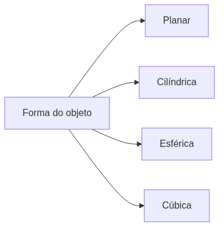

<!-- _class: cover -->
<!-- _paginate: false -->

# Mapeamento UV

## Desdobrando o 3D no plano

**Semana 2** — Conceitos e projeção de textura

<!--
Notas: Abertura da mini aula (20 min). Não é tutorial — é a construção da intuição conceitual antes de abrir o Blender na demonstração. Lembrar que esta é a primeira vez que a turma abre o UV Editor com intenção de trabalho.
-->

---

## Objetivos de hoje

Ao final da semana você será capaz de:

- Explicar **o que é** um mapa UV e por que ele existe
- Ler o **espaço UV (0–1)**: distorção, sobreposição e desperdício
- Aplicar as **quatro projeções**: planar, cilíndrica, esférica, cúbica
- Usar o **checkerboard** para diagnosticar distorção

<!--
Notas: Ler rápido. Cada objetivo volta ao longo da aula. Não detalhar agora. Texel density entra apenas como intuição — o cálculo numérico é Semana 4.
-->

---

<!-- _class: question -->

# Você tem uma esfera 3D e quer pintá-la. Como dizer ao computador **onde** cada pixel vai parar?

<!--
Notas: Deixar 2–3 respostas da turma antes de apresentar a analogia da caixa de papelão. Não corrigir — usar as respostas como ponte para o conceito de "desdobrar".
-->

---

## A analogia da caixa

UV mapping é **desdobrar** um objeto 3D como uma caixa de papelão.

Você corta as dobras e abre tudo em um **plano 2D**.

É nesse plano que a textura será pintada.

<!--
Notas: Esta é a imagem mental central da semana. "Cortar as dobras" antecipa o conceito de seam (Semana 3), mas NÃO nomear seam ainda em profundidade — apenas plantar a ideia de que existe um corte.

FIGURA (produzir) — assets/analogia_caixa_uv.webp
Objetivo: tornar concreta a ideia de "desdobrar" um objeto 3D em um plano 2D, ancorando o conceito abstrato de UV na experiência física de abrir uma caixa.
Descrição: um cubo 3D à esquerda e, à direita, o mesmo cubo "aberto" em forma de cruz (planificação) sobre o quadrado da textura, com as faces numeradas para mostrar a correspondência.
Como produzir: no Blender, criar um cubo, aplicar Cube Projection e posicionar o Viewport 3D ao lado do UV Editor. Renderizar ou capturar as duas visões. No Krita, montar a comparação lado a lado e numerar as faces correspondentes.
-->

---

## O espaço UV (0–1)

O UV Editor é um **quadrado de 0 a 1** nos dois eixos.

A textura ocupa exatamente esse quadrado.

Cada vértice tem uma coordenada UV: *"este ponto do objeto = este ponto da textura"*.

<!--
Notas: Fixar que U e V vão de 0 a 1, independentemente da resolução da textura. Mostrar o cubo aberto ao lado da textura que o cobre. Não falar em UDIMs ou tiles múltiplas — isso é muito à frente.

FIGURA (produzir) — assets/espaco_uv_0_1.webp
Objetivo: mostrar que o espaço UV é um quadrado normalizado (0–1) onde as islands do objeto são posicionadas sobre a textura.
Descrição: o UV Editor do Blender com os eixos rotulados 0 e 1, uma textura checkerboard preenchendo o quadrado e as islands de um cubo posicionadas sobre ela.
Como produzir: no Blender, abrir o UV Editor com um cubo desdobrado e checkerboard carregado. Capturar a tela e, no Krita, adicionar os rótulos "0" e "1" nos cantos dos eixos U e V.
-->

---

## O problema da distorção

Não dá para desdobrar uma esfera **sem distorção** — como um mapa-múndi plano.

O objetivo **não é eliminar** a distorção.

O objetivo é **controlá-la**: mantê-la onde ninguém percebe.

Distorção invisível é distorção resolvida.

<!--
Notas: Comparação com o mapa-múndi (projeção de Mercator) funciona muito bem. Reforçar a mudança de expectativa: nesta semana o sucesso é OBSERVAR e NOMEAR a distorção, não zerá-la. Isso previne a paralisia do "quero deixar perfeito".
-->

---

## Quatro tipos de projeção

A projeção certa **depende da forma**. Não existe uma que sirva para tudo.

<!--
Notas: Introduzir as quatro projeções como um menu de ferramentas, cada uma boa para uma família de formas. Os próximos slides detalham uma a uma com uma frase cada. Não sobrecarregar.
-->

---

## Planar & Cilíndrica

**Planar** — projeta de um ângulo, como uma câmera.
Boa para superfícies **planas**. Distorce nas bordas laterais.

**Cilíndrica** — enrola a textura ao redor do objeto.
Boa para **colunas, tubos, troncos, pernas**.

<!--
Notas: Emparelhar planar e cilíndrica porque são as mais intuitivas. Pedir exemplos concretos à turma: "que peça do kit de vocês seria planar? qual seria cilíndrica?". Conectar ao projeto integrador.

FIGURA (produzir) — assets/projecao_planar_cilindrica.webp
Objetivo: associar cada projeção à família de formas onde ela distorce menos, comparando visualmente o checkerboard resultante.
Descrição: à esquerda, um plano/parede com projeção planar e checker uniforme; à direita, um cilindro com projeção cilíndrica mostrando o seam vertical e o grid regular no corpo.
Como produzir: no Blender, aplicar Project From View (planar) em um plano e Cylinder Projection em um cilindro, ambos com checkerboard. Capturar Viewport + UV Editor e montar lado a lado no Krita.
-->

---

## Esférica & Cúbica

**Esférica** — enrola em todas as direções.
Boa para **esferas e cabeças**. Distorce nos **polos**.

**Cúbica (Box)** — seis projeções planares nas faces de um cubo imaginário.
Boa para formas com **faces reconhecíveis**.

<!--
Notas: A distorção nos polos da esférica é o ponto mais visual — mostrar como o checker "aperta" no topo e na base. A cúbica é a mais usada para props do kit modular nesta fase. Não entrar em Smart UV Project ainda (é a demonstração).

FIGURA (produzir) — assets/projecao_esferica_cubica.webp
Objetivo: evidenciar onde cada projeção falha — os polos na esférica e as arestas na cúbica — para o estudante reconhecer o padrão no próprio trabalho.
Descrição: à esquerda, uma esfera com projeção esférica e o checker comprimido nos polos; à direita, um cubo com Cube Projection e checker uniforme nas seis faces.
Como produzir: no Blender, aplicar Sphere Projection a uma UV Sphere e Cube Projection a um cubo, ambos com checkerboard. Capturar e comparar no Krita, destacando com uma seta a compressão nos polos.
-->

---

## O checkerboard é seu diagnóstico

Um grid regular aplicado à superfície **revela** o que os UVs escondem.

- Quadrados **uniformes** → distorção sob controle
- Quadrados **esticados** → estiramento (stretch)
- Quadrados **repetidos/sobrepostos** → duas partes no mesmo espaço UV

Se a grade parece regular, a textura vai parecer regular.

<!--
Notas: O checker é a ferramenta central da semana. No Blender, ativar via Z → Material Preview após conectar a textura ao Principled BSDF. ANTECIPAR o erro comum: aplicar a textura no UV Editor mas esquecer de ativar o Material Preview no Viewport.
-->

---

## Distorção ≠ Sobreposição

### Distorção

O grid está **deformado** — esticado ou comprimido.
Problema de **forma** da island.

### Sobreposição

Duas partes ocupam o **mesmo espaço UV**.
O checker aparece **duplicado**.

<!--
Notas: Este é o ponto conceitual mais difícil da semana — os dois problemas se parecem no checker mas são distintos. Distorção se corrige com melhor projeção/seam; sobreposição se corrige separando as islands. Usar o UV Stretch Overlay para mostrar a distorção isoladamente.
-->

---

## Texel density — a intuição

**Texel** = pixel de textura. **Density** = texels por centímetro do objeto.

Uma parede grande e uma pedra pequena com o **mesmo espaço UV**?

A parede fica **embaçada**, a pedra fica **nítida** — ou vice-versa.

Islands maiores no espaço UV = mais nítidas. O cálculo numérico vem na Semana 4.

<!--
Notas: NÃO entrar em fórmulas agora. Só a intuição "island maior = mais nítida". Se perguntarem valores exatos: "Vamos medir na Semana 4 — por enquanto, use o checker para ver se parece uniforme."
-->

---

## Erros comuns

Aplicar textura no UV Editor e esquecer de ativar **Material Preview** (`Z`) — o checker não aparece no Viewport.

Tentar **eliminar toda** a distorção só com projeção automática nesta semana.

<!--
Notas: O primeiro é o problema técnico número 1 da semana; fixar Z → Material Preview como verificação obrigatória. O segundo é uma questão de expectativa — a solução (seams) é Semana 3. Recontextualizar erros de UV como economia de trabalho futuro.
-->

---

<!-- _class: summary-slide -->

# Resumo

- UV = **desdobrar** o 3D em um plano 2D
- Espaço UV vai de **0 a 1** • cada vértice tem sua coordenada
- Distorção não se elimina, se **controla**
- Projeção **depende da forma**: planar, cilíndrica, esférica, cúbica
- **Checker** diagnostica • distorção **≠** sobreposição

<!--
Notas: Fechar a mini aula amarrando os conceitos. Cada item volta aplicado na produção em estúdio. Não reler tudo — apontar a conexão com o próximo passo.
-->

---

## Agora: demonstração

A seguir, **projeção UV no Blender**:

Cubo → Cube Projection • Esfera → Sphere & Cylinder

Checkerboard aplicado • UV Stretch Overlay

<!--
Notas: Transição para a demonstração de 20 min. Configurar o layout: Viewport 3D à esquerda, UV Editor à direita — usaremos esse layout dividido a semana toda. Seams manuais NÃO entram hoje: "Agora entendemos o problema. Semana que vem, aprendemos a controlar onde cortar."

FIGURA (produzir) — assets/demo_layout_blender.webp
Objetivo: orientar visualmente o layout de tela dividido (Viewport 3D + UV Editor) que será usado durante toda a demonstração e o estúdio.
Descrição: captura do Blender com a janela dividida: à esquerda o Viewport 3D com um cubo em Material Preview e checkerboard; à direita o UV Editor com as islands do mesmo cubo.
Como produzir: no Blender, montar o layout dividido descrito, carregar o checkerboard e capturar a tela cheia. Opcionalmente, no Krita, rotular "Viewport 3D" e "UV Editor" sobre cada painel.
-->
