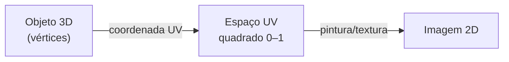

<!-- _class: cover -->
<!-- _paginate: false -->

# Texturização

## Mapeamento UV

**Semana 2** — Fundamentos de mapeamento UV: conceitos e projeção de textura

<!--
Notas: Esta é a primeira semana em que a turma opera o Blender com intenção de trabalho. Na Semana 1 houve apenas orientação espacial, sem prática. Abrir deixando isso explícito.
-->

---

## O que já vimos

Textura × material • raster × procedural • pipeline **Blender → 3D Coat → Unity**.

O trabalho interdisciplinar e o tema do semestre — ainda **em amadurecimento**, sem recorte fechado.

<!--
Notas: Revisão de 30 segundos, não uma retomada de conteúdo. Reforçar que tema e Hero Asset Referência só fecham na Semana 3 — hoje ninguém trabalha "no seu tema", e sim em objetos neutros de prática.
-->

---

Ao final da semana você será capaz de:

- Explicar o que é um **mapa UV** e por que ele existe
- Reconhecer **distorção** e **sobreposição** com o checkerboard
- Aplicar os 4 tipos de **projeção UV**
- Antecipar, de forma intuitiva, o conceito de **texel density**

<!--
Notas: Ler rápido. Os quatro objetivos são cobertos na mini aula e praticados na demonstração e no estúdio. O quarto item é só intuição — o cálculo formal de texel density é conteúdo da Semana 5, não desta.
-->

---

<!-- _class: question -->

# Você tem uma esfera 3D e quer **pintar** ela. Como dizer ao computador onde cada pixel da textura vai parar?

<!--
Notas: Deixar 2–3 respostas da turma antes de seguir. A resposta que queremos chegar: é preciso um sistema de coordenadas que relacione cada ponto da superfície 3D a um ponto da imagem 2D — isso é o mapa UV.
-->

---

## O que é um mapa UV

**UV mapping** é "desdobrar" um objeto 3D como se fosse uma caixa de papelão.

Você corta as dobras (**seams**) e abre tudo em um plano 2D — é nesse plano que a textura é pintada.

<!--
Notas: Fixar essa analogia — ela volta em todas as semanas de UV do semestre. Não citar "seams" como operação ainda: seams manuais são conteúdo da Semana 4 (Hero Asset Referência). Aqui é só nomear o conceito. Referência: apostila, Parte II, Cap. 4.
-->

---

<!-- _class: diagram -->

## O espaço UV

```mermaid
graph LR
  A["Objeto 3D<br/>(vértices)"] -->|coordenada UV| B["Espaço UV<br/>quadrado 0–1"]
  B -->|pintura/textura| C["Imagem 2D"]
```

Cada vértice do objeto tem uma coordenada UV: "esse ponto do objeto corresponde a esse ponto da textura".

<!--
Notas: O quadrado 0–1 é o mesmo para qualquer objeto, do prop mais simples ao asset mais complexo do kit. É a base de tudo que vem depois no semestre — bake, atlas e trim sheet, mais adiante, também operam dentro desse mesmo espaço.
-->

---

<!-- _class: image-right -->

## Um cubo desdobrado

Seis faces, um plano 2D.

A textura de **checkerboard** revela onde a projeção distorce.

<!--
Notas: Primeira imagem concreta da relação objeto ↔ UV Editor ↔ textura. Vai ser revisitada na demonstração, ao vivo no Blender.

[!FIGURA]
Objetivo didático — Tornar concreta a relação entre a malha 3D, o layout UV e a textura aplicada, antes de qualquer prática no Blender.
Arquivo sugerido — assets/cubo_uv_checker.webp
Descrição — Composição em três partes lado a lado: (1) um cubo 3D com checkerboard aplicado no viewport; (2) o mesmo cubo desdobrado no UV Editor, mostrando as 6 faces organizadas como ilhas; (3) a textura de checkerboard isolada. Setas leves conectando as três partes.
Como produzir — No Blender, aplicar Cube Projection em um cubo, ativar Material Preview com uma textura de checkerboard, e capturar o Viewport e o UV Editor lado a lado. Montar a composição final no Krita, adicionando a textura isolada e as setas de conexão.
-->

---

## O problema da distorção

Não é possível desdobrar uma esfera sem distorção — assim como não existe mapa-múndi perfeitamente plano sem deformar algo.

O objetivo não é **eliminar** distorção, é **controlá-la**: mantê-la onde não é percebida.

<!--
Notas: Analogia do mapa-múndi costuma ser eficaz porque é uma experiência visual que a maioria já teve (Groenlândia "gigante" na projeção Mercator). Não aprofundar em geometria — é só para instalar a intuição de que distorção é inevitável, e o trabalho do artista é administrá-la.
-->

---

## Quatro tipos de projeção

| Projeção | Quando usar |
|---|---|
| **Planar** | Superfícies planas, vista de um ângulo |
| **Cilíndrica** | Colunas, troncos, tubos |
| **Esférica** | Esferas, cabeças — distorce nos polos |
| **Cúbica (Box)** | Formas com faces reconhecíveis |

<!--
Notas: Não é uma lista para decorar — é um repertório de primeiras tentativas. Nenhuma projeção automática é definitiva; a partir da Semana 4, seams manuais vão refinar o resultado em cima de qualquer uma dessas.
-->

---

<!-- _class: image-right -->

## A mesma esfera, quatro resultados

O checker mostra: cada projeção falha de um jeito diferente.

<!--
Notas: Esta é a imagem-chave da aula — usar para a transição direta ao "vamos testar isso ao vivo" da demonstração.

[!FIGURA]
Objetivo didático — Mostrar num único quadro comparativo que a escolha de projeção muda o resultado visível, tornando tangível algo que só a palavra "distorção" não comunica.
Arquivo sugerido — assets/comparativo_projecoes_uv.webp
Descrição — Grade 2×2 com a mesma esfera renderizada com checkerboard, uma célula por tipo de projeção (Planar, Cilíndrica, Esférica, Cúbica), cada uma rotulada. Nas células de Esférica e Planar, destacar em vermelho leve as áreas de maior distorção (polos e bordas).
Como produzir — No Blender, aplicar cada tipo de projeção UV na mesma esfera com material de checkerboard e capturar o render em Material Preview. Montar a grade 2×2 com rótulos no Krita, adicionando os destaques de distorção com um pincel semitransparente.
-->

---

## Checkerboard: a ferramenta de diagnóstico

O grid revela o que os olhos sozinhos não veem.

- **Quadrados regulares** → projeção adequada
- **Esticado (vermelho no Stretch Overlay)** → distorção
- **Sobreposto** → duas partes do objeto disputando o mesmo espaço UV

<!--
Notas: Distorção e sobreposição são problemas diferentes, frequentemente confundidos. Vai ser o principal ponto de dúvida no estúdio — reforçar aqui para reduzir retrabalho na demonstração.
-->

---

Aceitar o resultado do **Smart UV Project** sem revisar.

Ele é rápido, mas não sabe o que é importante no objeto — vamos sempre conferir com o checker.

<!--
Notas: Smart UV Project entra na demonstração como recurso rápido, não como solução final. A revisão manual de seams começa de fato na Semana 4, quando há um asset real (Hero Asset Referência) em jogo.
-->

---

**Island maior no espaço UV = mais nítido na textura final.**

O cálculo exato disso — **texel density** — é conteúdo da Semana 5. Por hoje, basta o olho.

<!--
Notas: Antecipação intencional, sem fórmula. Se um estudante perguntar por valores numéricos, responder: "vamos medir isso na Semana 5 — por enquanto, use o olho e o checker."
-->

---

<!-- _class: invert -->

## Na indústria

Nenhum asset de produção vai para o motor de jogo sem um UV revisado manualmente.

A projeção automática é o ponto de partida — nunca o resultado final.

<!--
Notas: Contextualizar o valor profissional do cuidado com UV, que parece "burocrático" nesta fase introdutória. Amarra ao C3 (UV Mapping) da Rubrica Mestre, já ativo nesta semana.
-->

---

<!-- _class: summary-slide -->

# Resumo

- **UV mapping** = desdobrar o objeto 3D em um plano 2D
- Distorção é **inevitável** — o trabalho é **controlá-la**
- 4 projeções: **planar, cilíndrica, esférica, cúbica**
- **Checkerboard** diagnostica distorção e sobreposição
- Island maior = mais nítido → **texel density**, na Semana 5

<!--
Notas: Fechar amarrando os conceitos antes da demonstração. Não reler linha a linha — apontar que tudo isso será testado ao vivo em seguida, nos três objetos do arquivo de prática.
-->

---

## Agora: demonstração

Cubo e esfera, ao vivo no Blender.

Testando as quatro projeções com **checkerboard** ativo.

<!--
Notas: Transição para os 20 min de demonstração. Layout de tela padrão a partir de hoje: Viewport 3D à esquerda, UV Editor à direita. Deixar claro que seams manuais não entram nesta demonstração — isso é Semana 4.

[!FIGURA]
Objetivo didático — Antecipar visualmente o layout de tela que será usado durante toda a demonstração e a produção em estúdio, para que o estudante já configure sua própria tela da mesma forma.
Arquivo sugerido — assets/blender_uv_editor_layout.webp
Descrição — Captura da interface do Blender dividida em duas áreas lado a lado: Viewport 3D à esquerda (mostrando um objeto com checkerboard em Material Preview) e UV Editor à direita (mostrando o layout UV correspondente). Um rótulo simples identifica cada painel.
Como produzir — No Blender, configurar o layout de tela dividido, aplicar checkerboard em Material Preview e capturar a interface completa. Adicionar os dois rótulos no Krita.
-->
