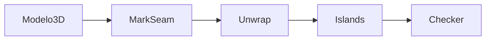

<!-- _class: cover -->
<!-- _paginate: false -->

# Seams manuais

## Você decide onde a malha se abre 

**Semana 3** — Abertura de malha com Seams manuais e Unwrap

<!--
Notas: Abertura da mini aula (20 min). Não é tutorial — é construir o raciocínio de POSICIONAMENTO de seam antes de abrir o Blender na demonstração. Lembrar que esta é a primeira vez que a turma trabalha em um asset REAL do kit modular, não em objeto de prática. E é a primeira CRÍTICA FORMAL da disciplina.
-->

---

## Objetivos de hoje

Ao final da semana você será capaz de:

- Explicar por que o **Smart UV Project** não basta para assets de produção
- Marcar **seams** com base em critérios visuais e estruturais
- Executar o **Unwrap manual** e verificar com checkerboard
- Organizar **islands** no UV Editor sem sobreposição

<!--
Notas: Ler rápido. Cada objetivo volta ao longo da aula. O foco é o RACIOCÍNIO de corte, não a otimização de layout (isso é Semana 4). Não falar em texel density numérico nem empacotamento automático hoje.
-->

---

<!-- _class: question -->

# Na Semana 2 você testou o **Smart UV Project**. O que aconteceu com ele num objeto mais complexo que um cubo?

<!--
Notas: Deixar 2–3 respostas da turma antes de prosseguir. Não corrigir — usar as respostas como ponte para a limitação do Smart UV Project. Objetivo: fazer a turma verbalizar que o algoritmo corta em lugares indesejados.
-->

---

## O que o Smart UV Project não sabe

Ele corta onde o **ângulo entre faces** é maior.

Ele **não sabe** o que é visível no jogo.
Ele **não sabe** onde fica a frente do objeto.

Seams manuais são o contraponto: **você** decide onde cortar e por quê.

<!--
Notas: Este é o pivô conceitual da semana. O algoritmo otimiza por geometria; o artista otimiza por VISIBILIDADE. Reforçar: a costura de uma bota não deve aparecer na frente do personagem — o Smart UV não sabe disso, você sabe.
-->

---

## O que é um seam

Um seam é uma **marcação de aresta** que instrui o Blender a cortar a malha antes de desdobrar.

É a **dobra da caixa de papelão**: você escolhe onde abrir para o objeto planificar do jeito que você quer.

Seams **não alteram a geometria** — são apenas instruções de corte para o UV.

<!--
Notas: Retomar a analogia da caixa da Semana 2 e agora NOMEAR o corte: seam. Fixar que o seam não muda o modelo 3D — só o UV. Mostrar as arestas em vermelho no Viewport.

FIGURA (produzir) — assets/seam_marcado_barril.webp
Objetivo: mostrar concretamente a aparência de um seam marcado (aresta vermelha) sobre um prop do kit, ligando a "dobra da caixa" ao conceito técnico.
Descrição: um barril (ou caixote) em Edit Mode no Blender com as arestas de seam destacadas em vermelho — fundo, junção vertical traseira e aro inferior — enquanto o restante da malha permanece em preto.
Como produzir: no Blender, abrir o prop de demonstração, entrar em Edit Mode, selecionar as arestas estratégicas e aplicar Mark Seam. Capturar o Viewport 3D com as arestas vermelhas visíveis.
-->

---

## Onde marcar seams — os critérios

- Preferir arestas **ocultas**: fundos, base, interior de encaixes
- Seguir a **geometria natural**: junção das tábuas, não o centro de uma face
- Em objetos simétricos, um seam no **eixo central** permite espelhar
- **Evitar** arestas frontais, cantos em destaque, superfícies vistas de perto

<!--
Notas: Estes são os quatro critérios centrais da semana — voltam na demo, no estúdio e na crítica. Pedir à turma exemplos concretos do PRÓPRIO kit: "onde fica o fundo do seu asset? é ali que o seam começa." Conectar ao projeto integrador.
-->

---

## O percurso do olhar do jogador

Imagine seu asset **já no jogo**. Trace o caminho do olhar do jogador.

As arestas **fora** desse percurso são candidatas a seam.

Se o jogador nunca vai olhar ali, é ali que a costura deve ficar.

<!--
Notas: Esta é a heurística que resolve o bloqueio nº 1 da semana ("não sei onde cortar"). É uma ferramenta mental, não técnica. Se o estudante travar, pedir que identifique a "frente" do objeto e comece com o seam nos fundos.

FIGURA (produzir) — assets/percurso_olhar_jogador.webp
Objetivo: transformar o critério abstrato "onde o jogador não olha" em uma imagem concreta que oriente a decisão de posicionamento do seam.
Descrição: um asset arquitetônico do kit visto na perspectiva típica do jogador, com uma seta indicando a linha de visão e as faces ocultas (traseira, base) destacadas como zona segura para seams.
Como produzir: no Blender, posicionar a câmera na altura/ângulo típico do jogador e renderizar o asset. No Krita, adicionar a seta da linha de visão e sombrear as faces ocultas com uma cor de destaque.
-->

---

## O que é uma boa island

Cada região separada por seams forma uma **island**.

Meta: o **menor número** de islands necessário, sem introduzir distorção.

Um barril simples deve ter entre **3 e 6 islands** — não 30.

<!--
Notas: Antecipar o erro comum de "seams demais". Medo de distorção leva o estudante a cortar tudo, gerando dezenas de islands minúsculas impossíveis de organizar. Heurística prática: resolva com o mínimo de seams antes de adicionar mais.
-->

---

## Padding e aproveitamento

**Padding** — espaço em branco entre islands. Evita que a textura "sangre" de uma para outra.

**Aproveitamento** — ocupar bem o quadrado UV (0–1). Espaço vazio = resolução desperdiçada.

<!--
Notas: Mencionar padding apenas como PRINCÍPIO, sem números. Se perguntarem valor exato (4 px em 1024): "Vamos medir e empacotar na Semana 4. Hoje, o objetivo é a lógica do corte, não a otimização." NÃO abrir UVPackmaster nem add-ons hoje.
-->

---

## Do modelo à textura — o fluxo

O seam é o passo que **decide** como o Unwrap vai abrir a malha.

<!--
Notas: Diagrama para situar o seam dentro do pipeline da semana. Mostrar que Unwrap é sempre o comando DEPOIS de marcar seam — não Smart UV. Criar o hábito verbal: "marcou seam → Unwrap".
-->

---

## Smart UV Project ainda serve?

**Sim** — para objetos de apoio, fundos, assets nunca vistos de perto.

**Não** — para os assets principais do kit, que terão texturização detalhada.

Para o Asset 01 do seu kit: seams manuais são obrigatórios.

<!--
Notas: Evitar demonizar o Smart UV Project — ele tem lugar. A decisão é de contexto: quanto mais visível e detalhado o asset, mais o controle manual se justifica. Conectar diretamente à entrega desta semana.
-->

---

## Erros comuns

Continuar usando **Smart UV Project** por hábito — depois de marcar seams, o comando é sempre **Unwrap** (`U`).

Marcar seams em **arestas frontais visíveis** — a costura vira artefato na textura final.

**Seams demais** — dezenas de islands minúsculas impossíveis de organizar.

<!--
Notas: Os três erros mais frequentes da semana. O primeiro é técnico (menu), o segundo é de critério (visibilidade), o terceiro é de excesso (medo de distorção). Fixar cada um com a solução correspondente durante a demo e o estúdio.
-->

---

<!-- _class: summary-slide -->

# Resumo

- Smart UV Project corta por **geometria**, não por **visibilidade**
- Seam = **instrução de corte**, não muda o modelo 3D
- Marcar em arestas **ocultas** • seguir a geometria natural
- Menos islands, sem distorção • **Unwrap** vem depois do seam
- Objetivo: seam **invisível** na textura final

<!--
Notas: Amarrar a mini aula. Cada item volta aplicado na produção em estúdio. Não reler tudo — apontar a conexão com o próximo passo: a demonstração no asset real.
-->

---

## Hoje é crítica FORMAL

Primeira crítica formal da disciplina.

- **Autoavaliação obrigatória** (Instrumento 2 da Rubrica)
- Você vai **justificar** suas decisões de seam
- Feedback escrito do professor no critério **C3 — UV Mapping**

O objetivo não é julgar o resultado — é praticar a **justificativa**.

<!--
Notas: Reduzir a ansiedade da primeira crítica formal. Deixar claro: um UV com problemas + boa explicação vale mais pedagogicamente do que um UV bom sem reflexão. A autoavaliação é o ponto de partida da crítica, não um teste. Distribuir o formulário nos últimos 5 min do 1º encontro.
-->

---

## Agora: demonstração

A seguir, **abertura de malha no Blender**:

Smart UV como linha de base • Mark Seam • Unwrap (`U`)

Checkerboard para comparar • organização de islands

<!--
Notas: Transição para a demonstração de 20 min. Mesmo layout dividido da Semana 2: Viewport 3D à esquerda, UV Editor à direita. Sequência: Smart UV como linha de base → desfazer → marcar seams → Unwrap → comparar checker → organizar islands. Mostrar de propósito um seam mal posicionado para reforçar o critério visual.

FIGURA (produzir) — assets/demo_layout_semana03.webp
Objetivo: orientar o layout de tela (Viewport 3D + UV Editor) e antecipar o resultado esperado da demonstração com o prop do kit.
Descrição: captura do Blender com janela dividida — à esquerda o prop (barril/caixote) em Material Preview com checkerboard e seams vermelhos visíveis; à direita o UV Editor com as islands organizadas dentro do quadrado 0–1.
Como produzir: no Blender, montar o layout dividido, marcar os seams do prop, executar Unwrap, carregar o checkerboard e organizar as islands. Capturar a tela cheia com os dois painéis visíveis.
-->
