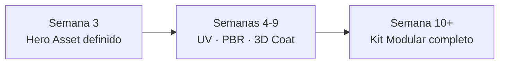

<!-- _class: cover -->
<!-- _paginate: false -->

# Texturização

## Do rascunho ao projeto

**Semana 3** — Moodboard temático e definição do Hero Asset Referência

<!--
Notas: Abrir marcando a virada da aula: até aqui o tema era "ideia em amadurecimento" (Semana 1) e a ferramenta era só técnica, sem tema (Semana 2). Hoje isso muda — ao final da aula, tema e Hero Asset deixam de ser hipótese e passam a ser dados do projeto.
-->

---

## Onde vocês estão

Semana 1: **ideias soltas**, sem compromisso.

Semana 2: primeiro contato técnico com **UV**, sem tema.

Hoje: a decisão que conecta as duas coisas.

<!--
Notas: Recapitular em uma frase, sem reabrir conteúdo técnico de UV nem repetir a dinâmica de props da Semana 1 — isso já foi feito. O objetivo aqui é só situar o estudante no fluxo, não reensinar.
-->

---

Ao final da semana você será capaz de:

- Explicar o que é um **Hero Asset Referência** e por que ele existe
- Aplicar os **três critérios** de escolha de um Hero Asset
- Consolidar um **moodboard** temático curado
- Justificar por escrito a sua escolha
- Comunicar sua proposta com clareza para a turma

<!--
Notas: Ler rápido. Os três primeiros objetivos são cobertos na mini aula e na demonstração; os dois últimos são o trabalho do estúdio de hoje, fechado na roda de temas do Encontro 2.
-->

---

<!-- _class: question -->

# Com **uma única peça**, vocês provariam que mundo é esse?

<!--
Notas: Deixar 2–3 respostas da turma antes de nomear o conceito. Não corrigir — usar como ponte direta para a definição de Hero Asset Referência.
-->

---

## O que é um Hero Asset Referência

Uma peça **única**, altamente representativa do tema.

Não é, necessariamente, parte literal do Kit Modular final.

<!--
Notas: Ênfase no "não precisa ser literal": pode ser um objeto simbólico que nunca aparece exatamente igual no kit, mas que concentra a linguagem visual toda. Referência: cronograma, Semana 3.
-->

---

## Para que ele serve

Prova de conceito do pipeline completo — **antes** de escalar para o Kit Modular inteiro.

```mermaid
graph LR
  A[Semana 3<br/>Hero Asset definido] --> B[Semanas 4-9<br/>UV · PBR · 3D Coat]
  B --> C[Semana 10+<br/>Kit Modular completo]
```

<!--
Notas: O Hero Asset é onde cada etapa do pipeline é testada pela primeira vez — UV na Semana 4, material PBR nas Semanas 6-7, texturização no 3D Coat nas Semanas 8-9. Só depois disso validado é que o Kit Modular é produzido de fato, a partir da Semana 10. Não detalhar UV ou PBR agora — apenas nomear a trajetória.
-->

---

## Por que não começar direto pelo kit

Descobrir um problema de pipeline em **uma peça** é barato.

Descobrir o mesmo problema depois de modelar **dez** é caro.

<!--
Notas: O Hero Asset é onde os erros são baratos. Essa é a justificativa estratégica, não só didática — vale a pena repetir isso porque explica por que a disciplina inteira gira em torno de uma única peça antes do kit.
-->

---

## Três critérios para escolher bem

1. **Legibilidade** do tema
2. **Viabilidade** técnica
3. **Reaproveitamento** no resto do kit

<!--
Notas: Slide de transição — cada critério ganha um slide próprio a seguir. Pedir que a turma já pense em um candidato próprio enquanto os três são apresentados.
-->

---

## Critério 1 — Legibilidade

Olhando **só** para essa peça, dá para reconhecer o mundo proposto?

Ela concentra os elementos mais distintivos do recorte cultural da Semana 1?

<!--
Notas: Testar com exemplo hipotético: um martelo genérico não é legível; um martelo com cabo de viola de cocho entalhado, sim. A legibilidade é sobre especificidade, não sobre "ser bonito".
-->

---

## Critério 2 — Viabilidade técnica

Complexidade adequada a um semestre.

Nem simples demais para não desafiar o pipeline — nem complexa demais para consumir todo o tempo disponível.

<!--
Notas: Um cubo texturizado não prova nada; uma arquitetura inteira não é um Hero Asset, é o Kit Modular inteiro. O ponto de equilíbrio é o que Modelagem 3D e Level Design consegue modelar em uma semana.
-->

---

## Critério 3 — Reaproveitamento

Os materiais e a paleta dessa peça vão **se conectar** ao resto do kit?

Um Hero Asset isolado demais gera retrabalho depois.

<!--
Notas: Ligar diretamente ao Critério 2 (Direção Artística) da Rubrica Mestre, que exige coerência entre as camadas do kit a partir da Semana 10. A escolha de hoje já condiciona essa nota futura.
-->

---

**Essa peça é legível, viável e reaproveitável — ou só bonita?**

Se falhar em um dos três, ela ainda não é o Hero Asset.

<!--
Notas: Pergunta de checagem para repetir circulando no estúdio. Vale escrever no quadro, no mesmo espírito da pergunta de checagem da Semana 1.
-->

---

## O papel do moodboard

Não é uma coleção de imagens bonitas.

É a **evidência** de que a proposta é coerente e específica.

<!--
Notas: Um moodboard genérico ("fantasia medieval") não orienta escolha nenhuma. Um moodboard específico já sugere naturalmente qual peça vira o Hero Asset — o moodboard bom faz o trabalho de escolha ficar mais fácil, não mais difícil.
-->

---

Moodboard genérico: "fantasia" no geral, sem recorte cultural reconhecível.

Menos de 10 referências, ou referências repetindo a mesma imagem com outras palavras.

<!--
Notas: Os dois erros mais comuns nesta etapa. Antecipar aqui poupa correção no estúdio. Reforçar a ponte com a Semana 1: "se você não consegue apontar qual dos 5 props está por trás dessa imagem, o recorte ainda está solto."
-->

---

<!-- _class: invert -->

## Na indústria

Nenhum estúdio aprova a modelagem de uma peça-chave sem antes aprovar, por escrito e em imagem, o moodboard que a sustenta.

A justificativa em texto é parte do trabalho — não um formalismo.

<!--
Notas: Contextualizar o valor profissional da decisão de hoje. Amarrar a C1 (Processo de Projeto) e C2 (Direção Artística) da Rubrica Mestre — critérios ativos nesta semana, ainda em nível inicial.
-->

---

<!-- _class: summary-slide -->

# Resumo

- **Hero Asset Referência** = prova de conceito do pipeline, antes do Kit Modular
- Três critérios: **legibilidade · viabilidade · reaproveitamento**
- O **moodboard** é evidência, não decoração — mínimo 10 referências
- Hoje o tema deixa de ser hipótese: vira **dado do projeto**

<!--
Notas: Fechar a mini aula amarrando os conceitos. Apontar que a Semana 4 (primeira Crítica Formal) parte diretamente do que for decidido hoje.
-->

---

## Agora: demonstração

Exemplos reais de **Hero Assets** e do moodboard que provavelmente os originou.

Como transformar referências dispersas em uma justificativa de um parágrafo.

<!--
Notas: Transição para os 20 min de demonstração. Reforçar que a demonstração não abre Blender nem 3D Coat — é a primeira aula inteiramente curatorial do semestre, e isso é proposital: decisão de projeto é etapa distinta de execução técnica.

[!FIGURA]
Objetivo didático — Mostrar exemplos concretos de Hero Assets publicados e sua relação direta com um moodboard, para que o estudante veja o padrão de qualidade esperado antes de decidir o próprio.
Arquivo sugerido — assets/hero_asset_exemplos.webp
Descrição — Grade de 3 a 4 projetos de referência (ArtStation ou portfólios equivalentes), cada célula mostrando lado a lado um recorte do moodboard original e a peça-chave (Hero Asset) que resultou dele, evidenciando a correspondência de paleta e forma.
Como produzir — Selecionar 3-4 projetos publicados no ArtStation que exponham claramente o moodboard e o asset final. Capturar as imagens (respeitando os créditos) e montar a grade comparativa no Krita, com um rótulo curto por projeto.
-->

---

<!-- _class: chapter -->

03

# Produção em estúdio

Do moodboard à decisão

<!--
Notas: Divisória entre a mini aula e o estúdio. Os slides a seguir ficam projetados durante a produção — servem de consigna e timebox visíveis para a turma, não são material de exposição. Apresentar cada um só no momento em que a etapa correspondente começa.
-->

---

<!-- _class: exercise -->

## Etapa 1 — Consolidar o moodboard

**20 minutos.**

Reúnam as referências já produzidas em Pintura Digital e Arte Conceitual + as ideias da Semana 1.

Mínimo de **10 referências**, organizadas por categoria: paleta, formas/silhueta, materiais, referência cultural direta.

<!--
Notas: Encontro 1. Circular perguntando: "esse moodboard me diz um lugar específico, ou poderia ser qualquer fantasia genérica?" Identificar quem chega com moodboard disperso — vai precisar de atenção prioritária no Encontro 2.
-->

---

<!-- _class: exercise -->

## Etapa 2 — Listar candidatos a Hero Asset

**20 minutos.**

A partir do moodboard, listem **2 a 3 objetos** candidatos.

Para cada um, uma frase por critério: legibilidade / viabilidade / reaproveitamento.

<!--
Notas: Não force a decisão final ainda — o objetivo do Encontro 1 é chegar a candidatos justificáveis. Perguntar: "se Modelagem 3D e Level Design tivesse que modelar isso essa semana, dá tempo?"
-->

---

<!-- _class: exercise -->

## Etapa 3 — Teste em duplas

**10 minutos.**

Troquem sua lista de candidatos com um colega.

Pergunta do colega: **"Olhando só para essa lista, que mundo eu imagino?"**

<!--
Notas: Feedback rápido antes da decisão final, que fecha no Encontro 2. Não é avaliado — é ensaio da roda de temas que vem a seguir.
-->

---

<!-- _class: exercise -->

## Roda de temas — 20 minutos

Crítica coletiva informal. **1 minuto por estudante.**

> "Meu tema é ___. Meu candidato a Hero Asset é ___, porque ___."

A turma pode fazer **no máximo 1 pergunta** por apresentação.

<!--
Notas: Abertura do Encontro 2. Timebox rígido — usar cronômetro visível. Perguntas da turma sempre voltando aos três critérios: "isso está legível?", "isso é viável em uma semana de modelagem?", "isso puxa material para o resto do kit?"

Fechamento da roda (3-5 min): sistematizar padrões observados na turma — temas que se repetem, riscos comuns (escopo grande demais, moodboard genérico) — e afirmar que a decisão final acontece agora, na produção em estúdio que segue.
-->

---

<!-- _class: exercise -->

## Fechar a decisão — 60 minutos

Escolham **um único** Hero Asset — não mais uma lista.

Escrevam a justificativa em **1 parágrafo**, cobrindo os três critérios.

Finalizem o moodboard como arquivo de entrega.

Registrem o briefing para **Modelagem 3D e Level Design** — é a peça que eles modelam a partir de agora.

<!--
Notas: Nomear os arquivos como `[Nome]_Moodboard_Semana03` e `[Nome]_HeroAsset_Justificativa_Semana03`. Prioridade de atenção: estudantes que chegaram ao Encontro 2 com moodboard ainda disperso, e estudantes em dúvida entre dois candidatos (usar os três critérios como desempate, não a preferência estética isolada).

Não permitir que a decisão fique em aberto além deste encontro — a Semana 4 depende de Modelagem 3D e Level Design já ter um briefing fechado.
-->

---

<!-- _class: exercise -->

## Antes de sair

Confirmem as três entregas de hoje:

- **Moodboard** curado (mín. 10 referências)
- **Justificativa** do Hero Asset (1 parágrafo)
- **Briefing** compartilhado com Modelagem 3D e Level Design

A partir de agora, tema e Hero Asset são dados do projeto — não mais hipótese.

<!--
Notas: Fechamento (10 min): síntese rápida + reflexão individual registrada ("Escolhi este Hero Asset porque ___. O que mais me preocupa nessa escolha é ___.") + ponte para a Semana 4: "vocês recebem o Hero Asset modelado e abrem o UV dele de verdade — primeira Crítica Formal do semestre, com rubrica e autoavaliação. Revisem o Nível 3 do Critério 3 antes de vir para a aula."
-->
