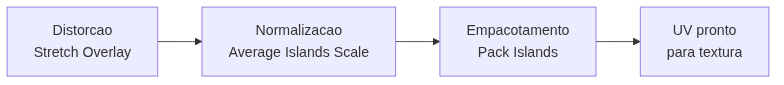

<!-- _class: cover -->
<!-- _paginate: false -->

# Otimizar o UV

## Não é estética — é resolução de textura

**Semana 4** — Distorção, texel density e empacotamento de islands

<!--
Notas: Abertura da mini aula (20 min). Continuação direta da Semana 3 — o UV já foi ABERTO; agora vamos QUALIFICAR esse UV. A mensagem central da semana está no subtítulo: otimizar UV tem impacto direto e mensurável na qualidade da textura. Última semana da Unidade I. Não é tutorial de cliques — é construir o raciocínio "distorção -> normalização -> empacotamento".
-->

---

## Objetivos de hoje

Ao final da semana você será capaz de:

- Identificar distorção com o **Stretch Overlay** e nomear sua causa
- Explicar **texel density** e por que ela precisa ser consistente
- Normalizar as islands com **Average Islands Scale**
- Empacotar o layout com **Pack Islands**, na ordem certa

<!--
Notas: Ler rápido. Cada objetivo volta ao longo da aula. Não antecipar PBR (Semana 5) nem Texture Atlas (Semana 13). O foco é qualificar o UV que já foi aberto na Semana 3.
-->

---

<!-- _class: question -->

# A textura é a **mesma**. Por que uma parte do objeto aparece **nítida** e outra parece **borrada**?

<!--
Notas: Mostrar aqui a comparação visual (figura abaixo). Deixar 2-3 respostas da turma antes de revelar a causa: texel density inconsistente. Não corrigir — usar as respostas como ponte para o conceito.
-->

---

<!-- _class: image-right -->

## O olho vê o sintoma

A causa está no **UV**, não na textura.

Uma island pequena recebe **menos pixels**. A textura chega esticada.

<!--
Notas: Revelar a causa depois das respostas da turma. Fixar: o problema não é o arquivo de imagem — é como o espaço UV foi distribuído. Isso prepara os três conceitos técnicos da aula.

[!FIGURA]
Objetivo didático: dar evidência visual concreta de que o mesmo material rende qualidade diferente conforme a área de UV — é o gancho que motiva toda a otimização da semana.
Arquivo sugerido: assets/comparacao_nitido_borrado.webp
Descrição: um único asset do kit renderizado com checkerboard (ou madeira), dividido ao meio: metade com UV normalizado (quadrados uniformes, nítido) e metade com island subdimensionada (quadrados grandes, borrado). Uma linha divide as duas condições.
Como produzir: no Blender, duplicar o asset e aplicar checkerboard em ambos; num deles reduzir a escala de uma island no UV Editor. Renderizar lado a lado em Material Preview e compor a comparação no Krita com rótulos "nítido / borrado".
-->

---

## Stretch Overlay: ver o que o olho não vê

No UV Editor, ativa a colorização de distorção por face:

- **Azul** — sem distorção (proporção do 3D preservada)
- **Verde** — distorção leve, geralmente aceitável
- **Vermelho** — distorção severa: a textura vai esticar

A causa mais comum: island **mal orientada** ou **mal escalonada** após o Unwrap.

<!--
Notas: O Stretch Overlay é ativado pelo ícone de gradiente na barra do UV Editor. Reforçar que ele mostra o problema ANTES de aplicar textura — não é preciso pintar para saber que vai dar errado. Adicionar um seam resolve parte; orientar/escalonar a island resolve o resto.
-->

---

## Texel density: todos os assets, a mesma atenção

**Texel density** = pixels de textura por unidade de área do modelo.

Island grande -> mais pixels. Island pequena -> menos pixels.

Se dois assets do kit têm density diferente, um parece ter o **dobro** da resolução do outro. O conjunto fica **incoerente**.

<!--
Notas: Este é o conceito-chave da semana. Amarrar ao Projeto Integrador: num kit modular, todos os assets vistos à mesma distância no jogo devem ter texel density similar, senão a cena parece amadora. Verificação prática: com checkerboard, os quadrados devem ter tamanho visual similar entre os assets, na mesma escala.
-->

---

## Average Islands Scale: normalizar em um clique

No UV Editor, com **todas** as islands selecionadas:

`UV > Average Islands Scale`

Redimensiona todas as islands para a **mesma densidade** de pixels por unidade de superfície.

É o **ponto de partida** de qualquer otimização: normalizar **antes** de empacotar.

<!--
Notas: Cuidado conceitual importante: o Average calcula em relação à ÁREA DA FACE no 3D, não ao tamanho aparente no Viewport. Um objeto pequeno terá islands menores, um grande terá maiores — mas a DENSIDADE será igual. Antecipar a confusão do bloco de dificuldades do plano.
-->

---

## Pack Islands: aproveitar o espaço UV

Depois de normalizar, as islands ficam espalhadas fora do quadrado.

`UV > Pack Islands` reorganiza tudo dentro do quadrado **0-1**, maximizando o aproveitamento e respeitando um **padding** mínimo.

Margin sugerida: **0.004** (textura 1024px) • **0.008** (textura 512px).

<!--
Notas: Padding maior evita bleeding em mipmaps, mas desperdiça espaço. Para resultados sofisticados (rotação de islands, formas irregulares), citar o add-on UVPackmaster — mas só demonstrar se estiver instalado em todos os computadores. Não aprofundar a ferramenta hoje.
-->

---

## A ordem importa

Pack Islands **não corrige** distorção — só reposiciona.
Uma island distorcida é empacotada **distorcida**.

<!--
Notas: Este diagrama é o núcleo procedimental da semana. Repetir verbalmente e projetar durante o estúdio: "Distorção -> Normalização -> Empacotamento". Inverter a ordem é o erro nº 1 da semana. Renderizar o Mermaid abaixo para assets/mermaid-1.png.

DIAGRAMA (Mermaid) para gerar assets/mermaid-1.png:
graph LR
  A[Distorcao Stretch Overlay] --> B[Normalizacao Average Islands Scale]
  B --> C[Empacotamento Pack Islands]
  C --> D[UV pronto para textura]
-->

---

## Empacotar com padding — a analogia

**Margin** é a **calçada** entre duas casas no UV.

- Calçada larga demais -> desperdiça terreno (resolução)
- Calçada estreita demais -> na chuva (mipmap), a água escorre de uma casa para a outra (**bleeding**)

Para texturas de 1024px, **4px de calçada** já bastam.

<!--
Notas: Analogia física do plano de aula para fixar a diferença entre padding suficiente e excessivo. Usar se a turma travar no conceito abstrato de margin. Não transformar em discussão numérica — a ideia é a intuição.
-->

---

## Quanto do espaço UV você aproveita?

- **~40%** — desperdício: metade da resolução jogada fora
- **~70%** — funcional: meta mínima desta semana
- **~90%** — otimizado: padrão de produção

Espaço UV vazio é **resolução de textura desperdiçada**.

<!--
Notas: Muitos estudantes não têm referência intuitiva de "70% de aproveitamento". Criar âncoras visuais concretas nomeando qualitativamente cada faixa. Na demonstração, mostrar os três níveis lado a lado. A meta de entrega é acima de 70%.
-->

---

## Cuidado: distorção que não é do UV

Às vezes o vermelho no Stretch Overlay vem da **geometria**, não do seam:

- **Ngon** — face com mais de 4 vértices
- **Face não-planar** — vértices fora do mesmo plano

Adicionar seams **não resolve** — o problema está antes do UV.

<!--
Notas: Erro comum nº 2 da semana. Se o vermelho persiste após reposicionar seams, pedir que verifique ngons: Select > All by Trait > Faces by Sides. Se for geometria, o conserto é no modelo, não no UV. Diagnóstico antes de ação.
-->

---

## Erros comuns

**Pack Islands antes de Average Islands Scale** — empacota com tamanhos errados; a density fica inconsistente e só aparece ao pintar.

**Confundir distorção de UV com ngon/geometria** — seams não corrigem face não-planar.

**Aceitar Stretch Overlay vermelho** — o veio da madeira vai aparecer inclinado na textura final.

<!--
Notas: Os três erros mais frequentes da semana. O primeiro é de ORDEM, o segundo é de DIAGNÓSTICO, o terceiro é de CRITÉRIO. Fixar cada um com a solução durante a demo e circular no estúdio buscando exatamente esses padrões.
-->

---

<!-- _class: summary-slide -->

# Resumo

- **Stretch Overlay** revela distorção antes de pintar — mire azul/verde
- **Texel density** consistente = kit visualmente coerente
- **Average Islands Scale** normaliza a densidade em um clique
- **Pack Islands** aproveita o espaço — mas não corrige distorção
- Ordem sagrada: **Distorção -> Normalização -> Empacotamento**

<!--
Notas: Amarrar a mini aula. Cada item volta aplicado na produção em estúdio. Não reler tudo — apontar a conexão com o próximo passo: a demonstração de otimização ao vivo. Lembrar que é a última semana para deixar a base do UV pronta antes do PBR.
-->

---

## Última semana da Unidade I

O UV que você entrega hoje é a **base** das próximas três unidades.

Na **Semana 5** começa o **PBR**: material que simula a física da luz.

Um UV bom fica **invisível** — o jogador só vê o material. Um UV ruim aparece na textura.

<!--
Notas: Conectar ao semestre e ao Projeto Integrador. Um UV com problemas nesta semana gera retrabalho nas Semanas 5, 6 e além. Comunicar essa consequência com clareza — é o que motiva o cuidado no estúdio de hoje. A crítica desta semana é INFORMAL.
-->

---

## Agora: demonstração

A seguir, **otimização ao vivo** de um UV com problemas reais:

Diagnóstico com Stretch Overlay • Average Islands Scale • Pack Islands

Comparação **antes / depois** com checkerboard

<!--
Notas: Transição para a demonstração de 20 min. Mesmo layout dividido das semanas anteriores: Viewport 3D à esquerda com checkerboard, UV Editor à direita com Stretch Overlay ativo. Sequência: diagnosticar vermelho -> corrigir island -> Average Islands Scale -> Pack Islands -> desfazer/refazer mostrando antes-depois. Manter o arquivo aberto durante o estúdio.

[!FIGURA]
Objetivo didático: orientar o layout de tela da demonstração e antecipar o resultado esperado da otimização, dando à turma um alvo visual claro para o próprio trabalho.
Arquivo sugerido: assets/demo_layout_semana04.webp
Descrição: captura do Blender com janela dividida — à esquerda o prop do kit em Material Preview com checkerboard uniforme; à direita o UV Editor com Stretch Overlay predominantemente azul e islands empacotadas ocupando bem o quadrado 0-1.
Como produzir: no Blender, montar o layout dividido, aplicar checkerboard, ativar o Stretch Overlay, executar Average Islands Scale e Pack Islands no prop de demonstração. Capturar a tela cheia com os dois painéis mostrando o estado OTIMIZADO.
-->
