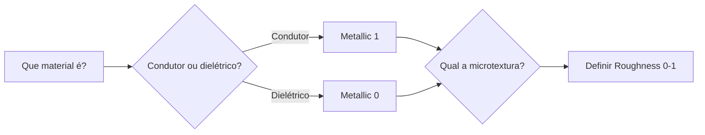

<!-- _class: cover -->
<!-- _paginate: false -->

# O material não é pintado

## É calculado pela física da luz

**Semana 5** — Fundamentos do Physically Based Rendering (PBR)

<!--
Notas: Abertura da mini aula (20 min). Início da Unidade II. Mensagem central no subtítulo: PBR não é um estilo visual, é um modelo matemático de como a luz se comporta. O UV das Semanas 3-4 vira o endereço onde os mapas PBR vão morar. Hoje é também a segunda crítica formal do semestre (fecha C3 - UV, estreia C4 - PBR). Não é tutorial de cliques: é construir o raciocínio "o material é condutor ou dielétrico? qual sua microtextura?".
-->

---

## Objetivos de hoje

Ao final da semana você será capaz de:

- Explicar **o que é PBR** e por que Metallic/Roughness é o padrão para jogos
- Descrever a função de **Albedo**, **Metallic** e **Roughness**
- Atribuir valores **fisicamente plausíveis** a metal, plástico, pedra e madeira
- Criar **4 materiais PBR** no Principled BSDF e verificar em render

<!--
Notas: Ler rápido. Cada objetivo retorna ao longo da aula. Não antecipar texturas seamless (Semana 6) nem Normal Map (Semana 7). O foco é o valor plano: propriedade física da superfície, ainda sem imagem no canal.
-->

---

<!-- _class: question -->

# Antes do PBR, como um material **brilhante** parecia brilhante em **qualquer** ângulo de luz?

<!--
Notas: Abrir com esta pergunta. Aguardar 2-3 respostas (vão citar: pintar highlight na textura, mapa especular, ajustar no motor). Confirmar que todas estavam certas — e então mostrar o problema no próximo slide: highlight embutido só funciona com a luz no ângulo certo.
-->

---

<!-- _class: image-right -->

## O problema do brilho pintado

Highlight **pintado na textura** só funciona com a luz no ângulo certo.

Mude a luz de lado e o brilho aparece no **lugar errado**.

<!--
Notas: Revelar após as respostas da turma. Fixar: antes de ~2013, o artista embutia luz, sombra e reflexo na textura difusa. Funcionava com câmera e iluminação fixas. Em qualquer outro ângulo, o material quebrava. Isso motiva a virada do PBR.

[!FIGURA]
Objetivo didático: mostrar visualmente por que o highlight pintado falha, motivando a necessidade do PBR.
Arquivo sugerido: assets/highlight_embutido_vs_pbr.webp
Descrição: mesma esfera em duas condições. À esquerda, esfera com highlight pintado na textura difusa, iluminada por um lado — parece correta. À direita, a MESMA esfera com a luz vinda do lado oposto — o brilho pintado aparece no lado errado, revelando o erro.
Como produzir: no Blender, criar uma esfera com um material Emission/difuso contendo um highlight pintado no Albedo (feito no Krita). Renderizar com uma luz à direita e depois à esquerda, sem mudar a textura. Compor as duas capturas lado a lado no Krita com rótulos "luz certa / luz errada".
-->

---

## O que o PBR muda

O PBR transfere a aparência do **artista** para a **física**.

O artista define **o que o material é** — rugoso? metálico?

O motor calcula **como ele parece** em cada condição de luz.

Resultado **consistente** em qualquer ângulo, qualquer iluminação — sem ajuste manual.

<!--
Notas: Este é o conceito-âncora da semana. Reforçar: o artista descreve propriedades físicas; o cálculo da aparência é do motor. É por isso que o mesmo material funciona numa masmorra escura e num deserto ensolarado sem retrabalho. Amarrar ao Projeto Integrador: o kit precisa ser coerente em qualquer cena.
-->

---

## Dois workflows — por que Metallic/Roughness

- **Specular/Glossiness** — mais antigo, controle direto do reflectance. Pipelines legados.
- **Metallic/Roughness** — Unity, Unreal, Blender (Principled BSDF). Mais simples de calibrar.

Nesta disciplina usamos **exclusivamente Metallic/Roughness**. Ao exportar para a Unity, os mapas já estarão no formato esperado.

<!--
Notas: Não aprofundar Specular/Glossiness — citar apenas para situar. O importante é a decisão: adotamos Metallic/Roughness porque é o padrão dos motores modernos e o destino do pipeline é a Unity (Semana 16). Menos sujeito a erros físicos.
-->

---

## Três canais definem qualquer material

Todo material que criarmos hoje é descrito por três propriedades:

- **Albedo** — a cor pura, sem luz nem sombra
- **Metallic** — condutor ou dielétrico?
- **Roughness** — superfície lisa ou áspera?

<!--
Notas: Slide de mapa mental. Cada canal é detalhado nos próximos três slides. Escrever no quadro e manter durante toda a aula: "Roughness 0 = espelho | Roughness 1 = fosco". Antecipar que Metallic é binário e Roughness é contínuo.
-->

---

## Albedo — só o pigmento

A cor pura do material: **sem** sombra, **sem** luz, **sem** reflexo.

Deve ser uma cor "achatada" — apenas pigmento.

Albedo com **highlight pintado** ou valores **extremos**. Nenhum material real reflete 100% (branco puro) nem absorve 100% (preto puro).

Faixa física: valores de brilho entre **~0.15 e ~0.9** (evitar preto e branco puros).

<!--
Notas: Analogia fotográfica útil (do plano): "Albedo é o material fotografado num dia nublado — iluminação difusa, sem sombra nem reflexo." Erro comum nº 3 da semana: Albedo extremo. Pedra real não reflete 95% da luz. Usar a referência do moodboard para ancorar o valor.
-->

---

## Metallic — é binário

Define se o material é **condutor** (metal) ou **dielétrico** (todo o resto).

- **0** = dielétrico → plástico, pedra, madeira, tecido, pele
- **1** = condutor → aço, ouro, cobre, alumínio

Na natureza **não existe "meio metal"**.

Usar **Metallic 0.5** como padrão — o erro mais comum da primeira semana de PBR. Cria um material "emborrachado", que não é metal nem plástico.

<!--
Notas: Erro nº 1 da semana. O estudante acha que "deixar no meio" é seguro. Valores intermediários só se justificam em regiões de TRANSIÇÃO (ferrugem sobre metal, metal pintado). Estratégia de correção: mostrar ao vivo Metallic 0, 0.5 e 1 com o mesmo Roughness e perguntar "você já viu esse material na vida real?".
-->

---

## Roughness — é contínuo

Define a microgranularidade: o quanto a luz é **espalhada** ao refletir.

- **0** = espelho perfeito (reflexo nítido)
- **1** = fosco total (luz difusa, sem reflexo direcional)

É o canal com **mais liberdade criativa** — a variação de roughness dá história ao material.

<!--
Notas: Ao contrário do Metallic, Roughness é genuinamente contínuo. Cuidado com o erro nº 1 de intuição invertida: quem viu tutoriais antigos pode achar "mais roughness = mais brilho". No Metallic/Roughness é o oposto. Manter no quadro: Roughness 0 = espelho | Roughness 1 = fosco.
-->

---

<!-- _class: diagram -->

## A pergunta que guia cada material

<!--
Notas: Este diagrama é o núcleo procedimental da semana. Repetir verbalmente no estúdio: "condutor ou dielétrico? qual a microtextura?". O GitHub Action converte o bloco mermaid em imagem automaticamente. Cada material do kit deve passar por essas duas perguntas antes de qualquer valor ser digitado.
-->

---

## Calibração com referências reais

Estime os valores **antes** de revelar:

| Material | Metallic | Roughness |
|---|---|---|
| Metal polido | 1 | 0.05–0.15 |
| Metal fosco (anodizado) | 1 | 0.4–0.6 |
| Plástico brilhante | 0 | 0.1–0.3 |
| Pedra calcária | 0 | 0.7–0.9 |
| Madeira natural | 0 | 0.6–0.8 |

<!--
Notas: Mostrar as 5 referências visuais preparadas e pedir que a turma ESTIME antes de revelar. O exercício de estimativa é mais importante que os valores finais — constrói intuição da escala 0-1. Deixar claro que os valores variam por subtipo (pedra polida vs. bruta) para evitar memorização mecânica.
-->

---

## No estúdio: 4 materiais do seu kit

Hoje você cria **4 materiais PBR** que reflitam o universo do seu tema.

Ainda **não** é pintar textura — é definir a **propriedade física** da superfície.

Comece pelos 4 materiais mais importantes do kit: normalmente uma pedra/concreto, uma madeira/metal e dois materiais característicos do tema.

<!--
Notas: Consigna do estúdio (50 min). Reforçar a ligação com o Projeto Integrador e o moodboard: não é "pedra genérica", é AQUELA pedra do kit Medieval/Sci-Fi específico. Nomear os materiais com o material real (ex: pedra_calcaria, aco_enferrujado). Usar esferas (respondem melhor ao reflexo especular) e HDRI neutra no Viewport Rendered.
-->

---

## Erros comuns

**Metallic 0.5 por padrão** — material sem identidade, nem metal nem dielétrico.

**Roughness igual em todos** — se a sensação de superfície é a mesma, os materiais não se distinguem.

**Albedo extremo** — branco/preto puro não existe em material físico real.

<!--
Notas: Os três erros mais frequentes da semana, alinhados ao bloco de dificuldades do plano. Circular no estúdio caçando exatamente estes padrões. Para Roughness uniforme, usar a analogia do tato: "de olhos fechados, você distingue madeira de pedra pelo tato — o Roughness é o tato visual".
-->

---

<!-- _class: summary-slide -->

# Resumo

- **PBR** = a física decide a aparência; o artista define o que o material é
- **Albedo** — pigmento puro, sem luz nem extremos
- **Metallic** — binário: 0 dielétrico, 1 condutor
- **Roughness** — contínuo: 0 espelho, 1 fosco
- A pergunta-guia: **condutor ou dielétrico? qual a microtextura?**

<!--
Notas: Amarrar a mini aula. Cada item retorna na demonstração e no estúdio. Não reler tudo — apontar a conexão com a demo dos 4 materiais no Principled BSDF. Lembrar que a crítica de hoje é FORMAL: fecha C3 (UV) e estreia C4 (PBR).
-->

---

## Hoje também: Crítica Formal

Segunda crítica formal do semestre.

- **Encerra C3 (UV Mapping)** — avaliação conclusiva do Asset 01
- **Estreia C4 (Materiais PBR)** — os 4 materiais de teste entram na avaliação

Na crítica você **justifica** os valores de Metallic e Roughness com referência a um material real.

<!--
Notas: Preparar a turma para o segundo encontro. Autoavaliação entregue ANTES da aula. Protocolo: o apresentador fala primeiro, a turma observa, depois abre. Selecionar 3-4 trabalhos que cubram o espectro. Vocabulário técnico esperado: condutor/dielétrico, microgranularidade.
-->

---

## Agora: demonstração

A seguir, **4 materiais PBR ao vivo** no Principled BSDF:

Metal polido • Plástico brilhante • Pedra áspera • Madeira

Rotacionar a HDRI e ver os materiais **responderem** à luz sem ajuste.

<!--
Notas: Transição para a demonstração de 20 min. Layout dividido: Viewport Rendered com HDRI neutra à esquerda, Shader Editor à direita. Sequência: metal (Metallic 1, Rough 0.05) -> plástico (Metallic 0) -> pedra (Rough 0.85) -> madeira. Mostrar Metallic 0/0.5/1 no plástico. Rotacionar a HDRI no fim para provar a consistência. Manter o arquivo aberto durante o estúdio como âncora.

[!FIGURA]
Objetivo didático: dar à turma um alvo visual do resultado esperado e antecipar o layout de tela da demonstração.
Arquivo sugerido: assets/demo_4_materiais_pbr.webp
Descrição: captura do Blender com quatro esferas lado a lado em Viewport Rendered sob HDRI neutra — metal polido (reflexo nítido), plástico vermelho brilhante, pedra bege fosca e madeira marrom. Ao lado, o Shader Editor mostrando um Principled BSDF conectado ao Material Output.
Como produzir: no Blender, montar layout dividido (Viewport Rendered + Shader Editor), criar 4 esferas com os materiais da tabela de referência, adicionar HDRI neutra (ex: studio_small_09 do Poly Haven) no World e capturar a tela com os 4 materiais visíveis.
-->
