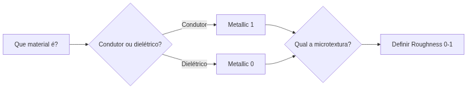

<!-- _class: cover -->
<!-- _paginate: false -->

# O material não é pintado

## É calculado pela física da luz

**Semana 5** — Revisão de UV (feedback da CF1) + Fundamentos do PBR

<!--
Notas: Abertura da mini aula (20 min). Semana de transição: fecha a Unidade I revisando o UV a partir do feedback da CF1 e abre a Unidade II com a primeira aproximação a materiais PBR. NÃO há crítica formal nesta semana — é um encontro de ajuste e abertura, sem instrumento de avaliação. A CF1 (Semana 4) já avaliou C3 formalmente; a próxima crítica formal, a CF2, só acontece na Semana 8. Pela primeira vez os estudantes saem do UV Editor e entram no Shader Editor.
-->

---

## Objetivos de hoje

Ao final da semana você será capaz de:

- Corrigir distorção e aproveitamento de espaço UV com base no feedback da CF1
- Explicar **o que é PBR** e por que Metallic/Roughness é o padrão para jogos
- Descrever a função de **Albedo**, **Metallic** e **Roughness**
- Atribuir valores **fisicamente plausíveis** a metal, plástico, pedra e madeira
- Criar materiais PBR de teste e aplicar um deles ao Hero Asset Referência

<!--
Notas: Ler rápido. Os dois primeiros objetivos fecham a Unidade I (UV); os demais abrem a Unidade II (PBR). Não há nota nesta semana — o professor observa C1, C3 e C4 informalmente, alimentando o acompanhamento que será avaliado formalmente na CF2 (Semana 8). Não antecipar texturas seamless (Semana 6) nem Normal Map (Semana 7): o foco de hoje é o valor plano.
-->

---

<!-- _class: chapter -->

# Fechando o UV

## Revisão rápida com o feedback da CF1

<!--
Notas: Parte 1 da mini aula (~8 min). Objetivo: relembrar Stretch Overlay, texel density e Pack Islands o suficiente para que os estudantes ajam sobre o feedback da CF1 sem precisar de uma aula nova. Abrir dizendo: "Vocês já viram tudo isso na Semana 4. Hoje não é aula nova de UV — é a correção do que a crítica formal apontou."
-->

---

## Três checagens rápidas antes de seguir

- **Stretch Overlay** — azul = compressão, vermelho = esticamento. Meta: predominância de verde/azul-claro neutro.
- **Texel density** — islands do mesmo objeto com densidade equivalente (Average Islands Scale resolve a maioria dos casos).
- **Pack Islands** — aproveitamento do espaço 0–1, padding consistente entre islands.

Abram o feedback escrito que receberam na CF1 e localizem, no próprio arquivo, exatamente onde está o problema apontado.

<!--
Notas: Revisão no quadro/projetor, não uma aula nova. Serve apenas para destravar a correção guiada pelo feedback já recebido. Estudantes que trabalharam em outros softwares podem confundir intuições — reforçar verbalmente a leitura das cores do Stretch Overlay.
-->

---

<!-- _class: two-columns -->

## O que muda entre a CF1 e hoje

Antes (avaliado na CF1)

- Islands esticadas ou comprimidas
- Densidade de texel desigual entre islands
- Espaço 0–1 mal aproveitado

Depois (revisão de hoje)

- Average Islands Scale aplicado
- Pack Islands reorganizado
- Stretch Overlay predominantemente neutro

<!--
Notas: Slide conceitual de apoio à correção ao vivo (Demonstração Parte 1, ~5 min): abrir um arquivo de prática com distorção evidente, aplicar Average Islands Scale e Pack Islands, comparar antes/depois. "Isso é exatamente o que vocês vão fazer com o feedback da própria CF1 daqui a pouco."

[!FIGURA]
Não existe hoje um arquivo de imagem para este slide — mantido texto-somente. Se for produzida uma nova figura, um bom candidato é um par de capturas de Stretch Overlay lado a lado (antes da correção / depois da correção) do mesmo asset, para reforçar visualmente a comparação.
-->

---

<!-- _class: chapter -->

# Abrindo a Unidade II

## Fundamentos do Physically Based Rendering

<!--
Notas: Parte 2 da mini aula (~12 min). Objetivo: criar o entendimento de que PBR não é um estilo visual, mas um modelo matemático de como a luz se comporta ao tocar superfícies. O UV revisado agora é o endereço onde os mapas PBR das próximas semanas vão morar.
-->

---

<!-- _class: question -->

# Antes do PBR, como um material **brilhante** parecia brilhante em **qualquer** ângulo de luz?

<!--
Notas: Abrir com esta pergunta. Aguardar 2-3 respostas (vão citar: pintar highlight na textura, mapa especular, ajustar no motor). Confirmar que todas estavam certas — e então mostrar o problema no próximo slide: highlight embutido só funciona com a luz no ângulo certo.
-->

---

<!-- _class: image-right -->

## O problema do brilho pintado

Highlight **pintado na textura** só funciona com a luz no ângulo certo.

Mude a luz de lado e o brilho aparece no **lugar errado**.

<!--
Notas: Revelar após as respostas da turma. Fixar: antes de ~2013, o artista embutia luz, sombra e reflexo na textura difusa. Funcionava com câmera e iluminação fixas. Em qualquer outro ângulo, o material quebrava. Isso motiva a virada do PBR.

[!FIGURA]
Este arquivo ainda não existe em assets/ — precisa ser produzido antes da aula.
Objetivo didático: mostrar visualmente por que o highlight pintado falha, motivando a necessidade do PBR.
Arquivo sugerido: assets/highlight_embutido_vs_pbr.webp
Descrição: mesma esfera em duas condições. À esquerda, esfera com highlight pintado na textura difusa, iluminada por um lado — parece correta. À direita, a MESMA esfera com a luz vinda do lado oposto — o brilho pintado aparece no lado errado, revelando o erro.
Como produzir: no Blender, criar uma esfera com um material Emission/difuso contendo um highlight pintado no Albedo (feito no Krita). Renderizar com uma luz à direita e depois à esquerda, sem mudar a textura. Compor as duas capturas lado a lado no Krita com rótulos "luz certa / luz errada".
-->

---

## O que o PBR muda

O PBR transfere a aparência do **artista** para a **física**.

O artista define **o que o material é** — rugoso? metálico?

O motor calcula **como ele parece** em cada condição de luz.

Resultado **consistente** em qualquer ângulo, qualquer iluminação — sem ajuste manual.

<!--
Notas: Este é o conceito-âncora da semana. Reforçar: o artista descreve propriedades físicas; o cálculo da aparência é do motor. É por isso que o mesmo material funciona numa masmorra escura e num deserto ensolarado sem retrabalho. Amarrar ao Projeto Integrador: o kit precisa ser coerente em qualquer cena.
-->

---

## Dois workflows — por que Metallic/Roughness

- **Specular/Glossiness** — mais antigo, controle direto do reflectance. Pipelines legados.
- **Metallic/Roughness** — Unity, Unreal, Blender (Principled BSDF), 3D Coat. Mais simples de calibrar.

Nesta disciplina usamos **exclusivamente Metallic/Roughness**. Ao exportar para a Unity, os mapas já estarão no formato esperado.

<!--
Notas: Não aprofundar Specular/Glossiness — citar apenas para situar. O importante é a decisão: adotamos Metallic/Roughness porque é o padrão dos motores modernos e o destino do pipeline é a Unity (Semana 16). Menos sujeito a erros físicos.
-->

---

## Três canais definem qualquer material

Todo material que criarmos hoje é descrito por três propriedades:

- **Albedo** — a cor pura, sem luz nem sombra
- **Metallic** — condutor ou dielétrico?
- **Roughness** — superfície lisa ou áspera?

<!--
Notas: Slide de mapa mental. Cada canal é detalhado nos próximos três slides. Escrever no quadro e manter durante toda a aula: "Roughness 0 = espelho | Roughness 1 = fosco". Antecipar que Metallic é binário e Roughness é contínuo.
-->

---

## Albedo — só o pigmento

A cor pura do material: **sem** sombra, **sem** luz, **sem** reflexo.

Deve ser uma cor "achatada" — apenas pigmento.

Albedo com **highlight pintado** ou valores **extremos**. Nenhum material real reflete 100% (branco puro) nem absorve 100% (preto puro).

Faixa física: valores de brilho entre **~0.15 e ~0.9** (evitar preto e branco puros).

<!--
Notas: Analogia fotográfica útil (do plano): "Albedo é o material fotografado num dia nublado — iluminação difusa, sem sombra nem reflexo." Erro comum observado nesta semana: Albedo extremo. Pedra real não reflete 95% da luz. Usar a referência do moodboard para ancorar o valor.
-->

---

## Metallic — é binário

Define se o material é **condutor** (metal) ou **dielétrico** (todo o resto).

- **0** = dielétrico → plástico, pedra, madeira, tecido, pele
- **1** = condutor → aço, ouro, cobre, alumínio

Na natureza **não existe "meio metal"**.

Usar **Metallic 0.5** como padrão — o erro mais comum da primeira semana de PBR. Cria um material "emborrachado", que não é metal nem plástico.

<!--
Notas: Erro mais frequente observado na circulação. O estudante acha que "deixar no meio" é seguro. Valores intermediários só se justificam em regiões de TRANSIÇÃO (ferrugem sobre metal, metal pintado). Estratégia de correção: mostrar ao vivo Metallic 0, 0.5 e 1 com o mesmo Roughness e perguntar "você já viu esse material na vida real?".
-->

---

## Roughness — é contínuo

Define a microgranularidade: o quanto a luz é **espalhada** ao refletir.

- **0** = espelho perfeito (reflexo nítido)
- **1** = fosco total (luz difusa, sem reflexo direcional)

É o canal com **mais liberdade criativa** — a variação de roughness dá história ao material.

<!--
Notas: Ao contrário do Metallic, Roughness é genuinamente contínuo. Cuidado com o erro de intuição invertida: quem viu tutoriais antigos pode achar "mais roughness = mais brilho". No Metallic/Roughness é o oposto. Manter no quadro: Roughness 0 = espelho | Roughness 1 = fosco.
-->

---

<!-- _class: diagram -->

## A pergunta que guia cada material

<!--
Notas: Este diagrama é o núcleo procedimental da semana. Repetir verbalmente no estúdio: "condutor ou dielétrico? qual a microtextura?". Cada material do kit deve passar por essas duas perguntas antes de qualquer valor ser digitado. Reaproveitado sem alteração — a lógica é a mesma independente de haver ou não crítica formal.
-->

---

## Calibração com referências reais

Estime os valores **antes** de revelar:

| Material | Metallic | Roughness |
|---|---|---|
| Metal polido | 1 | 0.05–0.15 |
| Metal fosco (anodizado) | 1 | 0.4–0.6 |
| Plástico brilhante | 0 | 0.1–0.3 |
| Pedra calcária | 0 | 0.7–0.9 |
| Madeira natural | 0 | 0.6–0.8 |

<!--
Notas: Mostrar as 5 referências visuais preparadas e pedir que a turma ESTIME antes de revelar. O exercício de estimativa é mais importante que os valores finais — constrói intuição da escala 0-1. Deixar claro que os valores variam por subtipo (pedra polida vs. bruta) para evitar memorização mecânica.
-->

---

## No estúdio hoje: UV + primeiros materiais

50 minutos, dois blocos — **sem nota**, com acompanhamento do professor:

1. **Revisão do UV** (≈20 min) — corrigir o Hero Asset Referência com base no feedback escrito da CF1
2. **Materiais PBR de teste** (≈25 min) — criar de 2 a 4 materiais que reflitam o tema do kit

Ainda **não** é pintar textura — é definir a **propriedade física** da superfície. Nomeie os materiais com o nome real (ex: `pedra_calcaria`, `aco_enferrujado`).

<!--
Notas: Consigna do estúdio (Encontro 1, 50 min). Etapa 1: reabrir o Hero Asset com o feedback da CF1, reativar Stretch Overlay, aplicar Average Islands Scale/Pack Islands, salvar `[Nome]_HeroAsset_UV_Semana05.blend`. Etapa 2: criar 2-4 materiais no Principled BSDF com valores de referência real, aplicar um deles (valores planos) ao Hero Asset já com UV revisado, salvar `[Nome]_MateriaisPBR_Semana05.blend`. Circular perguntando: "O que a CF1 apontou nesse UV? Mostra onde corrigiu." e "Esse material é condutor ou dielétrico?".
-->

---

## Erros comuns

**Tratar o UV como opcional** — sem nota nesta semana, mas o UV mal corrigido vira problema de textura visível na Semana 6.

**Metallic 0.5 por padrão** — material sem identidade, nem metal nem dielétrico.

**Roughness igual em todos** — se a sensação de superfície é a mesma, os materiais não se distinguem.

**Albedo extremo** — branco/preto puro não existe em material físico real.

<!--
Notas: Quatro erros mais frequentes da semana, alinhados ao bloco de dificuldades do plano. Circular no estúdio caçando exatamente estes padrões. Para Roughness uniforme, usar a analogia do tato: "de olhos fechados, você distingue madeira de pedra pelo tato — o Roughness é o tato visual".
-->

---

<!-- _class: industry -->

## Na indústria

Desde a adoção do workflow PBR pela indústria de jogos (por volta de 2014), nenhum material AAA é aprovado sem calibração contra valores de referência real — artistas de textura mantêm cartelas de roughness e metallic medidos, não estimados.

Errar metallic ou roughness fora da faixa física de um material é o tipo de erro que uma revisão técnica sênior identifica em segundos, antes mesmo de olhar o restante do asset.

<!--
Notas: Contextualizar o valor profissional. PBR deixou de ser opcional na indústria há mais de uma década — hoje é o piso mínimo de qualquer pipeline de material em tempo real. A calibração contra referência real que a mini-aula ensinou hoje é observada informalmente e volta a ser cobrada formalmente na CF2 (Semana 8), já com textura real e dentro do 3D Coat.
-->

---

<!-- _class: summary-slide -->

# Resumo

- **UV revisado** — distorção e aproveitamento corrigidos com base no feedback da CF1
- **PBR** = a física decide a aparência; o artista define o que o material é
- **Albedo** — pigmento puro, sem luz nem extremos
- **Metallic** — binário: 0 dielétrico, 1 condutor
- **Roughness** — contínuo: 0 espelho, 1 fosco
- A pergunta-guia: **condutor ou dielétrico? qual a microtextura?**

<!--
Notas: Amarrar a mini aula. Cada item retorna na demonstração e no estúdio. Não reler tudo — apontar a conexão com a demo dos materiais no Principled BSDF. Não há crítica formal hoje: as observações de C1, C3 e C4 alimentam o acompanhamento informal até a CF2, na Semana 8.
-->

---

## Encontro 2: crítica circulante informal

Sem Ficha de Crítica Formal. Sem autoavaliação obrigatória. Sem apresentação individual estruturada.

- 2–3 exemplos de UV revisado com sucesso (antes/depois)
- 1–2 exemplos de material PBR bem calibrado
- O erro mais comum observado na circulação do dia anterior

Serve para recalibrar antes do estúdio, não para gerar nota. A reflexão de hoje aquece o que será cobrado formalmente na CF2 (Semana 8).

<!--
Notas: Abertura do Encontro 2 (15 min). Roteiro: (5 min) mostrar exemplos projetados de UV e material bem calibrados; (5 min) nomear o erro mais comum observado (tipicamente Metallic 0.5, Albedo muito claro, Roughness igual); (5 min) pergunta aberta a 2-3 voluntários — "Qual bloco foi mais difícil hoje, o UV ou o PBR? Por quê?" — sem registro formal.
-->

---

## Agora: demonstração

**Parte 1** — correção ao vivo de um UV com distorção residual (Average Islands Scale + Pack Islands)

**Parte 2** — 4 materiais PBR ao vivo no Principled BSDF:

Metal polido • Plástico brilhante • Pedra áspera • Madeira

Rotacionar a HDRI e ver os materiais **responderem** à luz sem ajuste.

<!--
Notas: Transição para a demonstração de 20 min (5 min de UV + 15 min de PBR). Layout dividido: Viewport Rendered com HDRI neutra à esquerda, Shader Editor à direita. Sequência: metal (Metallic 1, Rough 0.05) -> plástico (Metallic 0) -> pedra (Rough 0.85) -> madeira. Mostrar Metallic 0/0.5/1 no plástico. Rotacionar a HDRI no fim para provar a consistência. Manter os dois arquivos de demonstração (UV e materiais) abertos durante o estúdio como âncora.

[!FIGURA]
Este arquivo ainda não existe em assets/ — precisa ser produzido antes da aula.
Objetivo didático: dar à turma um alvo visual do resultado esperado e antecipar o layout de tela da demonstração.
Arquivo sugerido: assets/demo_4_materiais_pbr.webp
Descrição: captura do Blender com quatro esferas lado a lado em Viewport Rendered sob HDRI neutra — metal polido (reflexo nítido), plástico vermelho brilhante, pedra bege fosca e madeira marrom. Ao lado, o Shader Editor mostrando um Principled BSDF conectado ao Material Output.
Como produzir: no Blender, montar layout dividido (Viewport Rendered + Shader Editor), criar 4 esferas com os materiais da tabela de referência, adicionar HDRI neutra (ex: studio_small_09 do Poly Haven) no World e capturar a tela com os 4 materiais visíveis.
-->

---

## Encerrando a Semana 5

Vocês fecharam o ciclo de UV da CF1 e começaram a definir o que os materiais do kit são fisicamente.

A pergunta que vai guiar todo o resto do semestre: **esse valor corresponde a algo real?**

**Semana 6:** vocês saem dos valores planos e entram em texturas seamless (imagens no canal Albedo). Guardem os arquivos com versionamento — os valores de hoje vão migrar para dentro das texturas.

A próxima crítica formal, a **CF2**, é só na **Semana 8** — Semanas 6 e 7 são de produção livre, sem nota.

<!--
Notas: Fechamento (10 min). Síntese técnica (2 min): "se a resposta for não, o material vai parecer falso, independentemente de quanto detalhe você pintar por cima." Reflexão de processo (3 min): perguntar a 2-3 voluntários qual material foi mais difícil de calibrar e por quê. Confirmação das entregas (2 min): Hero Asset com UV revisado, materiais PBR de teste (v1 e v2 pós-circulação), Hero Asset com material PBR aplicado, screenshots — recapitular nomenclatura esperada.
-->
