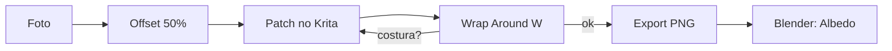

<!-- _class: cover -->
<!-- _paginate: false -->

# A costura é um problema técnico

## Não estético

**Semana 6** — Criação de texturas seamless e tileable

<!--
Notas: Abertura da mini aula (20 min). Unidade II, entre a CF2 (Sem 5) e a CF3 (Sem 8). Mensagem central no subtítulo: a costura de uma textura não é falta de talento artístico — é uma imagem cujas bordas não são contínuas. Marco da semana: pela primeira vez uma IMAGEM REAL entra no pipeline. Nas Semanas 3-5 o Albedo era cor plana; agora vira uma superfície com variação e história. Não é tutorial de cliques: é entender por que a repetição precisa ser invisível.
-->

---

## Objetivos de hoje

Ao final da semana você será capaz de:

- Explicar **o que é** uma textura seamless e por que jogos precisam dela
- Diferenciar **offset+patch** de uma repetição direta de foto
- Criar uma textura seamless a partir de uma foto no **Krita**
- Conectar a textura ao canal **Albedo** do Asset 01 no Blender
- Localizar mapas PBR em fontes livres (**Poly Haven**, **AmbientCG**)

<!--
Notas: Ler rápido. Cada objetivo retorna ao longo da aula. Não antecipar Normal Map nem Roughness mapeado (Semana 7) — hoje só o Albedo deixa de ser cor e passa a ser imagem. Manter os valores de Metallic e Roughness calibrados na Semana 5.
-->

---

<!-- _class: question -->

# O que está errado nesta parede?

<!--
Notas: Abrir com esta pergunta usando a imagem estática de comparação no projetor (sem abrir software ainda). Aguardar 2-3 respostas — o objetivo é que a turma IDENTIFIQUE a costura antes de nomear o conceito. Vão dizer "tem uma linha", "a pedra se repete igual". Confirmar e revelar o conceito no slide seguinte.

[!FIGURA]
Objetivo didático: provocar a turma a enxergar a costura por conta própria, ancorando o conceito na percepção antes da definição.
Arquivo sugerido: assets/parede_costura_vs_seamless.webp
Descrição: uma parede de jogo em duas versões lado a lado. À esquerda, uma textura de pedra 512x512 repetida sem tratamento — linhas de corte (costuras) visíveis em grade. À direita, a MESMA parede com a textura tornada seamless — a repetição não é perceptível.
Como produzir: no Blender, aplicar uma textura de pedra 512x512 num plano grande com escala de repetição alta (nó Mapping com Scale elevado) e renderizar — as costuras aparecem. Tornar a mesma textura seamless no Krita (offset+patch), reaplicar e renderizar de novo. Compor as duas capturas lado a lado no Krita com rótulos "sem tratamento / seamless".
-->

---

## O que é uma textura seamless

Uma imagem cujas bordas **esquerda/direita** e **topo/base** são contínuas.

Quando repetida lado a lado, o olho **não** detecta a transição entre tiles.

Paredes, pisos e terrenos são maiores que um tile. A solução eficiente é repetir uma textura pequena — mas só funciona se ela for seamless.

<!--
Notas: Fixar o conceito central. Superfícies grandes de jogo são maiores que uma única tile. Usar textura pequena repetida é a opção mais eficiente em memória — mas exige seamless. A alternativa (textura única cobrindo tudo) existe, mas não escala para um kit modular. Amarrar ao Projeto Integrador: o kit precisa de superfícies amplas coerentes.
-->

---

## Por que uma foto bruta não é seamless

Uma foto captura **iluminação**, **sombras** e **perspectiva** diferentes em cada borda.

Mesmo com conteúdo idêntico, gradientes de luz vazam pelas extremidades.

Ao repetir, essas diferenças aparecem como **linhas de costura**.

<!--
Notas: O ponto-chave que motiva o método. A costura não é falha de conteúdo — é diferença entre as bordas. Por isso capturar em iluminação difusa (dia nublado) é tão importante: sombras duras criam costuras que "giram" com o tile e não se corrigem por offset simples. Preparar o terreno para a solução: offset.
-->

---

<!-- _class: image-right -->

## O método: offset

Deslocar a imagem **50%** em X e Y.

As bordas — antes invisíveis — vão para o **centro**.

Agora dá para **consertá-las** com pintura.

<!--
Notas: Explicar o coração do processo. O offset não conserta nada sozinho — ele TRAZ o problema para onde conseguimos vê-lo e pintar. As bordas passam a ser contínuas; o trabalho de patch acontece no centro. No Krita: Filter > Transform > Offset, 50% em cada eixo.

[!FIGURA]
Objetivo didático: tornar visível a lógica do offset — o problema não some, ele muda de lugar para poder ser corrigido.
Arquivo sugerido: assets/offset_traz_costura_ao_centro.webp
Descrição: textura de pedra em duas etapas. À esquerda, a imagem original com a costura implícita nas bordas (invisível). À direita, a mesma imagem após offset de 50% — as antigas bordas agora formam uma cruz de costuras no centro da imagem, prontas para o patch.
Como produzir: no Krita, abrir uma foto de pedra, aplicar Filter > Transform > Offset a 50% em X e Y. Capturar antes e depois. Compor lado a lado com uma seta indicando "bordas -> centro".
-->

---

## O patch: cobrir a costura

Com **Clone Stamp** (`S`), amostrar (`Ctrl+clique`) regiões próximas e cobrir a linha.

- Trabalhar em pinceladas **irregulares**, não em linha reta
- Seguir as **formas naturais** do material (veios, juntas)
- **Smudge** para suavizar transições

Patch em linha reta troca uma costura por um **padrão de linhas paralelas** — igualmente visível.

<!--
Notas: O erro nº 1 do estúdio. Clonar em linha reta cria um novo padrão repetitivo. Orientar pinceladas diagonais e irregulares, seguindo a textura do material. O Smudge suaviza os limites do patch. Mostrar isso ao vivo na demonstração com o Wrap Around ativo.
-->

---

<!-- _class: image-left -->

## Wrap Around: o feedback em tempo real

Atalho `W` no Krita: pré-visualiza a **repetição enquanto você pinta**.

Sem exportar e testar a cada ajuste.

Recue 2 passos do monitor. Se precisar se **concentrar** para achar a costura, ela já não incomoda o jogador. Essa é a régua.

<!--
Notas: O Wrap Around (W) é o único feedback confiável em tempo real — o estudante vê a costura ANTES de ir para o Blender. Erro comum nº 2: o PNG isolado parece perfeito, mas a costura só aparece quando tilea. Insistir no uso do Wrap Around durante todo o processo, não só no fim. A régua do "bom o suficiente" é uma decisão artística, não técnica.

[!FIGURA]
Objetivo didático: mostrar como o Wrap Around revela costuras que são invisíveis na imagem isolada.
Arquivo sugerido: assets/krita_wrap_around.webp
Descrição: captura de tela do Krita com uma textura de pedra em modo Wrap Around ativo, exibindo a repetição em grade 3x3. Uma costura residual aparece destacada por um círculo vermelho anotado.
Como produzir: no Krita, abrir uma textura de pedra parcialmente tratada, pressionar W para ativar o Wrap Around, dar zoom out até ver a repetição em grade. Capturar a tela e anotar a costura residual com um círculo no próprio Krita.
-->

---

<!-- _class: diagram -->

## O ciclo de trabalho da semana

<!--
Notas: Núcleo procedimental da semana. O ciclo Krita -> Blender vai se repetir várias vezes no estúdio — é normal. Reforçar o loop C->D->C: verificar no Wrap Around, voltar ao patch se houver costura. O GitHub Action converte o bloco mermaid em imagem automaticamente.
-->

---

## Fontes de texturas PBR gratuitas

- **Poly Haven** (polyhaven.com) — mapas PBR completos, licença CC0
- **AmbientCG** (ambientcg.com) — grande variedade por categoria, CC0

Já vêm quase seamless e com Albedo, Normal, Roughness e AO.

Baixar é válido e faz parte do fluxo profissional. Mas a entrega inclui **evidência do processo** — não só o arquivo final.

<!--
Notas: Deixar claro que baixar textura pronta NÃO isenta de entender o seamless. Se o estudante baixa do Poly Haven, precisa documentar por que é seamless (apontar continuidade de bordas no Wrap Around) e adaptar cor/detalhe ao tema. "Baixar é válido. Entregar sem entender não é." Erro comum nº 6 do plano. Se a internet do lab for instável, ter um pen drive com 5-6 texturas preparadas.
-->

---

## Escala importa tanto quanto seamless

A textura pode estar perfeita e ainda parecer **errada** no asset.

- Tiles **grandes demais**: pedras gigantes, quebra a crença
- Tiles **pequenos demais**: pedras minúsculas, vira ruído

Ajustar com o nó **Mapping** + **Texture Coordinate** no Blender.

<!--
Notas: Erro comum nº 5. Escala não é problema do seamless — é de mapeamento. Adicionar nó Mapping (Shift+A > Vector > Mapping) entre Texture Coordinate e Image Texture, ajustar Scale em X e Y. Referência física: uma pedra de parede medieval tem 20-40 cm — quanto isso é em relação ao Asset 01?
-->

---

## Preserve o material da Semana 5

Ao conectar a textura ao **Base Color**, **não** perca o resto.

- **Metallic** e **Roughness** devem manter os valores calibrados
- Trocar o Albedo **não** significa zerar os outros canais

Adicionar o nó Image Texture e, sem querer, desconectar Metallic/Roughness — que voltam ao padrão.

<!--
Notas: Erro comum recorrente. Ao adicionar o Image Texture, o estudante às vezes desfaz outros inputs. Verificar no Principled BSDF: Base Color conectado ao Image Texture, Metallic e Roughness com valores não-padrão coerentes com o material (ex: o Roughness 0.85 da pedra calibrado na Semana 5 continua lá?).
-->

---

## Erros comuns

**Patch em linha reta** — troca a costura por um padrão de linhas paralelas.

**Confiar no PNG isolado** — a costura só aparece quando tilea. Use o Wrap Around.

**Foto com sombra dura** — a sombra "gira" com o tile e não se corrige por offset.

<!--
Notas: Os três erros mais frequentes da semana, alinhados ao bloco de dificuldades do plano. Circular no estúdio caçando exatamente estes padrões. Para a sombra dura: orientar imagens de dia nublado / iluminação difusa; se a sombra for leve, suavizar com Dodge/Burn ou níveis antes do offset.
-->

---

<!-- _class: summary-slide -->

# Resumo

- **Seamless** = bordas contínuas; a repetição fica invisível
- **Offset** traz a costura das bordas para o centro
- **Patch** irregular cobre a costura sem criar novo padrão
- **Wrap Around (W)** é o feedback em tempo real
- Preserve **Metallic** e **Roughness** ao conectar o Albedo

<!--
Notas: Amarrar a mini aula. Cada item retorna na demonstração e no estúdio. Não reler tudo — apontar a conexão com a demo (pedra seamless no Krita -> Blender). Lembrar: hoje é crítica INFORMAL; o foco é ler costura e coerência temática no trabalho dos colegas.
-->

---

## No estúdio: textura do Asset 01

Crie uma textura seamless do **material principal** do Asset 01.

Três caminhos: criar de uma foto, adaptar do Poly Haven/AmbientCG, ou baixar pronta.

O que importa é chegar a um **PNG seamless** aplicado ao Albedo do Asset 01 no Blender — com Metallic e Roughness preservados.

<!--
Notas: Consigna do estúdio (50 min). Se o Asset 01 é parede de pedra medieval, a textura é pedra; se é caixa de metal Sci-Fi, é metal com ferrugem. Amarrar ao moodboard: não é "pedra genérica", é AQUELA pedra do tema. Nomenclatura: [Nome]_[material]_seamless_S06.png. Salvar o .kra nativo com as camadas — vai poupar trabalho na Semana 7.
-->

---

## Agora: demonstração

A seguir, uma **pedra seamless ao vivo**: foto → offset → patch → Blender.

Krita à esquerda com Wrap Around, Blender à direita com o Asset 01.

<!--
Notas: Transição para a demonstração de 20 min. Sequência: importar foto -> Wrap Around mostra costura -> Offset 50% -> patch com Clone Stamp -> verificar no Wrap Around -> exportar PNG -> Blender: nó Image Texture no Base Color -> comparar com o Albedo plano da Semana 5. Deixar uma costura residual é didaticamente valioso: mostrar o ciclo Krita -> Blender -> Reload.

[!FIGURA]
Objetivo didático: dar à turma um alvo visual do resultado esperado e antecipar o layout de tela da demonstração.
Arquivo sugerido: assets/demo_seamless_krita_blender.webp
Descrição: tela dividida. À esquerda, o Krita com uma textura de pedra em Wrap Around (repetição em grade sem costuras). À direita, o Blender em Viewport Rendered com o Asset 01 recebendo a mesma textura de pedra no canal Albedo, sob HDRI neutra.
Como produzir: no Krita, finalizar uma pedra seamless e ativar o Wrap Around. No Blender, aplicar o PNG exportado ao Base Color do Principled BSDF do Asset 01 em Viewport Rendered. Capturar as duas telas e compô-las lado a lado no Krita.
-->
