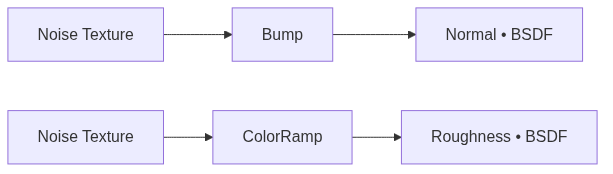

<!-- _class: cover -->
<!-- _paginate: false -->

# Profundidade sem geometria

## O material deixa de ser plano

**Semana 7** — Normal Map, Roughness procedural e SSS

<!--
Notas: Abertura da mini aula (20 min). Unidade II, entre a CF2 (Sem 5) e a CF3 (Sem 8). Mensagem central: nesta semana o material ganha PROFUNDIDADE. Nas Semanas 5-6 o Albedo passou de cor plana a imagem real; agora o Normal Map simula relevo e o Roughness varia dentro da mesma superfície — sem adicionar um único polígono. Saída da semana: o primeiro material PBR COMPLETO (Albedo + Metallic + Roughness + Normal). Não é tutorial de cliques: é entender por que a luz "acredita" em uma superfície que não existe.
-->

---

## Objetivos de hoje

Ao final da semana você será capaz de:

- Explicar **como** um Normal Map simula relevo sem mudar a geometria
- Diferenciar **Normal Map** de **Bump Map** e saber quando usar cada um
- Gerar um Normal Map **procedural** no Blender (Noise → Bump → Normal)
- Criar **variação de Roughness** com Noise Texture + ColorRamp
- Montar um material PBR **completo** com os quatro canais conectados

<!--
Notas: Ler rápido. Cada objetivo retorna ao longo da aula. Não antecipar 3D Coat (Semana 8) nem bake (Semana 11) — hoje tudo acontece com nós procedurais no Blender. O SSS entra apenas para completar o vocabulário do Principled BSDF.
-->

---

<!-- _class: question -->

# O que mudou entre as três paredes?

<!--
Notas: Abrir com a imagem estática de comparação no projetor (sem abrir software ainda). Três versões do MESMO asset: só Albedo / com Normal / com Normal + Roughness. Aguardar 2-3 respostas. O ponto-chave a extrair da turma: a GEOMETRIA é idêntica nos três casos — nenhum polígono foi adicionado. Confirmar e revelar o conceito no slide seguinte.

[!FIGURA]
Objetivo didático: provocar a turma a perceber que a diferença de profundidade não vem da geometria, ancorando o conceito antes da definição.
Arquivo sugerido: assets/parede_tres_estagios.webp
Descrição: a mesma parede de pedra em três painéis lado a lado. (1) só Albedo — superfície plana com a foto aplicada. (2) com Normal Map — blocos de pedra ganham volume, rachaduras e relevo. (3) com Normal + Roughness — algumas faces parecem polidas e outras matte.
Como produzir: no Blender, montar uma parede simples com textura seamless da Semana 6 no Albedo e renderizar (painel 1). Adicionar Noise → Bump → Normal e renderizar (painel 2). Adicionar Noise → ColorRamp → Roughness e renderizar (painel 3). Compor os três lado a lado no Krita com rótulos.
-->

---

## O que é um Normal Map

Uma imagem **RGB** onde cada pixel guarda um **vetor de direção** — a normal da superfície naquele ponto.

O motor usa esses vetores no cálculo de luz **em vez** das normais reais da geometria.

R = direção X · G = direção Y · B = profundidade (Z). Por isso mapas de espaço tangente têm sempre aquele **tom azulado**: quase tudo aponta "para fora".

<!--
Notas: Fixar o conceito central. O Normal Map engana o cálculo de luz — a superfície permanece plana, mas a luz reage como se houvesse relevo. O tom azulado é consequência direta da codificação: B alto = Z alto = vetor apontando para fora da superfície. Amarrar ao custo de polígonos: em jogos em tempo real, simular relevo é muito mais barato que modelá-lo.
-->

---

## Espaço tangente vs. espaço objeto

**Tangente** — vetores relativos à superfície local. Funciona em qualquer objeto, mesmo rotacionado. É o padrão de jogos.

**Objeto** — vetores absolutos. Só funciona se o objeto **não** girar. Raro na produção.

Na dúvida, é **espaço tangente**. É o que o pipeline de jogos usa por padrão.

<!--
Notas: Não aprofundar além disso. A distinção importa porque explica por que o mapa é "colável" em qualquer asset — o espaço tangente acompanha a orientação local de cada face. Espaço objeto é citado só para contraste; nenhum estudante vai usá-lo esta semana.
-->

---

## Normal Map vs. Bump Map

**Bump Map** — imagem em **escala de cinza**; o valor é altura (branco = alto). O motor calcula a normal a partir do gradiente.

**Normal Map** — guarda os **vetores diretamente**. Mais preciso e portável entre motores.

No Blender, o nó **Bump** transforma qualquer valor (inclusive ruído) em contribuição de normal — sem precisar de um mapa pronto.

<!--
Notas: O Bump é mais simples porém menos preciso e não exporta bem para outros motores. Mas o nó Bump do Blender é justamente o atalho que usaremos hoje: ele converte a saída do Noise Texture em relevo, sem precisar de um Normal Map baked (isso vem na Semana 11).
-->

---

## Geração procedural: os nós de hoje

- **Noise Texture** — padrão de ruído orgânico (Scale, Detail, Roughness)
- **Bump** — lê um valor como altura e gera contribuição de normal
- **ColorRamp** — converte ruído contínuo em faixas de contraste
- **Musgrave** (3.x) ou **Noise com Detail alto** (4.x) — ruído mais estruturado

<!--
Notas: Apresentar o kit mínimo de nós. Não é preciso decorar parâmetros — a demonstração mostra cada um ao vivo. Atenção à versão do laboratório: no Blender 4.0 o Musgrave foi incorporado ao Noise Texture (via Detail/Roughness). Verificar antes da aula e adaptar a nomenclatura.
-->

---

<!-- _class: diagram -->

## Os dois fluxos da semana

<!--
Notas: Núcleo procedimental. Dois caminhos independentes que chegam a canais diferentes do Principled BSDF: um Noise vira relevo (via Bump → Normal), outro Noise vira variação de brilho (via ColorRamp → Roughness). São dois Noise Texture SEPARADOS — não reaproveitar o mesmo nó. O GitHub Action converte o mermaid em imagem.
-->

---

<!-- _class: image-right -->

## Calibrar o Strength

O `Strength` padrão do Bump é **1.0** — quase sempre **forte demais**.

Pedra `0.2–0.4` · madeira `0.1–0.3` · metal `0.05–0.15`.

Strength alto transforma micro-textura em **crateras lunares**.

<!--
Notas: Erro de calibração nº 1 do estúdio. O valor padrão exagera o relevo. Orientar a comparar com referência real (foto do Poly Haven do mesmo material) e baixar o Strength progressivamente até o relevo parecer crível. A estrutura do nó não muda — só a intensidade.

[!FIGURA]
Objetivo didático: mostrar visualmente que o mesmo Normal Map procedural muda completamente conforme o Strength, ancorando a noção de calibração.
Arquivo sugerido: assets/bump_strength_comparacao.webp
Descrição: a mesma parede de pedra em três painéis, com Strength do nó Bump em 1.0 (exagerado, aspecto de cratera), 0.3 (crível) e 0.05 (quase imperceptível).
Como produzir: no Blender, montar Noise → Bump → Normal em uma parede, renderizar em Viewport Rendered com Strength 1.0, 0.3 e 0.05, capturar cada estado e compor lado a lado no Krita com os valores rotulados.
-->

---

<!-- _class: image-left -->

## Variação de Roughness conta história

O **ColorRamp** transforma ruído em contraste de brilho: áreas polidas × áreas matte.

Marcadores **muito próximos** = variação invisível. Afaste-os (ex.: `0.4` e `0.85`).

O brilho deve responder a uma **lógica de uso**: onde o material desgastou? Onde acumulou sujeira?

<!--
Notas: A variação de Roughness é o que faz o material parecer USADO, não fabricado. Erro comum: dois marcadores do ColorRamp muito juntos (0.6 e 0.65) — a variação não aparece. Afastar para extremos. Mais importante: a variação precisa de intenção artística, não ser só ruído bonito. Referência de material real no Poly Haven ajuda a decidir onde há mais ou menos brilho.

[!FIGURA]
Objetivo didático: mostrar como o afastamento dos marcadores do ColorRamp converte ruído sem graça em variação de brilho legível.
Arquivo sugerido: assets/colorramp_roughness.webp
Descrição: à esquerda, um ColorRamp com marcadores próximos (0.60 e 0.65) e o render resultante com brilho uniforme. À direita, marcadores afastados (0.40 e 0.85) e o render com contraste visível entre áreas polidas e matte.
Como produzir: no Blender, montar Noise → ColorRamp → Roughness, capturar o editor de nós e o Viewport Rendered com marcadores próximos, depois com marcadores afastados. Compor os dois estados no Krita.
-->

---

## Subsurface Scattering: quando usar

O **SSS** simula luz que **penetra** o material antes de dispersar — pele, cera, mármore, folhas, tecidos finos.

Para um kit de ambiente (pedra, metal, madeira, concreto): **quase nunca**.

SSS em pedra ou metal deixa o material com aparência de **plástico ou cera**.

<!--
Notas: O SSS entra só para completar o vocabulário do Principled BSDF. No Principled: parâmetro Subsurface de 0 a 1; valores 0.05–0.15 já produzem efeito visível. Para o kit da maioria, o valor correto é 0. Exceção: elementos orgânicos (vela, planta, tecido). Se o tempo apertar, cobrir em 2 minutos: "existe esse parâmetro, use em materiais orgânicos".
-->

---

## O material PBR completo

Quatro canais trabalhando juntos no Principled BSDF:

- **Albedo** — cor e identidade (textura seamless da Semana 6)
- **Metallic** — quase binário: `0` não-metal · `1` metal
- **Roughness** — variação procedural (Noise + ColorRamp)
- **Normal** — relevo procedural (Noise + Bump)

<!--
Notas: Este é o conjunto mínimo de um material de jogo profissional — o marco da semana. Reforçar o Metallic quase binário: em PBR físico não há meio-termo. Ferrugem é dielétrico (Metallic 0) com a cor do ferrugem no Albedo, não Metallic intermediário. Amarrar ao Projeto Integrador: cada material do kit precisa dos quatro canais coerentes com o tema.
-->

---

## Erros comuns

**Normal no canal errado** — fio do Bump conectado ao Base Color; o Albedo fica azulado e o relevo some.

**Scale inadequado** — Noise em 1–2 vira ondas de terreno; em 50+ some no render. Comece por `8–12`.

**Roughness sem contraste** — marcadores do ColorRamp muito próximos; a variação não aparece.

<!--
Notas: Os três erros mais frequentes da semana, alinhados ao bloco de dificuldades do plano. Circular no estúdio caçando exatamente estes padrões. Para o canal errado: verificar o fio ROXO chegando à entrada Normal (abaixo de Roughness), vindo do Bump — nunca o fio amarelo do Noise direto. Para a escala: sugerir Texture Coordinate em Object para o Scale corresponder ao tamanho real do asset.
-->

---

<!-- _class: summary-slide -->

# Resumo

- **Normal Map** = vetores que enganam a luz; relevo sem geometria
- **Tangente** é o padrão de jogos; **Bump** gera normal a partir de valor
- **Noise → Bump → Normal** e **Noise → ColorRamp → Roughness**
- Calibre o **Strength**; afaste os marcadores do **ColorRamp**
- Material completo = **Albedo + Metallic + Roughness + Normal**

<!--
Notas: Amarrar a mini aula. Cada item retorna na demonstração e no estúdio. Não reler tudo — apontar a conexão com a demo. Lembrar: hoje é crítica INFORMAL; o foco é ler profundidade e coerência do material no trabalho dos colegas. Na Semana 8 (CF FORMAL) o mesmo material vem no 3D Coat.
-->

---

## No estúdio: material PBR completo

Adicione **Normal** (Noise → Bump) e **Roughness** (Noise → ColorRamp) ao seu asset.

Meta mínima: um asset com **Albedo + Normal + Roughness** conectados e node tree organizado em **frames** nomeados.

Quem chegou sem o Albedo do Asset 02: os primeiros 15 min são para concluí-lo antes de avançar.

<!--
Notas: Consigna do estúdio. Dois blocos: quem falta terminar o Albedo do Asset 02 fecha isso primeiro (Bloco A, ~15 min); toda a turma adiciona Normal e Roughness (Bloco B). Nomenclatura: [Nome]_Asset01_PBR_S07.blend. Capturar screenshot do node tree + render comparativo antes/depois do Normal Map. Organizar em frames (Ctrl+J) é equivalente a organizar camadas no Krita.
-->

---

## Agora: demonstração

A seguir, um **material PBR completo ao vivo**: Noise → Bump → Normal, depois Noise → ColorRamp → Roughness.

Shader Editor à esquerda, Viewport Rendered à direita.

<!--
Notas: Transição para a demonstração de 20 min. Sequência: parede com Albedo da Semana 6 -> Noise → Bump → Normal (calibrar Strength) -> segundo Noise → ColorRamp → Roughness (afastar marcadores) -> organizar em frames -> demo rápida de SSS (subir a 0.1 e voltar a 0) -> comparar antes/depois desabilitando os frames com M. Fechar com a mensagem: o asset é idêntico geometricamente; o que mudou foi a informação que chegou ao cálculo de luz.

[!FIGURA]
Objetivo didático: dar à turma um alvo visual do resultado esperado e antecipar o layout de tela da demonstração.
Arquivo sugerido: assets/demo_material_completo.webp
Descrição: tela dividida. À esquerda, o Shader Editor do Blender com dois frames nomeados (Normal_Procedural e Roughness_Variacao) e os nós conectados ao Principled BSDF. À direita, o Viewport Rendered com a parede de pedra exibindo relevo e variação de brilho sob HDRI neutra.
Como produzir: no Blender, montar o material completo com os dois frames organizados, ativar Viewport Rendered com HDRI neutra e capturar as duas áreas. Compor lado a lado no Krita.
-->
