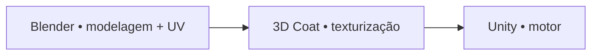
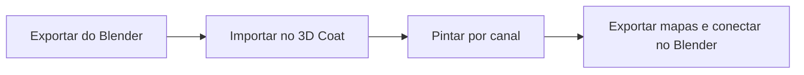

<!-- _class: cover -->
<!-- _paginate: false -->

# Do nó ao mapa pintado

## A textura vira imagem real

**Semana 8** — Introdução ao 3D Coat: Paint Room, camadas e exportação PBR

<!--
Notas: Abertura da mini aula (20 min). Terceira Crítica Formal do semestre (CF3) — encerra a Unidade II. Mensagem central: até a Semana 7, o material vivia dentro do Blender como rede de nós procedurais. Hoje os estudantes cruzam para uma ferramenta dedicada de texturização — o 3D Coat — onde o material passa a ser pintado, canal por canal, e exportado como imagens reais (PNG). Manter o ritmo: os canais PBR já são conhecidos desde a Semana 5, o foco de hoje é a ferramenta e o fluxo, não os conceitos.
-->

---

## Objetivos de hoje

Ao final da semana você será capaz de:

- Identificar os três espaços de trabalho do 3D Coat: **Paint Room**, **UV Room**, **Render Room**
- Importar um asset com UV do Blender no modo **Per Pixel Painting**
- Organizar camadas no Paint Room e alternar entre canais PBR
- Pintar os canais **Color**, **Roughness** e **Metallic** diretamente sobre a malha
- Exportar mapas PBR e reconectá-los no material do Blender

<!--
Notas: Ler rápido. Não antecipar Normal Map baked (Semana 11) nem pintura artística de desgaste (Semana 9) — hoje o 3D Coat aparece pela primeira vez, com os três canais básicos. O objetivo 5 já prepara para a demonstração e para o estúdio.
-->

---

<!-- _class: question -->

# O material da Semana 7 viaja com o asset para a Unity?

<!--
Notas: Pergunta de abertura. Deixar a turma responder brevemente. Resposta esperada: os nós procedurais (Noise, Bump, ColorRamp) funcionam só dentro do Blender — para exportar para a Unity é preciso ter mapas de imagem reais (PNG/TGA). Confirmar e revelar: o 3D Coat é a ferramenta que gera esses mapas, pintando diretamente sobre a malha 3D.
-->

---

## Nó procedural × mapa pintado

Nós geram aparência **matematicamente**, a cada render — funcionam só dentro do Blender.

Mapas do 3D Coat são **imagens reais**, portáveis para qualquer motor ou software.

Um PNG exportado do 3D Coat abre no Krita, conecta na Unity ou no Unreal sem nenhuma conversão.

<!--
Notas: Fixar a diferença fundamental antes de qualquer detalhe de interface. Os estudantes já sabem o que Albedo, Roughness e Metallic representam desde a Semana 5 — hoje muda apenas COMO essa informação é criada e armazenada.
-->

---

<!-- _class: diagram -->

## Onde o 3D Coat entra no pipeline

<!--
Notas: O 3D Coat recebe a malha com UV do Blender e devolve mapas de imagem que representam cada canal PBR. Esses mapas voltam ao Blender (para conferência) ou vão direto para a Unity. Reforçar: esta é a posição exata do 3D Coat no pipeline da disciplina — não substitui o Blender, entra depois do UV pronto.
-->

---

## Os três espaços de trabalho (Rooms)

- **Paint Room** — o espaço principal; pintar sobre a malha 3D com pincéis, stencils e alphas
- **UV Room** — conferir o mapa UV importado (os UVs já chegam prontos do Blender)
- **Render Room** — visualização em alta qualidade com iluminação HDR, para avaliar o resultado antes de exportar

<!--
Notas: O 3D Coat organiza o trabalho em "Rooms" especializadas. No workflow da disciplina, o UV Room é usado apenas para conferência — a abertura de UV acontece no Blender (Semanas 2-4). O Render Room será usado ao longo da demonstração para checar o efeito de cada camada pintada.
-->

---

## Camadas que guardam múltiplos canais

O Paint Room usa camadas empilhadas — como no Krita — mas cada camada guarda dados para **vários canais ao mesmo tempo**: Color, Roughness, Metallic, Normal, Opacity.

É como se cada camada tivesse várias "sub-imagens" invisíveis. Pintar no canal Color só afeta o Color — a estrutura de camadas é compartilhada.

<!--
Notas: Este é o conceito mais estranho para quem vem do Krita/Photoshop puro. O artista escolhe qual canal está ativo no momento de pintar, mas a pilha de camadas (ordem, blend mode, opacidade) é a mesma para todos os canais. Essa distinção evita o erro mais comum da aula: pintar no canal errado.
-->

---

<!-- _class: diagram -->

## O fluxo da aula em quatro etapas

<!--
Notas: Núcleo procedimental da semana. Exportar como .obj (com UV Coords marcado) ou .fbx. Importar em Per Pixel Painting. Pintar Color, depois Roughness, depois Metallic — nessa ordem. Exportar como PNG e reconectar no Principled BSDF, lembrando do Color Space Non-Color para os mapas de dado. O GitHub Action converte o mermaid em imagem.
-->

---

<!-- _class: image-right -->

## Importar no modo certo

`File → Import for Per-Pixel Painting`. Resolução **1024×1024** para a aula. Workflow: **Metalness PBR** (não Specular/Glossiness).

Em produção usaríamos 2048 — hoje 1024 é suficiente e mais rápido para navegar.

<!--
Notas: Passo 1 da demonstração. Reforçar que o 3D Coat detecta o UV automaticamente se o export estiver correto. Workflow errado (Specular/Glossiness) muda a lógica dos canais pintados mais adiante — confirmar sempre Metalness PBR neste pipeline.

[!FIGURA]
Objetivo didático: mostrar a janela de importação do 3D Coat para que os estudantes reconheçam as opções antes de tentar sozinhos no estúdio.
Arquivo sugerido: assets/importacao_per_pixel.webp
Descrição: captura de tela da janela "Import for Per-Pixel Painting" do 3D Coat, com o campo de resolução marcado em 1024x1024 e o seletor de workflow em "Metalness PBR" destacado.
Como produzir: no 3D Coat, abrir File → Import for Per-Pixel Painting com um asset de demonstração, capturar a janela de importação antes de confirmar, destacar os dois campos citados com uma seta ou contorno no Krita.
-->

---

## Canal Color (Albedo)

Renomear a camada base para `Base_Color`. Preencher com a cor dominante do material (Fill).

Criar uma segunda camada de **variação de tom** — modo Overlay, opacidade baixa — para quebrar a uniformidade.

Uma única camada de Fill uniforme deixa o material com aspecto de plástico.

<!--
Notas: Etapa 3 do estúdio. A camada de variação é o que evita o "look" de cor sólida perfeita — nenhuma superfície real é assim. Pedra: cinza; madeira: marrom; metal: cinza escuro frio. Adaptar ao tema do kit de cada estudante.
-->

---

## Canal Roughness

Branco = muito rugoso (matte) · preto = muito liso (reflexivo) — mesmo princípio do Principled BSDF.

Camada base (Fill) + camada de **desgaste** nas arestas e projeções, com valor mais claro (mais liso).

No Render Room, procure diferença de brilho visível entre arestas e a face principal — é o desgaste pintado aparecendo.

<!--
Notas: Etapa 4. Pedra e madeira não-polidas ficam em torno de 0.6-0.8 na base. As arestas e pontos de contato mais usados recebem roughness mais baixo — reflexo do desgaste físico por uso. Esse é o mesmo raciocínio de "onde a luz revela a história do objeto" que retorna nas Semanas 9-10.
-->

---

## Canal Metallic

Quase binário: **preto = 0** (dielétrico: pedra, madeira, concreto) · **branco = 1** (metal).

Materiais mistos: preencher zonas distintas — sem gradientes suaves.

Ferrugem é **dielétrico** (Metallic 0) com cor de ferrugem no Albedo — não um valor intermediário de Metallic.

<!--
Notas: Etapa 5. Para a maioria dos kits (Medieval, Fantasia, pós-apocalíptico), pedra e madeira ficam em Metallic 0 sem pintura adicional. Reservar o Metallic 1 apenas para metal exposto, com preto pintado nas áreas de ferrugem ou tinta.
-->

---

## Exportar e reconectar no Blender

`File → Export Textures` → PNG, mesma resolução da importação → pasta de destino.

No Blender: três nós **Image Texture** — Albedo em **sRGB**, Roughness e Metallic em **Non-Color**.

Color Space errado deixa o material excessivamente reflexivo ou completamente matte, sem controle.

<!--
Notas: Passo final do fluxo. Regra fixa a repetir sempre: só o Albedo fica em sRGB; todo mapa de DADO (Roughness, Metallic, Normal, AO) vai em Non-Color. Manter o Normal Map procedural da Semana 7 conectado — o 3D Coat ainda não gerou Normal Map nesta semana (isso vem no bake, Semana 11).
-->

---

## Erros comuns

**Canal errado ativo** — pintar cor enquanto o canal ativo é Roughness; o mapa de Roughness recebe informação de cor.

**Roughness sem variação** — camada de desgaste pintada com opacidade baixa demais; o PNG exportado sai quase uniforme.

**UV ausente na importação** — export do `.obj` sem "UV Coords" marcado; a malha chega esticada no Paint Room.

<!--
Notas: Os três erros mais frequentes da semana, alinhados às Possíveis Dificuldades do plano de aula. Circular no estúdio caçando exatamente estes padrões: conferir o indicador de canal ativo, abrir o Render Room isolando o Roughness, e verificar as ilhas de UV no UV Room se a malha aparecer estranha.
-->

---

<!-- _class: summary-slide -->

# Resumo

- Nós procedurais ficam no Blender; **mapas do 3D Coat são imagens reais e portáveis**
- Três Rooms: **Paint** (pintar), **UV** (conferir), **Render** (avaliar)
- Uma camada guarda **vários canais**; o canal ativo define o que a pincelada afeta
- Fluxo: **exportar → importar → pintar (Color, Roughness, Metallic) → exportar → conectar**
- Albedo em **sRGB**; Roughness e Metallic em **Non-Color**

<!--
Notas: Amarrar a mini aula antes da demonstração. Cada item retorna na demonstração ao vivo e no estúdio. Lembrar: hoje é Crítica Formal (CF3) sobre o material das Semanas 5-7 — os primeiros resultados do 3D Coat entram só como contexto, não como foco avaliativo desta crítica.
-->

---

## No estúdio: primeiro contato com o 3D Coat

Meta do Encontro 1: Asset 01 **importado** e com os três canais — Color, Roughness, Metallic — com pelo menos uma **camada base** pintada.

Sigam a ordem da demonstração: primeiro Color, depois Roughness, depois Metallic.

<!--
Notas: Consigna do estúdio de 50 minutos. Não precisa estar terminado — o segundo encontro tem mais 60 minutos de estúdio. Nomenclatura esperada: [Nome]_Asset01_S08.3b. Lembrar de distribuir a autoavaliação ao final deste encontro — é pré-requisito da crítica formal do Encontro 2.
-->

---

## Agora: demonstração

A seguir, o fluxo completo ao vivo: importar, pintar Color e Roughness por camadas, exportar e reconectar no Blender.

3D Coat à esquerda, Blender com o material da Semana 7 à direita para comparação.

<!--
Notas: Transição para a demonstração de 20 min. Sequência: importar asset de demonstração (parede ou caixa) → reconhecer Layers, Toolbar, canais ativos → pintar Base_Color + variação → pintar Base_Roughness + desgaste em arestas → exportar Albedo/Roughness/Metallic → conectar no Blender e comparar com o material de nós da Semana 7. Priorizar Albedo e Roughness se o tempo apertar; Metallic pode ficar como valor único no Principled BSDF.

[!FIGURA]
Objetivo didático: antecipar o layout de tela da demonstração para que a turma acompanhe a comparação entre as duas ferramentas.
Arquivo sugerido: assets/demo_3dcoat_pipeline.webp
Descrição: tela dividida. À esquerda, o Paint Room do 3D Coat com o painel de Layers visível (camadas Base_Color, Variacao_Cor, Base_Roughness, Roughness_Desgaste) sobre um asset de parede de pedra. À direita, o Shader Editor do Blender com o material da Semana 7 e o Viewport Rendered mostrando o resultado.
Como produzir: no 3D Coat, montar as camadas citadas em um asset de demonstração e capturar o Paint Room com o painel de Layers aberto; no Blender, abrir o material de nós da Semana 7 lado a lado. Compor as duas capturas no Krita.
-->
