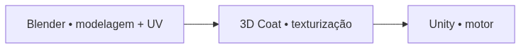

<!-- _class: cover -->
<!-- _paginate: false -->

# Quatro mapas, um material

## Refinamento no 3D Coat e exportação PBR unificada

**Semana 8** — Color, Roughness, Metallic e Normal: o fechamento técnico da Unidade II

<!--
Notas: Abertura da mini aula (20 min). Esta é a segunda Crítica Formal do semestre (CF2) — após a Semana 4 — e encerra a Unidade II. Mensagem central: a Semana 7 já fez a migração completa para o 3D Coat e já deu ao Asset 01 profundidade real via bake de AO/Curvature e Normal pintado no canal Depth. Hoje não se reintroduz a ferramenta — aprofunda-se o que já está em andamento: mais controle de camada, o canal Metallic, e o fechamento com a exportação dos quatro mapas PBR (Albedo, Metallic, Roughness e Normal, todos vindos do 3D Coat), reconectados no Blender sem nenhum nó procedural remanescente.
-->

---

## Objetivos de hoje

Ao final da semana você será capaz de:

- Refinar camadas de Color, Roughness e Metallic com detalhe intencional
- Localizar o canal **Subsurface Scattering (SSS)** e testá-lo em elementos orgânicos
- Pintar o canal **Metallic** com lógica física correta (quase binária)
- Exportar os **quatro mapas PBR** do 3D Coat — Albedo, Metallic, Roughness e **Normal**
- Configurar o material no Blender com os quatro mapas, sem nós procedurais remanescentes

<!--
Notas: Ler rápido. A turma já domina a mecânica básica do 3D Coat desde a Semana 7 — esta mini-aula não reapresenta a ferramenta. O Normal Map já foi bakeado a partir do Depth pintado na Semana 7; hoje ele é exportado junto com os demais mapas pela primeira vez. O objetivo 6 (apresentação na crítica formal) fica para o Encontro 2.
-->

---

<!-- _class: question -->

# Vocês já têm Color, Roughness e Normal ativos. O que falta para esse material estar pronto para a Unity?

<!--
Notas: Pergunta de abertura da mini aula. Conduzir a turma a perceber que falta: (1) o Metallic, ainda não trabalhado a fundo; (2) mais uma camada de detalhe intencional sobre o que já existe; (3) a exportação de tudo isso como imagem real, incluindo o Normal pela primeira vez.
-->

---

## Recapitulando: por que os mapas do 3D Coat são portáveis

Nós geram aparência **matematicamente**, a cada render — funcionam só dentro do Blender.

Mapas do 3D Coat são **imagens reais** (PNG/TGA), portáveis para qualquer motor ou software.

É por isso que o pipeline da disciplina fecha com essa exportação: Blender (modelagem + UV) → **3D Coat (texturização)** → Unity (motor).

<!--
Notas: Recapitulação rápida (1 min) — conceito já visto na Semana 7, não precisa de tempo de demonstração aqui. Serve só para reancorar por que a exportação de hoje fecha o pipeline.
-->

---

<!-- _class: diagram -->

## Onde o 3D Coat entra no pipeline

<!--
Notas: Recapitulação visual. O 3D Coat recebe a malha com UV do Blender e devolve mapas de imagem que representam cada canal PBR — hoje, os quatro. Esses mapas voltam ao Blender (para conferência) ou vão direto para a Unity.
-->

---

## Subsurface Scattering (SSS): um canal ainda não usado

Simula luz que penetra levemente o material antes de dispersar — pele, cera, mármore, folhas, tecidos finos.

Para um kit de ambiente (pedra, metal, madeira, concreto), o SSS quase sempre fica em **0**. As exceções: elementos decorativos orgânicos ou itens translúcidos (velas, cristais).

Assim como no Principled BSDF do Blender, o canal aceita valores de 0 a 1. Para quem tiver um elemento orgânico no kit: localize o canal hoje e teste um valor baixo.

<!--
Notas: A estrutura de camadas (uma camada, vários canais) já é conhecida desde a Semana 7 — hoje entra especificamente o canal Subsurface, que ainda não tinha sido ativado. Não há cobrança prática de pintura no SSS para quem não tem elemento orgânico no kit — localizar o canal na interface já é suficiente.
-->

---

## Combinando fontes numa mesma camada de material

Cada material, a esta altura, já tem no mínimo três origens empilhadas:

1. **Base** — foto ou Smart Material
2. **Máscara** gerada da geometria — AO/Curvature
3. **Pintura manual** — Depth, variações de cor

"Se alguém desligar só a sua camada de máscara, o material ainda deveria parecer razoável — só mais 'novo'. Se desligar e o material sumir ou virar outra coisa, a máscara está fazendo trabalho demais sozinha."

<!--
Notas: O refinamento desta semana consiste em ajustar o peso relativo dessas três camadas — nenhuma delas sozinha deveria contar toda a história do material. Esta é a lógica central da mini-aula, junto com o SSS.
-->

---

## O pacote de exportação: quatro mapas, uma vez só

1. **Refinar** as camadas de Color, Roughness e Metallic com detalhe adicional
2. **Exportar** os quatro mapas: Albedo (Color), Roughness, Metallic e **Normal** — já bakeado a partir do Depth pintado na Semana 7
3. **Conectar** os quatro mapas no material do Blender, com o Color Space correto em cada nó

O Normal sai junto com os outros três pela primeira vez nesta semana — antes, o material no Blender ainda dependia de um Normal procedural ou de nenhum Normal.

<!--
Notas: Fecha a mini-aula antes da demonstração. Este pacote de três passos é o roteiro exato que será repetido na demonstração e nos dois estúdios do dia.
[!FIGURA]
Objetivo didático: um diagrama visual (substituindo o antigo fluxo de três canais da Semana 7) mostrando os três passos — Refinar → Exportar quatro mapas → Conectar — com destaque para o Normal como novidade da semana.
Como produzir: regenerar o mermaid do pipeline da aula com os quatro mapas explícitos (Albedo, Roughness, Metallic, Normal) e publicar como assets/mermaid-3.png; até lá, apresentar esta etapa apenas com a lista acima.
-->

---

## Refinar o Color: camada de detalhe

Adicionar uma camada `Detalhe_Cor` — modo **Multiply** ou **Overlay**, opacidade **20–30%**.

Pintar detalhes específicos do tema sobre a base já existente: sombras de fissuras, manchas de umidade, concentração de cor em áreas de desgaste — **reforçando**, não substituindo, o que a máscara de AO/Curvature já indicava.

No Render Room: a cor tem história? Parece que o objeto foi usado?

<!--
Notas: Passo 1 da demonstração / Etapa 1 do Estúdio 1. A camada de detalhe precisa concordar com a máscara de baixo, não competir com ela — se as duas contarem histórias diferentes de desgaste, o material perde coerência.
-->

---

## Canal Metallic

Quase binário: **preto = 0** (dielétrico: pedra, madeira, concreto) · **branco = 1** (metal).

Materiais mistos: preencher zonas distintas — sem gradientes suaves.

A transição de metal para ferrugem não é um gradiente suave de Metallic — é uma borda nítida, guiada pela máscara de Curvature. Fisicamente, ou é metal exposto ou não é.

<!--
Notas: Passo 2 da demonstração / Etapa 2 do Estúdio 1. Para a maioria dos kits (Medieval, Fantasia, pós-apocalíptico), pedra, madeira e concreto ficam em Metallic 0 sem exceção. Reservar o Metallic 1 apenas para metal exposto, com preto pintado nas áreas de ferrugem ou tinta usando a máscara de Curvature como guia.
-->

---

## Roughness: revisão da máscara combinada

Camadas empilhadas no painel Layers: **base** + **desgaste** (Curvature) + **sujeira** (AO).

No Render Room: alternar ligando/desligando cada camada para conferir a contribuição individual de cada uma. Se não houver diferença de brilho visível entre arestas e face principal, o contraste está fraco.

<!--
Notas: Passo 3 da demonstração / Etapa 3 do Estúdio 1. No Encontro 2, esta revisão pode ganhar uma camada adicional `Roughness_Sujeira` (Multiply, 40–50%, pintada em áreas côncavas com valor mais alto) para incorporar o feedback da crítica formal.
-->

---

## Exportar os quatro mapas e reconectar no Blender

`File → Export Textures` → PNG, mesma resolução da importação → selecionar **Albedo, Roughness, Metallic e Normal**.

No Blender: quatro nós **Image Texture** — Albedo em **sRGB**; Roughness, Metallic e Normal em **Non-Color**. O Normal passa por um nó **Normal Map** antes do Principled BSDF.

Conectar o Image Texture do Normal direto ao Principled BSDF, sem o nó `Normal Map` no meio, produz um resultado fisicamente incorreto — o motor interpreta a imagem como cor, não como vetor.

<!--
Notas: Passo 4 e 5 da demonstração. Regra fixa a repetir sempre: só o Albedo fica em sRGB; todo mapa de DADO (Roughness, Metallic, Normal) vai em Non-Color. O nó Normal Map é obrigatório entre o Image Texture do Normal e o Principled BSDF — é um erro silencioso, o material roda sem erro mas com aparência errada.
-->

---

## Erros comuns

**Canal errado ativo** — pintar cor enquanto o canal ativo é Roughness; o mapa de Roughness recebe informação de cor.

**Roughness sem variação** — camada de desgaste pintada com opacidade baixa demais; o PNG exportado sai quase uniforme.

**Normal Map sem o nó intermediário** — Image Texture do Normal ligado direto ao Principled BSDF; o relevo sai errado sem nenhum erro visível na tela.

<!--
Notas: Alinhado às Possíveis Dificuldades do plano de aula. Circular no estúdio caçando exatamente estes três padrões, e um quarto ponto de checagem: os quatro mapas foram de fato exportados, conferindo no explorador de arquivos — não só na confirmação do 3D Coat.
-->

---

<!-- _class: industry -->

## Na indústria

3D Coat, Substance Painter e Mari são as ferramentas-padrão de pintura PBR em produção de jogos — o fluxo de refinar por canal, exportar e reconectar no material do motor/DCC, praticado hoje com o pacote completo de quatro mapas, se repete quase idêntico em qualquer pipeline profissional.

Canal invertido (roughness/smoothness) e Normal sem o nó de conversão são dois dos bugs visuais mais comuns em produção — e dos mais rápidos de diagnosticar quando se sabe exatamente o que procurar.

<!--
Notas: Contextualizar o valor profissional. Amarra à Semana 16, onde o mesmo tipo de inversão de canal (Roughness vs. Smoothness) reaparece na Unity.
-->

---

<!-- _class: summary-slide -->

# Resumo

- Refinar Color, Roughness e Metallic com camadas que **combinam** base, máscara e pintura manual
- **Subsurface Scattering**: canal novo, quase sempre 0 num kit de ambiente
- Metallic é **quase binário** — preto para dielétricos, branco para metais, sem gradientes
- Exportar os **quatro mapas** PBR: Albedo, Roughness, Metallic e **Normal** (bakeado do Depth na S7)
- No Blender: Albedo em **sRGB**; os outros três em **Non-Color**; Normal sempre via nó **Normal Map**

<!--
Notas: Amarrar a mini aula antes da demonstração. Hoje é a segunda Crítica Formal do semestre (CF2) — após a Semana 4 — e encerra a Unidade II. O objeto da crítica é o trabalho das Semanas 6–7 consolidado; o refinamento feito no Estúdio 1 pode entrar como contexto, mas o foco avaliativo é o estado consolidado do material nas duas trilhas visuais (fotorrealista e estilizada).
-->

---

## No estúdio: refinamento e primeira exportação de teste

Meta do Encontro 1: Asset 01 com Color refinado (camada de detalhe), Metallic corretamente preenchido, e uma **primeira exportação de teste** dos quatro mapas.

Antes de sair daqui: Metallic com lógica física e pelo menos uma exportação de teste na pasta do projeto — os quatro mapas, incluindo o Normal.

<!--
Notas: Consigna do estúdio de 50 minutos. Não precisa ser a versão final — o Encontro 2 tem mais 60 minutos de estúdio, incluindo a reconexão completa no Blender. Nomenclatura esperada: [Nome]_Asset01_S08.3b e pasta [Nome]_Asset01_Mapas_S08/. Lembrar de distribuir a autoavaliação ao final deste encontro — é pré-requisito da crítica formal (CF2) do Encontro 2.
-->

---

## Agora: demonstração

A seguir, o fluxo completo ao vivo: refinar Color e Metallic por camadas, revisar o Roughness combinado, exportar os quatro mapas e reconectar no Blender com o nó Normal Map.

3D Coat à esquerda (arquivo da Semana 7), Blender com o material anterior à direita para comparação.

<!--
Notas: Transição para a demonstração de 20 min. Sequência: abrir o arquivo de demonstração da Semana 7 → refinar Color com camada de detalhe → preencher Metallic (pedra = preto, metal = branco com ferrugem) → revisar Roughness combinado → exportar os quatro mapas → conectar no Blender (quatro Image Texture + nó Normal Map) e comparar com o estado anterior.

[!FIGURA]
Objetivo didático: antecipar o layout de tela da demonstração para que a turma acompanhe a comparação entre refinamento no 3D Coat e reconexão no Blender.
Arquivo sugerido: assets/demo_3dcoat_pipeline.webp
Descrição: tela dividida. À esquerda, o Paint Room do 3D Coat com o painel de Layers visível (camadas Base_Color, Detalhe_Cor, Metallic, Roughness base/desgaste/sujeira) sobre um asset de parede de pedra. À direita, o Shader Editor do Blender com quatro nós Image Texture (Albedo, Roughness, Metallic, Normal), o nó Normal Map, e o Viewport Rendered mostrando o resultado final.
Como produzir: no 3D Coat, montar as camadas citadas em um asset de demonstração e capturar o Paint Room com o painel de Layers aberto; no Blender, montar o node tree com os quatro Image Texture + Normal Map + Principled BSDF. Compor as duas capturas no Krita.
-->
