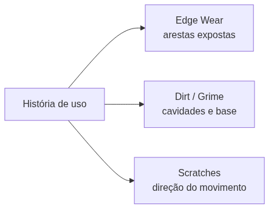
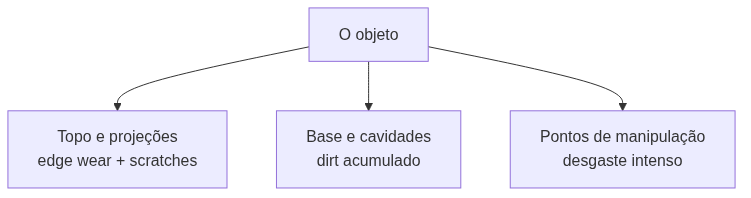

<!-- _class: cover -->
<!-- _paginate: false -->

# A textura ganha história

## Desgaste, sujeira e detalhe hand-painted

**Semana 9** — Texturização artística no 3D Coat: edge wear, dirt e scratches

<!--
Notas: Abertura da mini aula (20 min). Unidade III — Pintura Digital e Bake. Crítica 🔵 Informal nesta semana. Mensagem central: na Semana 8 os estudantes aprenderam a pintar os três canais base no 3D Coat (Color, Roughness, Metallic). Hoje NÃO há ferramenta nova — há uma nova INTENÇÃO. O foco passa do estrutural (canais corretos) para o narrativo (o que aconteceu com esse objeto?). Deixar isso claro logo na capa: a pergunta que guia a semana é "qual é a história desse objeto?".
-->

---

## Objetivos de hoje

Ao final da semana você será capaz de:

- Distinguir texturização **fotorrealista** de **estilizada** e escolher a coerente com o kit
- Aplicar os três tipos de detalhe: **edge wear**, **dirt/grime** e **scratches**
- Organizar **camadas por tipo de detalhe** no 3D Coat
- Usar a **lógica de uso** para decidir *onde* pintar cada detalhe
- Avaliar a leitura do material **à distância de uso**, não só em close-up

<!--
Notas: Ler rápido. Não antecipar stencils (Semana 10) nem bake de Normal/AO (Semana 11). Hoje é pintura manual de detalhe com intenção narrativa, usando as ferramentas já conhecidas da Semana 8. O objetivo da "leitura à distância" prepara a verificação no Render Room que aparece na demonstração e no estúdio.
-->

---

<!-- _class: question -->

# Dois assets, a mesma malha. O que os torna diferentes?

<!--
Notas: Pergunta de abertura. Exibir dois renders do MESMO asset: um só com as três camadas base da Semana 8 (cor flat, roughness uniforme), outro com desgaste, sujeira e scratches. Mesma malha, mesmo UV, mesmo número de polígonos. Deixar 2-3 respostas. Direcionar para: a textura com desgaste narra o tempo de uso. Ela responde "o que aconteceu com esse objeto antes de ele aparecer no frame?".

[!FIGURA]
Objetivo didático: materializar visualmente a diferença entre "textura funcional" e "textura com história" — o salto conceitual de toda a aula em uma imagem.
Arquivo sugerido: assets/antes_depois_desgaste.webp
Descrição: comparação lado a lado do MESMO asset (ex.: barril ou caixa de metal). À esquerda, versão S08 com Color, Roughness e Metallic base, aparência limpa e uniforme. À direita, versão S09 com edge wear nas arestas, sujeira acumulada nas cavidades inferiores e scratches direcionais.
Como produzir: no 3D Coat, abrir o asset de demonstração; capturar o Render Room com apenas as camadas base visíveis; depois reativar as camadas de detalhe e capturar de novo no mesmo ângulo e iluminação. Compor as duas capturas lado a lado no Krita.
-->

---

## De onde viemos: Semana 8

Você já tem o Asset 01 com os três canais pintados no 3D Coat:

- **Color** — cor base + variação de tom
- **Roughness** — base + desgaste inicial nas arestas
- **Metallic** — base

<div class="tip">

A estrutura já existe. Hoje não trocamos de ferramenta — mudamos a **pergunta** que fazemos ao pintar.

</div>

<!--
Notas: Revisão rápida. Reforçar que o ponto de partida de hoje é exatamente o estado em que o asset ficou na Semana 8. As camadas base já estão prontas; adicionamos camadas de INFORMAÇÃO sobre elas. Lembrar os estudantes de revisitar o moodboard do kit antes de começar — a lógica de desgaste depende do contexto do universo (medieval envelhecido vs. sci-fi em uso ativo).
-->

---

## Fotorrealista × estilizado

Não é escolha de **qualidade** — é escolha de **intenção**.

- **Fotorrealista** — aparência de material real sob luz física
- **Estilizado** — amplifica qualidades visuais para impacto e identidade

Mesmas ferramentas, mesmos canais PBR. Muda a **intensidade** e o **exagero**.

<!--
Notas: A diferença não é técnica, é de direção artística. Perguntar: "O tema do seu kit pede realismo ou estilo? Olhem o moodboard — as referências são fotográficas ou artísticas?". Não há resposta certa, mas a escolha deve ser deliberada e consistente em todo o kit. Um kit cartoon com edge wear branco e uniforme é edge wear estilizado — a lógica de ONDE pintar é a mesma; o quanto exagera é decisão artística.
-->

---

<!-- _class: diagram -->

## Os três tipos de detalhe de superfície



<!--
Notas: Esta taxonomia organiza todo o processo de pintura da semana. Cada tipo responde a uma lógica física diferente: edge wear = exposição ao contato; dirt = gravidade + abrigo; scratches = direção de uso. Os próximos três slides detalham cada um. O GitHub Action converte o mermaid em imagem.
-->

---

## Edge Wear — desgaste de aresta

Acontece onde o material é **exposto ao contato**: bordas, projeções, pontos de manipulação.

- **Color** — cor *interna* do material exposta (metal limpo sob ferrugem)
- **Roughness** — arestas mais polidas → valor menor (mais reflexivo)

<div class="tip">

Regra de ouro: quanto mais projetado e exposto, mais desgastado.

</div>

<!--
Notas: É onde tinta descasca, metal polido aparece sob ferrugem, pedra lascada expõe material interno. As duas camadas (Color + Roughness) constroem juntas a leitura de "material exposto pelo uso". Ponto crítico que retorna nos erros comuns: NÃO pintar todas as arestas igualmente — a intensidade é proporcional à exposição ao contato.
-->

---

## Dirt / Grime — sujeira e acúmulo

Acontece onde **gravidade e abrigo convergem**: cantos inferiores, encaixes, fendas, reentrâncias.

- **Color** — tom mais escuro/acinzentado, modo **Multiply**
- **Roughness** — sujeira é muito rugosa → valor maior

<div class="tip">

Regra de ouro: quanto mais baixo e protegido, mais sujo.

</div>

<!--
Notas: Pó, fuligem, musgo e óleo acumulam em lugares protegidos onde o vento não chega e a água fica parada. O modo Multiply é essencial: escurece a base sem apagá-la (acúmulo gradual, não mancha opaca). Pintar em passadas suaves e acumulativas com brush grande e opacidade baixa. A cor da sujeira segue o tema: pó terroso (Medieval), graxa/fuligem (Sci-Fi), ferrugem+terra (Pós-apocalíptico).
-->

---

## Scratches — riscos e arranhões

Acontecem pela **direção de uso**: arrastar, empurrar, apoiar.

- **Roughness** — micro-alteração de superfície ao longo do risco
- **Color** (opcional) — material base exposto pelos riscos maiores

<div class="tip">

Regra de ouro: os riscos seguem a direção do movimento do usuário.

</div>

<!--
Notas: Riscos têm direção e comprimento que revelam como o objeto foi usado — horizontal se deslizado em superfícies, vertical se apoiado contra paredes, diagonal se carregado. Não cobrir toda a face: concentrar em 20-30% das superfícies expostas. Na demonstração, scratches ficam como desafio de estúdio para estudantes avançados; edge wear e dirt são o foco.
-->

---

<!-- _class: diagram -->

## Onde pintar: a lógica de uso



<!--
Notas: A pergunta que resolve tudo: "o que o usuário toca? o que bate no chão quando o objeto é largado? onde a poeira cairia e ficaria parada?". O desgaste uniforme é decorativo; o desgaste posicionado pela lógica de uso é narrativo. Este é o critério C5 (Texturização) que separa o nível 2 do nível 4 na rubrica. Insistir na assimetria — é ela que torna o desgaste crível.
-->

---

## Uma camada por tipo de detalhe

```
EdgeWear_Color     ← cor interna exposta nas arestas
Dirt_Color         ← acúmulo em cavidades (Multiply)

EdgeWear_Rough     ← arestas mais polidas
Dirt_Rough         ← cavidades mais rugosas
Scratches_Rough    ← micro-rugosidade dos riscos
```

Ajustar um detalhe sem retrabalhar os outros. Comparar antes/depois desativando camadas.

<!--
Notas: Nomenclatura recomendada da mini aula. "Quem tem as camadas assim nomeadas ajusta qualquer detalhe direto. Quem tem tudo numa camada só refaz o asset do zero na próxima crítica." A organização de camadas é critério C1 (Processo de Projeto) na rubrica — camadas nomeadas por função, nunca "Layer 1". Cada tipo de detalhe = sua própria camada ou grupo.
-->

---

## A leitura à distância de uso

Em jogos, assets de ambiente são vistos a **3–10 metros** — não em close-up de portfólio.

Micro-detalhe que só aparece a 30 cm no Render Room é **invisível** no jogo.

<div class="error">

Se o edge wear some com a câmera a 5 m, está fraco demais. Se o asset parece coberto de arranhões, está forte demais.

</div>

<!--
Notas: Regra prática que vira hábito de trabalho: verificar a distância no Render Room ANTES de declarar uma camada pronta. O objetivo é que o desgaste "leia à distância" sem ser caricato. Esse gesto — afastar a câmera e conferir — deve ser repetido a cada camada nova durante o estúdio. É a defesa contra o erro de "comparativo antes/depois sem diferença visível".
-->

---

## Erros comuns

<div class="error">

**Edge wear uniforme** — todas as arestas com a mesma intensidade; parece filtro, não uso real.

</div>

<div class="error">

**Dirt em modo Normal** — cria manchas opacas em vez de acúmulo. Use **Multiply**.

</div>

<div class="error">

**Desgaste invisível à distância** — opacidade baixa demais; a S09 fica igual à S08.

</div>

<!--
Notas: Os três erros mais frequentes, alinhados às Possíveis Dificuldades do plano de aula. Circular no estúdio caçando exatamente estes padrões. Para o edge wear uniforme: pedir que o estudante identifique verbalmente as 2-3 arestas mais expostas ANTES de pintar. Para o Dirt: conferir o modo de mistura antes de qualquer pincelada. Para a invisibilidade: desativar as camadas novas e comparar — "vê diferença? não? então falta intensidade".
-->

---

<!-- _class: summary-slide -->

# Resumo

- Hoje muda a **intenção**, não a ferramenta: da textura funcional à textura com **história**
- Três detalhes: **edge wear** (arestas), **dirt** (cavidades/Multiply), **scratches** (direção)
- A **lógica de uso** decide *onde* pintar — desgaste uniforme é decorativo
- **Uma camada por tipo**, nomeada por função
- Sempre validar a **leitura à distância** no Render Room

<!--
Notas: Amarrar a mini aula antes da demonstração. Cada item retorna na demonstração ao vivo (edge wear + dirt no asset preparado) e no estúdio (Asset 01 recebe as camadas de detalhe). Lembrar: semana de crítica 🔵 Informal — sem nota, mas o professor registra evidências de C5 para calibrar a CF4 (Semana 11).
-->

---

## Agora: demonstração

A seguir, ao vivo no 3D Coat: **edge wear** e **dirt** no Color e no Roughness, com verificação à distância no Render Room.

A pergunta que você leva ao estúdio: **qual é a história do seu objeto?**


<!--
Notas: Transição para a demonstração de 20 min. Sequência: partir do asset com as três camadas base pintadas (mesmo estado em que a turma chega) → EdgeWear_Color nas arestas expostas → EdgeWear_Rough coincidindo com as mesmas arestas → Dirt_Color em Multiply nas cavidades e base → Dirt_Rough nas mesmas áreas → afastar a câmera no Render Room e verificar a leitura. Scratches ficam como desafio de estúdio. Não demonstrar bake nem stencil — não é o escopo desta semana.

[!FIGURA]
Objetivo didático: antecipar o resultado esperado da demonstração para que a turma reconheça o alvo visual antes de produzir no estúdio.
Arquivo sugerido: assets/demo_edgewear_dirt.webp
Descrição: captura do Render Room do 3D Coat mostrando o asset de demonstração já com edge wear nas arestas superiores (cor interna + roughness mais baixo, arestas com brilho sutil diferente) e dirt acumulado nas cavidades inferiores (tom escuro e mais matte). Painel de Layers visível à lateral com as camadas EdgeWear_Color, EdgeWear_Rough, Dirt_Color e Dirt_Rough nomeadas.
Como produzir: no 3D Coat, pintar as quatro camadas no asset de demonstração seguindo o percurso da demonstração; abrir o Render Room com iluminação HDR e capturar em um ângulo que mostre arestas e cavidades ao mesmo tempo, com o painel de Layers aberto.
-->
