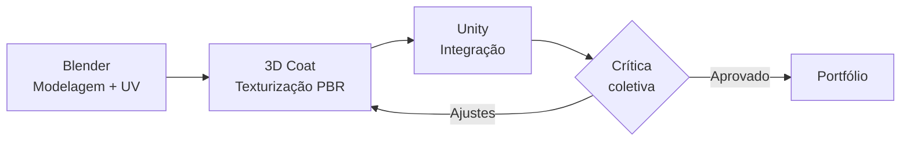

<!-- _class: diagram -->

## Pipeline de texturização

```mermaid
flowchart LR
    A[Blender<br/>Modelagem + UV] --> B[3D Coat<br/>Texturização PBR]
    B --> C[Unity<br/>Integração]
    C --> D{Crítica<br/>coletiva}
    D -->|Ajustes| B
    D -->|Aprovado| E[Portfólio]
```

Esse mesmo fluxo (modelar → texturizar → integrar → revisar) é o padrão em estúdios profissionais.

